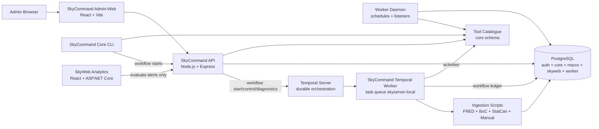

# SkyCommand

SkyCommand is the private **Node.js / Express / PostgreSQL control plane** for the Sky ecosystem. It owns operational administration, ingestion, repository tooling, worker scheduling, script execution, alert evaluation, and durable workflow orchestration.

SkyWeb Analytics is the public/member-facing analytics product. SkyCommand stays behind the curtain as the trusted operational engine.

## Stack at a Glance

| Layer                 | Technology                                                                                                   |
| --------------------- | ------------------------------------------------------------------------------------------------------------ |
| API                   | Node.js, Express                                                                                             |
| Admin client          | React, Vite, React Router, Bootstrap, Axios, Apache ECharts, D3                                              |
| Database              | PostgreSQL                                                                                                   |
| Data access           | `pg`, SQL migrations/seeds, relational metadata                                                              |
| Auth                  | App-scoped login, hashed bearer sessions, RBAC permissions, audit events                                     |
| Worker/control plane  | Node worker daemon, scheduler/listener schema, tool execution logs                                           |
| Durable orchestration | Temporal worker, workflow executor, task queue diagnostics, worker heartbeats                                |
| Tool result contract  | Universal child-process adapter, wrapper-owned structured result transport, versioned `ToolResult` envelopes |
| Data ingestion        | FRED, Bank of Canada, Statistics Canada, manual CSV/spreadsheet pipelines                                    |
| Repo automation       | Watcher-safe repository intelligence, development promotion, repo map generation, lean repo zip generation   |
| Product consumer      | SkyWeb Analytics via public/member macro and alert APIs                                                      |

## What This Project Demonstrates

- **Operational control-plane architecture** for private admin workflows, tools, ingestion, scheduling, audit, automation, and readiness checks.
- **PostgreSQL-first system design** with separate `auth`, `core`, `macro`, `skyweb`, and `worker` schemas.
- **Permission-aware browser-triggered script execution** with risk levels, confirmation phrases, execution logs, output limits, and audit trails.
- **Reusable data-ingestion pipelines** for public macroeconomic sources with staging, normalization, incremental loading, and status inspection.
- **Worker-backed automation foundation** for scheduled tools, worker-visible tool catalogue entries, schedule runs, node heartbeats, listener staging, and worker health checks.
- **Temporal-backed durable workflow orchestration** with tool/API/workflow/template nodes, condition branches, waits, human approvals, retries, version guardrails, run controls, and diagnostics.
- **Clean system boundary with SkyWeb**, where SkyCommand owns ingestion/evaluation/control-plane work while SkyWeb owns analytics presentation and member workflows.
- **Repository automation discipline** through generated repo maps, generated lean handoff zips, and dev-commit tooling.
- **SkyCommand visual operations layer** with reusable Apache ECharts/D3 chart cards, full-screen chart overlays, and dashboard/workflow/worker/ingestion/tool/readiness analytics.
- **Persistent API observability** with privacy-safe PostgreSQL request evidence, normalized routes, success/error trends, p95/p99 latency, request correlation IDs, route pressure, and configurable retention.
- **Workflow-native tool result architecture** that keeps stdout/stderr in Tool History while exposing validated, versioned, domain-specific results to workflows through one generic adapter.

## Current Status

SkyCommand is now a mature private operational control plane for the Sky ecosystem. It combines a branded Admin-Web experience with PostgreSQL-backed administration, repository and tool management, ingestion operations, scheduling and automation, durable Temporal workflows, approvals, run control, diagnostics, readiness checks, observability, and structured workflow results.

The ingestion and data-contract foundation is portable beyond the original macroeconomic use case while retaining the established FRED, Bank of Canada, and Statistics Canada paths. Current development is focused on reusable operational tooling, workflow templates, repository automation, diagnostics, testing, documentation, and continued UI polish rather than adding another large numbered milestone.

Docker containerization has now begun with the **Temporal development service**. Temporal runs from a pinned container with persistent local state, while the SkyCommand Temporal worker remains host-run for the first proof boundary. The next infrastructure slice will containerize the worker after Docker-specific repository paths and Git authentication are handled deliberately.

## Workflow Runtime and Structured Results

### SkyCommand Core workflow runtime parameters

Published workflow runtime parameters are shared across Admin-Web and the `npm run core` launcher. SkyCommand Core lists the schema count, prompts for each typed value, validates required/default/select/number/boolean/JSON rules, and submits the values under both `input.params` and `input.runtimeParameters`. Node defaults reference them with the same syntax used by Admin-Web:

```text
{{ params.commitMessage }}
```

SkyCommand also supports the `repo` workflow parameter type. Repository values are selected from the active repository catalogue in Admin-Web or SkyCommand Core, and compatible repository node fields can store a typed binding such as:

```text
{{ params.repoName }}
```

The node editor keeps literal repository choices and workflow-parameter bindings in separate dropdown groups. At launch, the API validates the selected value against active configured repositories and normalizes it to the canonical repository code.

The CLI still accepts an optional additional workflow-input JSON object for advanced overrides. Temporal-backed runs can be followed without Admin-Web by leaving the follow prompt at its default `Y`; progress is read from `worker.workflow_run_records` and `worker.workflow_node_run_records`.

Optional environment controls are documented in `.env.example`:

```text
SKYCOMMAND_CORE_WORKFLOW_EXECUTOR_MODE=temporal
SKYCOMMAND_CORE_WORKFLOW_FOLLOW=true
SKYCOMMAND_CORE_WORKFLOW_POLL_MS=2000
SKYCOMMAND_CORE_WORKFLOW_FOLLOW_TIMEOUT_MS=1800000
```

### Development promotion workflow

The recommended repository delivery workflow is:

```text
Repository Intelligence
→ Promotion Ready? condition
   ├─ TRUE  → Repository Map → Repository ZIP → Dev Commit → Human Merge Approval → Main → Dev Synchronization → Summary
   └─ FALSE → Summary (terminal branch; STOP_SUCCESS remains the no-target fallback)
```

Repository Intelligence inspects local and remote `dev`/`main` state without switching branches or rewriting watched files. It emits `git_repository_status.v1`, and the preflight condition continues only when `nodes.repo_intel_node.output.readyForDevelopmentPromotion` is truthy. The false branch can route directly to the final Summary node and stop successfully, producing a clean blocked-preflight result without running mutation nodes. The approval checkpoint confirms that the Dev → Main pull request has been completed. The `main_merge` tool then synchronizes development from main and emits `git_branch_sync_summary.v1`, including branch-head movement, commits applied, synchronized state, optional tag evidence, and Git-step outcomes. Workflow History provides dedicated condition, Main Merge, and approval tables, while the Summary node automatically produces a Development Promotion stage rollup. Suggested workflow name: **SkyCommand Development Promotion**.

### Structured result consumption and summary aggregation

Structured result handling centralizes the deterministic result-to-workflow view in `packages/tools/src/workflowResultContext.js`. Both inline execution and the Temporal workflow bundle now use the same rules:

```text
nodes.<nodeKey>.result      complete ToolResult envelope
nodes.<nodeKey>.output      domain-specific payload
nodes.<nodeKey>.warnings    non-fatal warnings
nodes.<nodeKey>.error       structured error
nodes.<nodeKey>.metadata    safe result metadata
previousResult              previous complete result
previousOutput              previous domain payload
```

Condition nodes can branch on paths such as `nodes.fred_ingestion.output.totals.rowsInserted` or `nodes.repo_intel_node.output.readyForDevelopmentPromotion`. A configured path that does not exist now fails with `WORKFLOW_CONDITION_PATH_NOT_FOUND` unless a fallback literal is supplied, preventing silent branches caused by misspelled paths.

Summary nodes no longer create source-labelled JSON previews. They build a compact node-result index and, when macro ingestion results are present, a normalized rollup containing one row for every source plus combined requested/updated/unchanged/failed/row totals. Repository delivery workflows also receive a Development Promotion rollup covering optional Repository Intelligence preflight evidence, generated map/package artifacts, Dev Commit evidence, human merge approval, and Main → Dev synchronization. Workflow History renders both models as purpose-built tables.

Scheduled direct-tool runs store only a compact contract summary in `worker.schedule_runs.metadata`: schema/output type, success/message/warning count, and domain-specific evidence where applicable. Full output remains in the tool execution result and workflow ledger rather than being duplicated into scheduler metadata.

### Condition and schedule proof

The recommended promotion lane now places a condition immediately after Repository Intelligence:

```text
Repository Intelligence
→ Promotion Ready? condition
   ├─ TRUE  → Repository Map → Repository ZIP → Dev Commit → Approval → Main → Dev Sync → Summary
   └─ FALSE → Summary (terminal branch; STOP_SUCCESS remains the no-target fallback)
```

Use the canonical preflight path:

```text
nodes.repo_intel_node.output.readyForDevelopmentPromotion
```

Configure the operator as `TRUTHY`, leave the fallback blank, route the true branch to the first promotion action, route the false branch to the final Summary node, and keep `STOP_SUCCESS` as the safe fallback if no explicit false target is configured. A missing structured path fails clearly instead of silently choosing a branch. Workflow History records the evaluated path, value, operator, selected branch, and target node, and the Development Promotion Summary includes the preflight gate as a first-class stage.

Direct-tool schedules now expose a purpose-built **Structured result evidence** panel in Scheduler run details. Repository Intelligence schedules show `git_repository_status.v1`, repository, outcome, promotion readiness, current/expected branch, remote-baseline synchronization, working-tree changes, blocker count, and inspection duration while preserving raw metadata below for diagnostics.

Focused verification commands:

```powershell
npm run workflow-condition:self-test
npm run workflow-result-context:self-test
npm run validate
```

### Structured-result failure isolation

A successful tool operation is never converted into a failure solely because its optional structured result is missing, invalid, or cannot be emitted. The wrapper records the result warning, retains stdout/stderr in Tool History, and allows workflows to use the legacy fallback when necessary. Repository Map and Repository Zip therefore remain available as recovery tools even when other structured-result reporting code is damaged.

### Development watcher safety

Structured-result files are ephemeral runtime artifacts, not source files. They use the `.tool-result` extension and are written beneath `logs/tool-results`; the shared `nodemon.json` ignores runtime log and temporary-data paths so API, worker, and Temporal development processes do not restart when a tool emits its result. The wrapper reads and deletes each result after validation, so the result directory is normally empty between executions.

## Core Product Surfaces

| Surface              | Purpose                                                                                                                                                                                          |
| -------------------- | ------------------------------------------------------------------------------------------------------------------------------------------------------------------------------------------------ |
| SkyCommand Dashboard | Private operational intelligence dashboard for API/DB health, ingestion, automation, workflows, task queue health, readiness, tools, sessions, scripts, audits, and chart-based visual summaries |
| Tools                | Permission-filtered operational tool launcher with dynamic parameters and Tools History logging                                                                                                  |
| Workflows            | Versioned workflow builder, visual graph editor, start/history, approvals, run controls, Temporal diagnostics, and worker health                                                                 |
| Automation           | Scheduler/listener control surfaces, including bridges to Temporal templates and SkyCommand workflows                                                                                             |
| Ingestion Status     | Source health, indicator freshness, stale-data detection, run history, per-indicator diagnostics, and macro pipeline analytics                                                                   |
| Access Control       | User, role, permission, session, password administration, and User History audit review                                                                                                          |
| Tools History        | Browser-triggered and worker-triggered tool execution history with stdout/stderr traceability plus usage, speed, category, and outcome analytics                                                 |
| SkyWeb APIs          | Public/member macro, profile, preference, dashboard, alert, and alert-evaluation support for SkyWeb Analytics                                                                                    |

## Architecture



Current control flow:

```text
Admin-Web / Core CLI
  → SkyCommand API / tool launcher / workflow launcher
      → PostgreSQL auth + core + worker catalogue
      → ingestion, repo, DB, git, and operational scripts
          ↳ stdout/stderr → Tool History and diagnostics
          ↳ validated ToolResult → workflow node result and context
      → worker schedules and listener definitions
      → Temporal-backed SkyCommand workflow definitions and run ledgers
      → audit + script execution history

SkyWeb Analytics
  → SkyWeb.Api for analytics/member reads and writes
  → SkyCommand API only for evaluate-now alert execution and future control-plane workflows
```

## Relationship to SkyWeb Analytics

SkyCommand and SkyWeb now have a clean boundary:

| SkyCommand owns                                      | SkyWeb owns                                     |
| --------------------------------------------------- | ----------------------------------------------- |
| Ingestion pipelines                                 | Public/member analytics UI                      |
| Worker scheduling                                   | Dashboards and saved views                      |
| Alert evaluation execution                          | Alert rules and Signal Center presentation      |
| Admin-Web and RBAC administration                   | Account/profile/preferences UX                  |
| Script/tool execution and admin visual intelligence | Public/member ECharts/D3 analytics presentation |
| Repo map/zip/dev-commit utilities                   | Portfolio-ready product presentation            |
| Temporal orchestration and workflow diagnostics     | Public/member API consumption                   |

SkyCommand should not duplicate SkyWeb product surfaces. SkyWeb should not duplicate SkyCommand administrative control surfaces.

## SkyCommand UI and Visualization Direction

**SkyCommand** uses a branded Admin-Web shell. The design keeps the dark operational console identity while moving navigation into a permission-aware left sidebar with grouped sections for command, tools, workflows, automation, data, configuration, and access control. The top bar carries page context, command search, notification/message shells, and the authenticated operator icon.

The UI modernization changed the app shell, sidebar, topbar, spacing, dashboard command center, workflow workbench behavior, login experience, brand mark, and shared UI primitives without changing workflow execution or database semantics. Reusable SkyCommand components now cover status pills, stat cards, panels, page headers, sidebar navigation, and the inline SVG brand mark.

The reusable visualization layer uses Apache ECharts and D3 to power chart sections across the Dashboard, Workflow History, Worker Health, Ingestion Status, Tools History, and Production Readiness pages. Chart cards share a consistent anatomy, status color language, empty-state handling, and full-screen overlay behavior so visual analytics can expand without page-by-page chart sprawl.

The live intelligence spine keeps workflow and dashboard surfaces current through smart polling against standardized telemetry contracts, while workflow node completions now persist structured node outputs into `worker.workflow_run_node_outputs`. The workflow context store now updates `worker.workflow_run_context_values` with initial workflow inputs, runtime parameters, per-node status/output summaries, `last.*` values, and selected custom context updates. Workflow definitions can now store an explicit runtime parameter schema, Start Workflow renders that schema as a launch form only when workflow-level params exist, and node input parameters can resolve template references such as `{{ params.commitMessage }}`, `{{ context.last.output }}`, and `{{ nodes.some_node.output }}` before execution. Workflow History now keeps the runtime map full-width and opens detailed run metadata in an overlay. Manage Workflows keeps workflow-level runtime params in the definition section while node-level defaults stay on selected graph nodes, backed by the versioned workflow node ledger.

The workflow-native result contract separates operational narration from workflow business results. Tool History remains the authoritative location for stdout/stderr, while Workflow History and condition nodes consume deliberate `ToolResult` payloads through stable result and output paths. The initial foundation is runtime-agnostic and shared by API and worker execution, preserving child-process isolation while preparing FRED, BoC, StatCan, repository tools, and future registered scripts to use the same contract.

## Workflow Pages

The Workflows menu is the high-level SkyCommand workflow cockpit:

```text
Workflows -> Create Workflow
Workflows -> Manage Workflows
Workflows -> Start Workflow
Workflows -> Workflow History
Workflows -> Approvals
Workflows -> Worker Health
```

The workflow surfaces can:

- create, manage, clone, draft, validate, publish, and retire versioned workflow definitions backed by `worker.workflow_definitions`;
- compose `TOOL`, `API_CALL`, `WORKFLOW`, `TEMPORAL_WORKFLOW`, `CONDITION`, `WAIT`, and `HUMAN_APPROVAL` nodes;
- configure tool parameters, Temporal-template parameters, retry policy, node timeout, condition branches, wait timers, and approval role gates;
- render workflow graphs visually with node inspection, drag reorder, branch labels, and runtime status overlays;
- start active published workflows manually from Admin-Web, SkyCommand Core CLI, Admin tool bridge, or schedules;
- define runtime parameter schemas for reusable workflows and capture submitted launch values as durable `params` context;
- resolve node input templates from runtime params, workflow context, previous outputs, and named node outputs;
- store workflow-level and node-level run records in PostgreSQL while Temporal owns durable execution state;
- approve/reject human approval gates through Admin-Web signals back to Temporal;
- cancel, terminate, and retry workflow runs;
- inspect Temporal workflow IDs, run IDs, event summaries, diagnostic links, task queue status, and worker heartbeat health;
- auto-refresh Workflow History and selected run telemetry through smart polling, slowing down when no active workflows exist or the browser tab is hidden.

Lower-level Temporal runtime diagnostics remain available at `/workflows/temporal/start` and `/workflows/temporal/history` for direct Temporal-template visibility. Admin-Web calls SkyCommand API; it never connects to Temporal directly. Legacy `/automation/temporal` and `/temporal` links redirect to the workflow cockpit.

## Local Development

Install dependencies from the repository root:

```bash
npm install
```

Run common development surfaces:

```bash
# SkyCommand API
npm run api
```

```bash
# SkyCommand Admin-Web
npm run web
```

```bash
# SkyCommand worker daemon
npm run worker:dev
```

```bash
# SkyCommand Core CLI
# Top menu: Run Tools / Run Workflows
npm run core
```

Useful validation/build commands:

```bash
npm run validate:syntax
npm run validate:self-tests
npm run validate
npm run validate:release
npm run lint
npm run format:check
npm run prepush
npm run db:health
npm run db:build
```

`npm run validate` now uses a cross-platform Node runner. It executes syntax checks and the permanent routine regression suite as separate child processes, avoiding Windows command-line length limits. Historical acceptance proofs remain available as explicit package scripts, but they are not repeated during every normal validation pass.

## Environment

Create a root `.env` file with PostgreSQL connection settings:

```env
PGHOST=localhost
PGPORT=5432
PGDATABASE=skyserver_dev
PGUSER=postgres
PGPASSWORD=your_password
```

Common optional variables:

```env
API_PORT=7171
AUTH_SESSION_MINUTES=30
AUTH_SESSION_HOURS=12
SKYCOMMAND_CORE_APP_CODE=SKYSERVER_CORE
SKYCOMMAND_CONFIG_PROFILE=DEV_LOCAL
TOOL_EXECUTION_TIMEOUT_MS=180000
TOOL_EXECUTION_MAX_OUTPUT_BYTES=250000
TOOL_EXECUTION_STALE_AFTER_MINUTES=15
TOOL_HIGH_RISK_CONFIRMATION_PHRASE=RUN HIGH RISK
SERVE_ADMIN_WEB=false
WORKER_SCHEDULER_ENABLED=true
WORKER_LISTENER_ENABLED=false
WORKER_NODE_NAME=
WORKER_HEARTBEAT_SECONDS=30
WORKER_POLL_INTERVAL_SECONDS=15
WORKER_TOOL_TIMEOUT_MS=180000
WORKER_TOOL_MAX_OUTPUT_BYTES=250000
WORKER_ALLOW_HIGH_RISK_TOOLS=false

# Temporal local development
TEMPORAL_ADDRESS=localhost:7233
TEMPORAL_NAMESPACE=default
TEMPORAL_TASK_QUEUE=skyserver-local
TEMPORAL_UI_BASE_URL=http://localhost:8600
TEMPORAL_FRED_WORKFLOW_ID_PREFIX=skycommand-fred-ingestion
TEMPORAL_FRED_ACTIVITY_TIMEOUT_MS=1800000
SKYCOMMAND_INTERNAL_API_AUTH_ENABLED=true
SKYCOMMAND_INTERNAL_API_TOKEN=replace_with_a_local_secret

The internal service identity is intentionally narrow. It supports durable workflow coordination and read-only ingestion observability (`INGESTION_VIEW_STATUS`) for trusted local consumers such as SkyData Studio; it does not grant catalogue administration or ingestion mutation permissions.
```

The `SKYSERVER_CORE`, `SKYSERVER_ADMIN`, and `SKYSERVER_WORKER` values are stable PostgreSQL application keys rather than product labels. They are intentionally retained so existing roles, permissions, sessions, and audit history remain valid. Runtime configuration now prefers `SKYCOMMAND_*` environment-variable names and temporarily accepts the older `SKYSERVER_*` names as transition aliases.

The Temporal task queue `skyserver-local`, workflow type `skyserverWorkflowExecutorWorkflow`, and its `*SkyserverWorkflow*Activity` names are also retained as durable protocol identifiers. Temporal records these values inside workflow histories; changing them in place could strand or make existing executions non-deterministic. Their source filenames, runtime labels, and public SkyCommand-facing APIs use the current product identity while the persisted protocol keys remain stable.

The physical development database remains `skyserver_dev` during this repository identity changeover. Renaming the PostgreSQL database is a separate maintenance operation because every client connection and environment must move together.

After applying migration `00094__skycommand_repository_identity_changeover.sql`, verify the preserved repository relationships, canonical GitHub remote, DEV_LOCAL path, visible application titles, and compatibility boundary with:

```bash
npm run skycommand-identity:verify
```

Database, ingestion, API, worker, and tool execution scripts load `.env` from the SkyCommand root so tools can be executed from different command prompt locations.

## Primary Local URLs

| Surface                 | URL                                |
| ----------------------- | ---------------------------------- |
| SkyCommand API health    | `http://localhost:7171/_health`    |
| SkyCommand DB health     | `http://localhost:7171/_db/health` |
| Temporal Web UI         | `http://localhost:8600`            |
| SkyCommand Admin-Web     | `http://localhost:5173`            |
| SkyWeb Analytics client | `http://localhost:5175`            |
| SkyWeb.Api Swagger      | `http://localhost:7280/swagger`    |

## NPM Scripts

| Command                       | Description                                                                                 |
| ----------------------------- | ------------------------------------------------------------------------------------------- |
| `npm run start`               | Starts the API server.                                                                      |
| `npm run api`                 | Starts the API server with Nodemon.                                                         |
| `npm run web`                 | Starts the Admin-Web Vite development server.                                               |
| `npm run web:build`           | Builds the Admin-Web frontend.                                                              |
| `npm run web:preview`         | Previews the built Admin-Web frontend.                                                      |
| `npm run worker`              | Starts the worker daemon.                                                                   |
| `npm run worker:dev`          | Starts the worker daemon with Nodemon.                                                      |
| `npm run temporal:server:up`      | Starts/recreates the Dockerized Temporal development service in the background.              |
| `npm run temporal:server:stop`    | Stops the Temporal service container without deleting its persistent volume.                |
| `npm run temporal:server:restart` | Restarts the Temporal service container.                                                     |
| `npm run temporal:server:status`  | Shows the Temporal service container status/health.                                         |
| `npm run temporal:server:logs`    | Follows Temporal service container logs.                                                     |
| `npm run temporal:worker`         | Starts the SkyCommand Temporal worker on the host.                                           |
| `npm run temporal:worker:dev`     | Starts the SkyCommand Temporal worker with Nodemon on the host.                              |
| `npm run temporal:health`         | Checks connectivity to the configured Temporal service.                                     |
| `npm run temporal:fred`       | Starts the FRED ingestion workflow pilot and waits for the result.                          |
| `npm run daemon`              | Starts the API daemon entry point with Nodemon.                                             |
| `npm run core`                | Starts the SkyCommand Core CLI with top-level Run Tools / Run Workflows menus.               |
| `npm run db:health`           | Tests PostgreSQL connectivity.                                                              |
| `npm run db:build`            | Rebuilds the configured PostgreSQL database from SQL files.                                 |
| `npm run auth:create-admin`   | Runs the first-admin/user creation script.                                                  |
| `npm run lint`                | Runs ESLint checks.                                                                         |
| `npm run format:check`        | Verifies Prettier formatting.                                                               |
| `npm run validate:syntax`     | Runs cross-platform JavaScript syntax checks one file at a time.                            |
| `npm run validate:self-tests` | Runs the permanent routine regression suite one self-test at a time.                        |
| `npm run validate`            | Runs syntax checks and routine self-tests without constructing one oversized shell command. |
| `npm run validate:release`    | Runs full validation followed by the Admin-Web production build.                            |
| `npm run prepush`             | Lightweight reminder; run `npm run validate:release` intentionally before release handoff.  |

## Repository Layout

```text
SkyCommand/
├── apps/
│   ├── admin-web/        # Private React/Vite SkyCommand frontend
│   ├── api/              # Node/Express API layer
│   └── worker/           # Background worker daemon, schedulers, listeners
├── packages/
│   ├── auth/             # Admin user creation and password helpers
│   ├── core/             # SkyCommand Core CLI tool
│   ├── db/               # PostgreSQL connection and health utilities
│   ├── db_build/         # Ordered migrations, seeds, and build runner
│   ├── files/            # Repo map and repo zip utilities
│   ├── git/              # Dev commit, status, and merge scripts
│   ├── ingestion/        # FRED, BoC, StatCan, and manual ingestion pipelines
│   ├── skyweb/           # SkyWeb alert evaluation support scripts
│   └── temporal/         # Temporal worker, workflows, activities, and pilot clients
├── scripts/
│   ├── db/               # SQL schemas, tables, views, triggers, and functions
│   ├── node/             # Shared Node utilities
│   └── powershell/       # PowerShell automation helpers
├── docs/
│   ├── SkyCommand_RepoMap.md
│   ├── SkyCommand_Temporal_Local_Setup.md
│   └── SkyCommand_Temporal_Workflow_Architecture_Plan.md
├── logs/                 # Runtime logs, excluded from generated handoff zips/maps
├── change.log            # Detailed implementation history moved out of README
└── package.json
```

Generated handoff zips exclude dependency/build/runtime clutter such as `node_modules/`, `dist/`, `build/`, `bin/`, `obj/`, logs, temp folders, screenshots/images, `*.zip`, and `*.patch` files by default so project exchange stays lean. The Admin-Web favicon is explicitly preserved even though other image assets are excluded by default.

## API Families

| Family                            | Purpose                                                                                                    |
| --------------------------------- | ---------------------------------------------------------------------------------------------------------- |
| `/_health`, `/_db/health`         | API and database health checks                                                                             |
| `/api/auth/*`                     | Login, logout, current session, and permissions                                                            |
| `/api/tools/*`                    | Permission-filtered tool catalog and tool execution                                                        |
| `/api/admin/*`                    | Users, roles, permissions, sessions, settings, script executions, and audit events                         |
| `/api/macro/*`                    | Private macro summary, view, indicator, and series endpoints                                               |
| `/api/public/macro/*`             | Public macro endpoints consumed by SkyWeb during the transition path                                       |
| `/api/ingestion/*`                | Ingestion health, source status, recent runs, and indicator diagnostics                                    |
| `/api/worker/*`                   | Worker health, tools, nodes, schedules, runs, listeners, and listener events                               |
| `/api/workflows/*`                | Workflow definitions, drafts, starts, runs, approvals, run controls, worker health, and version guardrails |
| `/api/temporal/*`                 | Lower-level Temporal health, template starts, workflow listings, and diagnostics                           |
| `/api/admin/production-readiness` | Production readiness checks for environment, Temporal, DB, workflow, auth, and operations                  |
| `/api/skyweb/*`                   | SkyWeb member/profile/preference/dashboard/alert support and alert evaluation                              |

## Data and Automation Layers

### PostgreSQL schemas

| Schema   | Purpose                                                                                                                                     |
| -------- | ------------------------------------------------------------------------------------------------------------------------------------------- |
| `auth`   | Users, roles, permissions, sessions, login events, audit events, script execution logs                                                      |
| `core`   | Applications, repositories, tool catalogue, visibility channels, runtimes, parameters, risk levels                                          |
| `macro`  | Indicator registry, physical indicator tables, macro analysis views                                                                         |
| `skyweb` | SkyWeb profiles, preferences, saved views, dashboards, alert rules, events, notifications                                                   |
| `worker` | Worker nodes, schedules, schedule runs, listeners, workflow definitions/versions/runs, approvals, Temporal templates, and worker heartbeats |

### Ingestion sources

| Source                 | Loader                                           |
| ---------------------- | ------------------------------------------------ |
| FRED                   | `packages/ingestion/src/loadFREDMacroData.js`    |
| Bank of Canada         | `packages/ingestion/src/loadBoCMacroData.js`     |
| Statistics Canada      | `packages/ingestion/src/loadStatCanMacroData.js` |
| Manual CSV/spreadsheet | `packages/ingestion/src/loadManualData.js`       |

The ingestion pattern is intentionally idempotent: discover configured indicators, download source data, normalize rows, load staging, merge new data into target tables, log outcomes, and clean temporary files.

### Worker automation

The worker runtime under `apps/worker` is separate from the API process. It handles worker node registration, heartbeats, schedule polling, due-schedule claiming, recurring/one-time execution, queue/unqueue controls, schedule-run records, and worker-visible tool execution through the relational `core` catalogue.

Listener support is staged: schema, API endpoints, and Admin-Web surfaces exist; runtime listener processors remain a future focused slice.

### Temporal workflow orchestration

Temporal is now the durable workflow execution lane for SkyCommand business workflows. The existing worker daemon and scheduler/listener system remain active; Temporal is used when a process needs durable state, retries, timers, human approval signals, child workflow execution, history, or multi-step orchestration.

Local Temporal commands:

```bash
# Start the Dockerized Temporal development service
npm run temporal:server:up

# Inspect service/container status
npm run temporal:server:status

# Run the SkyCommand Temporal worker on the host for this first Docker slice
npm run temporal:worker:dev

# Check SkyCommand -> Temporal connectivity
npm run temporal:health

# Optional: follow Temporal container logs
npm run temporal:server:logs

# Optional direct FRED workflow pilot runner
npm run temporal:fred
npm run temporal:fred -- --indicators=GDP,UNRATE,DGS10 --concurrency=2
```

The root `compose.yaml` publishes Temporal gRPC at `localhost:7233`, maps the container Web UI port `8233` to host port `8600`, and persists the local SQLite development database in the named volume `skycommand_temporal_data`. The image is pinned to Temporal CLI `1.7.2` so the containerized service matches the currently proven local Temporal generation instead of drifting on `latest`.

Primary protected workflow API families include:

```text
/api/workflows/*              SkyCommand workflow definitions, drafts, starts, runs, approvals, run controls, and worker health
/api/temporal/*               Lower-level Temporal diagnostics and template starts
/api/admin/production-readiness  Production-readiness checklist for environment, worker, DB, workflow, and auth safety
```

The browser/Admin-Web should call SkyCommand API rather than Temporal directly, preserving the SkyCommand auth/RBAC boundary and keeping audit, versioning, workflow-run persistence, and diagnostics in one control-plane layer.

## SkyCommand Chart System

The Admin-Web visualization layer is built around reusable chart primitives under `apps/admin-web/src/components/charts`:

| Component/helper                          | Purpose                                                                                    |
| ----------------------------------------- | ------------------------------------------------------------------------------------------ |
| `EChartCard`                              | Shared chart card shell with title, subtitle, expand action, empty state, and chart canvas |
| `ChartFullscreenOverlay`                  | Reusable full-screen chart inspection overlay with close/Escape/backdrop behavior          |
| `TrendAreaChart`                          | Standard line/area trend chart for activity, run pressure, and status movement             |
| `DurationTrendChart`                      | Duration-specific trend chart for runtime pressure and execution timing                    |
| `StatusDonut`                             | Donut chart helper for health/outcome/status mix visualizations                            |
| `OutcomeBarChart`                         | Horizontal/vertical bar chart helper for outcome counts and ranked categories              |
| `chartTheme`, `chartOptions`, `chartData` | Centralized status colors, card/overlay typography profiles, tooltip/legend/axis styling, overlap protection, and grouping helpers |

Current visual pages include:

- Dashboard automation intelligence
- Workflow History run analytics
- Worker Health execution pulse
- Ingestion Status macro pipeline analytics
- Tools History execution analytics
- Production Readiness hardening analytics

Chart rules: keep status colors semantic, use cards for scanability, preserve full-screen overlay behavior, and keep low/empty-data states explicit.

## Browser-Triggered Script Safety

SkyCommand allows browser-triggered tool execution through Admin-Web, so guardrails are central:

- Bearer-token authentication and RBAC permission checks
- Tool-specific permissions and risk-level execution permissions
- Medium/high-risk confirmation flows and phrase confirmation
- Parameter validation, repository option validation, and path traversal safety
- Output byte limits, execution timeout handling, and active execution locks
- `STARTED` / `SUCCESS` / `FAILED` execution lifecycle logging
- Stale `STARTED` cleanup and audit events for attempts/results

Execution records are stored in `auth.script_execution_log`; captured stdout/stderr logs are written under `logs/script-executions/`.

## Documentation

`README.md` is the current-state overview. Detailed implementation history remains in `change.log`; generated structure remains in the repo map. Closed planning documents and generated audit snapshots were removed after acceptance because the architecture is now represented by the surviving design/closure records, the data-domain onboarding guide, runtime code, and PostgreSQL evidence.

| Asset | Purpose |
| --- | --- |
| [`change.log`](change.log) | Canonical implementation history and detailed engineering notes |
| [`docs/SkyCommand_RepoMap.md`](docs/SkyCommand_RepoMap.md) | Generated repository structure map |
| [`docs/SkyCommand_Temporal_Local_Setup.md`](docs/SkyCommand_Temporal_Local_Setup.md) | Current local Temporal setup, commands, and troubleshooting |
| [`docs/SkyCommand_Temporal_Workflow_Architecture_Plan.md`](docs/SkyCommand_Temporal_Workflow_Architecture_Plan.md) | Historical architecture decision record for the Temporal migration |
| [`docs/SkyCommand_Data_Domain_Onboarding_and_Operations_Guide.md`](docs/SkyCommand_Data_Domain_Onboarding_and_Operations_Guide.md) | Current process for adding domains, sources, assets, metrics, adapters, policies, and operations |
| [`docs/SkyCommand_Tool_Authoring_Guide.md`](docs/SkyCommand_Tool_Authoring_Guide.md) | Requirements and examples for creating a compatible Node.js tool |
| [`docs/SkyCommand_AI_Tool_Build_Prompt.md`](docs/SkyCommand_AI_Tool_Build_Prompt.md) | Standalone prompt for generating a reviewable tool package with an AI coding assistant |
| [`docs/SkyCommand_API_Observability.md`](docs/SkyCommand_API_Observability.md) | Persistent API telemetry, privacy boundaries, retention, and deployment behavior |

Removed after Temporal implementation because their contents are now represented by `README.md`, `change.log`, the current UI, and the surviving architecture/setup references:

```text
docs/SkyCommand_Temporal_Admin_Web_Console.md
docs/SkyCommand_Temporal_Core_API.md
docs/SkyCommand_Temporal_FRED_Pilot.md
docs/SkyCommand_Temporal_Workflow_Templates.md
docs/SkyCommand_Workflow_Builder_Foundation.md
```

## Roadmap

| Phase | Status | Objective |
| --- | --- | --- |
| Phase 1 | ✅ Complete | Bootstrap the Node.js application and establish npm tooling. |
| Phase 2 | ✅ Complete | Add code-quality automation with ESLint, Prettier, Husky, and lint-staged. |
| Phase 3 | ✅ Complete | Establish PostgreSQL schemas, migrations, seeds, the indicator registry, and core views. |
| Phase 4 | ✅ Complete | Build FRED, Bank of Canada, Statistics Canada, and manual ingestion pipelines. |
| Phase 5 | ✅ Complete | Introduce SkyCommand Core for controlled tool launching and workflow starts. |
| Phase 6 | ✅ Complete | Add private Admin-Web, authentication, RBAC, tool catalogue management, execution logging, and safety controls. |
| Phase 7 | ✅ Complete | Add macro operations, ingestion monitoring, admin APIs, access control, and dashboard surfaces. |
| Phase 8 | ✅ Complete | Establish worker automation with scheduled tools, worker APIs, listeners, and health monitoring. |
| Phase 9 | ✅ Complete | Integrate SkyWeb-facing macro, preference, dashboard, alert, and Signal Center support. |
| Phase 10 | ✅ Complete | Add Temporal-backed workflow orchestration with visual editing, approvals, branching, retries, and diagnostics. |
| Phase 11 | ✅ Complete | Modernize Admin-Web into the branded SkyCommand shell with unified navigation and reusable UI primitives. |
| Phase 12 | ✅ Complete | Add ECharts/D3 operational analytics, reusable visual components, and full-screen chart inspection. |
| Phase 13 | ✅ Complete | Add live workflow telemetry, runtime context, durable node outputs, conditions, and summary nodes. |
| Phase 14 | ✅ Complete | Establish structured tool results, workflow output contracts, typed bindings, and repository automation evidence. |
| Phase 15 | ✅ Complete | Add managed tool onboarding, contract validation, controlled execution, and regression/recovery proof. |
| Phase 16 | ✅ Complete | Build portable ingestion/data contracts with quality policies, freshness, recovery, generic operations, and consumer contracts. |
| Continuous | 🔄 Ongoing | Expand reusable tools, workflow templates, diagnostics, tests, documentation, and UI polish. |

Client-facing analytical product work—including the Python application, data-mart/warehouse evolution, advanced chart storyboards, BI modeling, and public analytical experiences—moves to the separate **SkyData Studio** repository roadmap. Those items are intentionally no longer numbered as SkyCommand phases.

## Design Philosophy

> “Automation should feel like intelligence — quiet, precise, and always one step ahead.”

Practical rules:

- Keep tools runnable from anywhere.
- Keep scripts config-driven where possible.
- Keep database builds deterministic.
- Keep ingestion idempotent.
- Keep browser-triggered script execution permission-aware and audited.
- Keep human logs and machine workflow results on separate channels.
- Keep workflow tool integration generic; domain flexibility belongs inside the validated output payload.
- Keep scheduled automation explicit, observable, and reversible.
- Keep the control-plane/product boundary clear between SkyCommand and SkyWeb.
- Keep architecture modular before it becomes painful to change.

## Repository

- **GitHub:** https://github.com/PStar1980/SkyCommand
- **Primary development branch:** `dev`
- **Main branch:** `main`
- **License:** ISC
