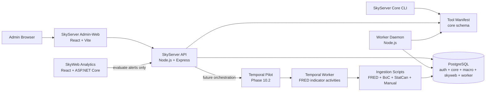

# SkyServer

SkyServer is the private **Node.js / Express / PostgreSQL control plane** for the Sky ecosystem. It owns operational administration, ingestion, repository tooling, worker scheduling, script execution, alert evaluation, and future workflow orchestration.

SkyWeb Analytics is the public/member-facing analytics product. SkyServer stays behind the curtain as the trusted operational engine.

## Stack at a Glance

| Layer | Technology |
| --- | --- |
| API | Node.js, Express |
| Admin client | React, Vite, React Router, Bootstrap, Axios |
| Database | PostgreSQL |
| Data access | `pg`, SQL migrations/seeds, relational manifests |
| Auth | App-scoped login, hashed bearer sessions, RBAC permissions, audit events |
| Worker/control plane | Node worker daemon, scheduler/listener schema, tool execution logs |
| Data ingestion | FRED, Bank of Canada, Statistics Canada, manual CSV/spreadsheet pipelines |
| Repo automation | Dev commit workflow, repo map generation, lean repo zip generation |
| Product consumer | SkyWeb Analytics via public/member macro and alert APIs |

## What This Project Demonstrates

- **Operational control-plane architecture** for private admin workflows, tools, ingestion, scheduling, audit, and automation.
- **PostgreSQL-first system design** with separate `auth`, `core`, `macro`, `skyweb`, and `worker` schemas.
- **Permission-aware browser-triggered script execution** with risk levels, confirmation phrases, execution logs, output limits, and audit trails.
- **Reusable data-ingestion pipelines** for public macroeconomic sources with staging, normalization, incremental loading, and status inspection.
- **Worker-backed automation foundation** for scheduled tools, worker-visible manifests, schedule runs, node heartbeats, and listener staging.
- **Clean system boundary with SkyWeb**, where SkyServer owns ingestion/evaluation/control-plane work while SkyWeb owns analytics presentation and member workflows.
- **Repository automation discipline** through generated repo maps, generated lean handoff zips, and dev-commit tooling.

## Current Status

**Active status:** Phase 10.2 — Temporal FRED indicator workflow

SkyServer has completed the SkyWeb public-facing macro integration track. SkyWeb now has its post-cutover React + ASP.NET Core/C# analytics layer, while SkyServer remains the operational control plane for ingestion, automation, workers, repository tooling, and alert evaluation.

Phase 10 introduces a side-by-side **Temporal workflow orchestration** lane. The existing worker/tool infrastructure remains intact while the FRED workflow proves durable execution, retries, workflow history, and per-indicator ingestion visibility.

## Core Product Surfaces

| Surface | Purpose |
| --- | --- |
| Admin-Web Dashboard | Private command center for API/DB health, ingestion status, automation status, tools, sessions, scripts, and audits |
| Tools | Permission-filtered operational tool launcher with dynamic parameters and execution logging |
| Ingestion Status | Source health, indicator freshness, stale-data detection, run history, and per-indicator diagnostics |
| Automation | Scheduler/listener control surfaces for worker-backed tool execution and future event-driven automation |
| Access Control | User, role, permission, session, and password administration |
| Script Executions | Browser-triggered and worker-triggered execution history with stdout/stderr traceability |
| Audit Events | Authentication, authorization, and operational audit trail |
| SkyWeb APIs | Public/member macro, profile, preference, dashboard, alert, and alert-evaluation support for SkyWeb Analytics |

## Architecture



Current control flow:

```text
Admin-Web / Core CLI
  → SkyServer API / tool launcher
      → PostgreSQL auth + core + worker manifests
      → ingestion, repo, DB, git, and operational scripts
      → worker schedules and listener definitions
      → audit + script execution history

SkyWeb Analytics
  → SkyWeb.Api for analytics/member reads and writes
  → SkyServer API only for evaluate-now alert execution and future control-plane workflows
```

## Relationship to SkyWeb Analytics

SkyServer and SkyWeb now have a clean boundary:

| SkyServer owns | SkyWeb owns |
| --- | --- |
| Ingestion pipelines | Public/member analytics UI |
| Worker scheduling | Dashboards and saved views |
| Alert evaluation execution | Alert rules and Signal Center presentation |
| Admin-Web and RBAC administration | Account/profile/preferences UX |
| Script/tool execution | ECharts/D3 visualization layer |
| Repo map/zip/dev-commit utilities | Portfolio-ready product presentation |
| Future Temporal orchestration | Public/member API consumption |

SkyServer should not duplicate SkyWeb product surfaces. SkyWeb should not duplicate SkyServer administrative control surfaces.

## Local Development

Install dependencies from the repository root:

```bash
npm install
```

Run common development surfaces:

```bash
# SkyServer API
npm run api
```

```bash
# SkyServer Admin-Web
npm run web
```

```bash
# SkyServer worker daemon
npm run worker:dev
```

```bash
# SkyServer Core CLI
npm run core
```

Useful validation/build commands:

```bash
npm run lint
npm run format:check
npm run prepush
npm run db:health
npm run db:build
```

## Environment

Create a root `.env` file with PostgreSQL connection settings:

```env
PGHOST=localhost
PGPORT=5432
PGDATABASE=skyserver_dev
PGUSER=postgres
PGPASSWORD=your_password
```

Common optional variables:

```env
API_PORT=7171
AUTH_SESSION_MINUTES=30
AUTH_SESSION_HOURS=12
SKYSERVER_CORE_APP_CODE=SKYSERVER_CORE
SKYSERVER_CONFIG_PROFILE=DEV_LOCAL
TOOL_EXECUTION_TIMEOUT_MS=180000
TOOL_EXECUTION_MAX_OUTPUT_BYTES=250000
TOOL_EXECUTION_STALE_AFTER_MINUTES=15
TOOL_HIGH_RISK_CONFIRMATION_PHRASE=RUN HIGH RISK
SERVE_ADMIN_WEB=false
WORKER_SCHEDULER_ENABLED=true
WORKER_LISTENER_ENABLED=false
WORKER_NODE_NAME=
WORKER_HEARTBEAT_SECONDS=30
WORKER_POLL_INTERVAL_SECONDS=15
WORKER_TOOL_TIMEOUT_MS=180000
WORKER_TOOL_MAX_OUTPUT_BYTES=250000
WORKER_ALLOW_HIGH_RISK_TOOLS=false

# Temporal local development / Phase 10 pilot
TEMPORAL_ADDRESS=localhost:7233
TEMPORAL_NAMESPACE=default
TEMPORAL_TASK_QUEUE=skyserver-local
TEMPORAL_FRED_WORKFLOW_ID_PREFIX=skyserver-fred-ingestion
TEMPORAL_FRED_ACTIVITY_TIMEOUT_MS=1800000
```

Database, ingestion, API, worker, and tool execution scripts load `.env` from the SkyServer root so tools can be executed from different command prompt locations.

## Primary Local URLs

| Surface | URL |
| --- | --- |
| SkyServer API health | `http://localhost:7171/_health` |
| SkyServer DB health | `http://localhost:7171/_db/health` |
| SkyServer Admin-Web | `http://localhost:5173` |
| SkyWeb Analytics client | `http://localhost:5175` |
| SkyWeb.Api Swagger | `http://localhost:7280/swagger` |

## NPM Scripts

| Command | Description |
| --- | --- |
| `npm run start` | Starts the API server. |
| `npm run api` | Starts the API server with Nodemon. |
| `npm run web` | Starts the Admin-Web Vite development server. |
| `npm run web:build` | Builds the Admin-Web frontend. |
| `npm run web:preview` | Previews the built Admin-Web frontend. |
| `npm run worker` | Starts the worker daemon. |
| `npm run worker:dev` | Starts the worker daemon with Nodemon. |
| `npm run temporal:worker` | Starts the SkyServer Temporal worker. |
| `npm run temporal:worker:dev` | Starts the SkyServer Temporal worker with Nodemon. |
| `npm run temporal:health` | Checks connectivity to the configured Temporal service. |
| `npm run temporal:fred` | Starts the FRED ingestion workflow pilot and waits for the result. |
| `npm run daemon` | Starts the API daemon entry point with Nodemon. |
| `npm run core` | Starts the SkyServer Core CLI tool. |
| `npm run db:health` | Tests PostgreSQL connectivity. |
| `npm run db:build` | Rebuilds the configured PostgreSQL database from SQL files. |
| `npm run auth:create-admin` | Runs the first-admin/user creation script. |
| `npm run lint` | Runs ESLint checks. |
| `npm run format:check` | Verifies Prettier formatting. |
| `npm run prepush` | Runs lint and formatting checks before push. |

## Repository Layout

```text
SkyServer/
├── apps/
│   ├── admin-web/        # Private React/Vite Admin-Web frontend
│   ├── api/              # Node/Express API layer
│   └── worker/           # Background worker daemon, schedulers, listeners
├── packages/
│   ├── auth/             # Admin user creation and password helpers
│   ├── core/             # SkyServer Core CLI tool
│   ├── db/               # PostgreSQL connection and health utilities
│   ├── db_build/         # Ordered migrations, seeds, and build runner
│   ├── files/            # Repo map and repo zip utilities
│   ├── git/              # Dev commit, status, and merge scripts
│   ├── ingestion/        # FRED, BoC, StatCan, and manual ingestion pipelines
│   ├── skyweb/           # SkyWeb alert evaluation support scripts
│   ├── temporal/         # Temporal worker, workflows, activities, and pilot clients
│   └── shared/           # Shared constants, contracts, and validators
├── scripts/
│   ├── db/               # SQL schemas, tables, views, triggers, and functions
│   ├── node/             # Shared Node utilities
│   ├── powershell/       # PowerShell automation helpers
│   └── python/           # Reserved Python utility space
├── docs/
│   ├── SkyServer_RepoMap.md
│   └── SkyServer_Temporal_Workflow_Architecture_Plan.md
├── logs/                 # Runtime logs, excluded from generated handoff zips/maps
├── change.log            # Detailed phase history moved out of README
└── package.json
```

Generated handoff zips exclude dependency/build/runtime clutter such as `node_modules/`, `dist/`, `build/`, `bin/`, `obj/`, logs, temp folders, and image binaries by default so project exchange stays lean.

## API Families

| Family | Purpose |
| --- | --- |
| `/_health`, `/_db/health` | API and database health checks |
| `/api/auth/*` | Login, logout, current session, and permissions |
| `/api/tools/*` | Permission-filtered tool catalog and tool execution |
| `/api/admin/*` | Users, roles, permissions, sessions, settings, script executions, and audit events |
| `/api/macro/*` | Private macro summary, view, indicator, and series endpoints |
| `/api/public/macro/*` | Public macro endpoints consumed by SkyWeb during the transition path |
| `/api/ingestion/*` | Ingestion health, source status, recent runs, and indicator diagnostics |
| `/api/worker/*` | Worker health, tools, nodes, schedules, runs, listeners, and listener events |
| `/api/skyweb/*` | SkyWeb member/profile/preference/dashboard/alert support and alert evaluation |

## Data and Automation Layers

### PostgreSQL schemas

| Schema | Purpose |
| --- | --- |
| `auth` | Users, roles, permissions, sessions, login events, audit events, script execution logs |
| `core` | Applications, repositories, tool manifest, visibility channels, runtimes, parameters, risk levels |
| `macro` | Indicator registry, physical indicator tables, macro analysis views |
| `skyweb` | SkyWeb profiles, preferences, saved views, dashboards, alert rules, events, notifications |
| `worker` | Worker nodes, schedules, schedule runs, listeners, listener events |

### Ingestion sources

| Source | Loader |
| --- | --- |
| FRED | `packages/ingestion/src/loadFREDMacroData.js` |
| Bank of Canada | `packages/ingestion/src/loadBoCMacroData.js` |
| Statistics Canada | `packages/ingestion/src/loadStatCanMacroData.js` |
| Manual CSV/spreadsheet | `packages/ingestion/src/loadManualData.js` |

The ingestion pattern is intentionally idempotent: discover configured indicators, download source data, normalize rows, load staging, merge new data into target tables, log outcomes, and clean temporary files.

### Worker automation

The worker runtime under `apps/worker` is separate from the API process. It handles worker node registration, heartbeats, schedule polling, due-schedule claiming, recurring/one-time execution, queue/unqueue controls, schedule-run records, and worker-visible tool execution through the relational `core` manifest.

Listener support is staged: schema, API endpoints, and Admin-Web surfaces exist; runtime listener processors remain a future focused slice.

### Temporal orchestration pilot

Phase 10 adds a side-by-side Temporal lane for durable workflow execution. The FRED pilot now runs indicator-level activities from `fredIngestionWorkflow`, returning structured per-indicator success/failure results that can later be surfaced through SkyServer Core and Admin-Web.

Temporal development commands:

```bash
# Start local Temporal separately
temporal server start-dev
```

```bash
# Run the SkyServer Temporal worker
npm run temporal:worker:dev
```

```bash
# Check Temporal connectivity
npm run temporal:health
```

```bash
# Start the FRED ingestion workflow pilot for all active FRED indicators
npm run temporal:fred

# Start selected indicators only
npm run temporal:fred -- --indicators=GDP,UNRATE,DGS10 --concurrency=2
```

The existing worker daemon and scheduler/listener system remain active. Temporal is introduced only when a process needs durable workflow state, retries, history, or multi-step orchestration.

SkyServer Core/API now exposes a protected Temporal control-plane surface under `/api/temporal`:

```text
GET    /api/temporal/health
GET    /api/temporal/workflow-definitions
GET    /api/temporal/workflows
GET    /api/temporal/workflows/:workflowId
POST   /api/temporal/workflows/fred-ingestion/start
POST   /api/temporal/workflows/:workflowId/cancel
POST   /api/temporal/workflows/:workflowId/terminate
```

The browser/Admin-Web should call SkyServer API rather than Temporal directly, preserving the SkyServer auth/RBAC boundary and giving us a clean location for future audit and workflow-run persistence.

## Browser-Triggered Script Safety

SkyServer allows browser-triggered tool execution through Admin-Web, so guardrails are central:

- Bearer-token authentication and RBAC permission checks
- Tool-specific permissions and risk-level execution permissions
- Medium/high-risk confirmation flows and phrase confirmation
- Parameter validation, repository option validation, and path traversal safety
- Output byte limits, execution timeout handling, and active execution locks
- `STARTED` / `SUCCESS` / `FAILED` execution lifecycle logging
- Stale `STARTED` cleanup and audit events for attempts/results

Execution records are stored in `auth.script_execution_log`; captured stdout/stderr logs are written under `logs/script-executions/`.

## Documentation

| Asset | Purpose |
| --- | --- |
| [`change.log`](change.log) | Detailed phase history and implementation notes moved out of the README |
| [`docs/SkyServer_RepoMap.md`](docs/SkyServer_RepoMap.md) | Generated repository structure map |
| [`docs/SkyServer_Temporal_Workflow_Architecture_Plan.md`](docs/SkyServer_Temporal_Workflow_Architecture_Plan.md) | Temporal workflow architecture plan and future migration notes |
| [`docs/SkyServer_Temporal_Local_Setup.md`](docs/SkyServer_Temporal_Local_Setup.md) | Local Temporal development setup and command guide |
| [`docs/SkyServer_Temporal_FRED_Pilot.md`](docs/SkyServer_Temporal_FRED_Pilot.md) | FRED ingestion workflow pilot notes and validation checklist |
| [`docs/SkyServer_Temporal_Core_API.md`](docs/SkyServer_Temporal_Core_API.md) | Protected Temporal Core/API endpoints and workflow control-plane notes |
| [`docs/SkyServer_Temporal_Phase_10_Roadmap.md`](docs/SkyServer_Temporal_Phase_10_Roadmap.md) | Phase 10 Temporal rollout slices and migration rules |

## Roadmap

| Phase | Status | Objective |
| --- | --- | --- |
| Phase 1 | ✅ Complete | Install Node.js, initialize the application, and establish npm tooling |
| Phase 2 | ✅ Complete | ESLint, Prettier, Husky, and lint-staged automation |
| Phase 3 | ✅ Complete | PostgreSQL schema, indicator registry, migrations, seeds, and views |
| Phase 4 | ✅ Complete | FRED, BoC, StatCan, and manual ingestion pipelines |
| Phase 5 | ✅ Complete | SkyServer Core CLI tool with configurable script launcher model |
| Continuous | 🔄 Ongoing | Expand automation scripts for Git, files, database, ingestion, workers, and operational workflows |
| Phase 6 | ✅ Complete | Private Admin-Web with auth, RBAC, relational tool manifest, execution logging, audit trail, dynamic parameters, and safety UX |
| Phase 7 | ✅ Complete | Macro, ingestion status, admin-action APIs, Access Control, Ingestion Status, and Dashboard v2 |
| Phase 8 | ✅ Complete | Worker automation foundation with scheduler-driven tool execution, worker daemon, worker APIs, Automation Admin-Web pages, and listener foundation |
| Phase 9 | ✅ Complete | SkyWeb integration for public-facing macro dashboards, member preferences, saved views, dashboards, alert rules, Signal Center, and alert evaluation support |
| Phase 10 | 🔄 In progress | Temporal workflow orchestration foundation with durable FRED indicator-level ingestion beside the existing worker/tool stack |
| Phase 11 | 🔜 Planned | Ingestion resilience hardening: retry/backoff, resumable runs, richer source diagnostics, and durable workflow handoff |
| Phase 12 | 🔜 Planned | Data mart and analytics-ready PostgreSQL model refinement for public, admin, and BI consumers |
| Phase 13 | 🔜 Planned | Cloud warehouse / BI integration track for Snowflake-style models, snapshots, and scheduled reporting outputs |

## Design Philosophy

> “Automation should feel like intelligence — quiet, precise, and always one step ahead.”

Practical rules:

- Keep tools runnable from anywhere.
- Keep scripts config-driven where possible.
- Keep database builds deterministic.
- Keep ingestion idempotent.
- Keep browser-triggered script execution permission-aware and audited.
- Keep scheduled automation explicit, observable, and reversible.
- Keep the control-plane/product boundary clear between SkyServer and SkyWeb.
- Keep architecture modular before it becomes painful to change.

## Repository

- **GitHub:** https://github.com/PStar1980/SkyServer
- **Primary development branch:** `dev`
- **Main branch:** `main`
- **License:** ISC
