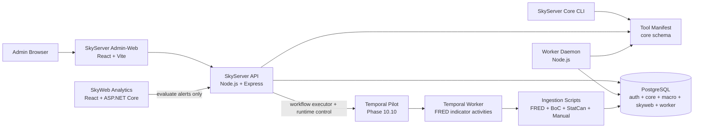

# SkyServer

SkyServer is the private **Node.js / Express / PostgreSQL control plane** for the Sky ecosystem. It owns operational administration, ingestion, repository tooling, worker scheduling, script execution, alert evaluation, and future workflow orchestration.

SkyWeb Analytics is the public/member-facing analytics product. SkyServer stays behind the curtain as the trusted operational engine.

## Stack at a Glance

| Layer | Technology |
| --- | --- |
| API | Node.js, Express |
| Admin client | React, Vite, React Router, Bootstrap, Axios |
| Database | PostgreSQL |
| Data access | `pg`, SQL migrations/seeds, relational manifests |
| Auth | App-scoped login, hashed bearer sessions, RBAC permissions, audit events |
| Worker/control plane | Node worker daemon, scheduler/listener schema, tool execution logs |
| Data ingestion | FRED, Bank of Canada, Statistics Canada, manual CSV/spreadsheet pipelines |
| Repo automation | Dev commit workflow, repo map generation, lean repo zip generation |
| Product consumer | SkyWeb Analytics via public/member macro and alert APIs |

## What This Project Demonstrates

- **Operational control-plane architecture** for private admin workflows, tools, ingestion, scheduling, audit, and automation.
- **PostgreSQL-first system design** with separate `auth`, `core`, `macro`, `skyweb`, and `worker` schemas.
- **Permission-aware browser-triggered script execution** with risk levels, confirmation phrases, execution logs, output limits, and audit trails.
- **Reusable data-ingestion pipelines** for public macroeconomic sources with staging, normalization, incremental loading, and status inspection.
- **Worker-backed automation foundation** for scheduled tools, worker-visible manifests, schedule runs, node heartbeats, and listener staging.
- **Clean system boundary with SkyWeb**, where SkyServer owns ingestion/evaluation/control-plane work while SkyWeb owns analytics presentation and member workflows.
- **Repository automation discipline** through generated repo maps, generated lean handoff zips, and dev-commit tooling.

## Current Status

**Active status:** Phase 10.32 — Temporal Diagnostics Polish

SkyServer has completed the SkyWeb public-facing macro integration track. SkyWeb now has its post-cutover React + ASP.NET Core/C# analytics layer, while SkyServer remains the operational control plane for ingestion, automation, workers, repository tooling, and alert evaluation.

Phase 10 introduces a side-by-side **Temporal workflow orchestration** lane. The existing worker/tool infrastructure remains intact while SkyServer workflows now compose tool primitives, execute through a Temporal-backed generic executor, expose domain-aware workflow history and Temporal diagnostics in Admin-Web, and include a visual Manage Workflows map with selected-node inspection, drag reorder of the sequential lane, condition branch edges, and run-aware status overlays in Workflow History.

## Core Product Surfaces

| Surface | Purpose |
| --- | --- |
| Admin-Web Dashboard | Private command center for API/DB health, ingestion status, automation status, tools, sessions, scripts, and audits |
| Tools | Permission-filtered operational tool launcher with dynamic parameters and Tools History logging |
| Workflows | SkyServer workflow create/start/history surfaces, with lower-level Temporal runtime pages preserved for diagnostics |
| Automation | Scheduler/listener control surfaces, including bridges to Temporal templates and SkyServer workflows |
| Ingestion Status | Source health, indicator freshness, stale-data detection, run history, and per-indicator diagnostics |
| Access Control | User, role, permission, session, password administration, and User History audit review |
| Tools History | Browser-triggered and worker-triggered tool execution history with stdout/stderr traceability |
| SkyWeb APIs | Public/member macro, profile, preference, dashboard, alert, and alert-evaluation support for SkyWeb Analytics |

## Architecture



Current control flow:

```text
Admin-Web / Core CLI
  → SkyServer API / tool launcher
      → PostgreSQL auth + core + worker manifests
      → ingestion, repo, DB, git, and operational scripts
      → worker schedules and listener definitions
      → audit + script execution history

SkyWeb Analytics
  → SkyWeb.Api for analytics/member reads and writes
  → SkyServer API only for evaluate-now alert execution and future control-plane workflows
```

## Relationship to SkyWeb Analytics

SkyServer and SkyWeb now have a clean boundary:

| SkyServer owns | SkyWeb owns |
| --- | --- |
| Ingestion pipelines | Public/member analytics UI |
| Worker scheduling | Dashboards and saved views |
| Alert evaluation execution | Alert rules and Signal Center presentation |
| Admin-Web and RBAC administration | Account/profile/preferences UX |
| Script/tool execution | ECharts/D3 visualization layer |
| Repo map/zip/dev-commit utilities | Portfolio-ready product presentation |
| Future Temporal orchestration | Public/member API consumption |

SkyServer should not duplicate SkyWeb product surfaces. SkyWeb should not duplicate SkyServer administrative control surfaces.

## Workflow Pages

Phase 10.10 shifts the Workflows menu to the higher-level SkyServer workflow model. Phase 10.10a adds first-class SkyServer workflow permissions and separates Admin-owned alert evaluation from public SkyWeb alert-write permissions. Open the main pages from:

```text
Workflows -> Create Workflow
Workflows -> Manage Workflows
Workflows -> Start Workflow
Workflows -> Workflow History
```

The workflow pages can:

- show approved SkyServer workflow definitions backed by `worker.workflow_definitions`;
- create and manage simple sequential workflow definitions from Admin-Web;
- compose TOOL, API_CALL, WORKFLOW, and TEMPORAL_WORKFLOW_TEMPLATE nodes;
- configure TOOL-node and Temporal-template parameters from stored manifest/template metadata;
- inspect the published node timeline for a workflow definition;
- start a workflow definition manually through `/api/workflows` using published node defaults;
- store workflow-level and node-level run records in PostgreSQL;
- list recent SkyServer workflow runs from Workflow History;
- inspect node outcomes for each workflow run.

Lower-level Temporal runtime diagnostics remain available at `/workflows/temporal/start` and `/workflows/temporal/history`.

Admin-Web calls `/api/temporal`; it never connects to Temporal directly. Legacy `/automation/temporal` and `/temporal` links redirect to `/workflows/history`.

Phase 10.5 adds database-backed workflow template metadata under the `worker` schema so Admin-Web can render approved workflow configuration from PostgreSQL while SkyServer Core/API still controls which workflow adapters may actually start.

Phase 10.6 adds a SkyServer-owned Temporal run-record index under `worker.temporal_workflow_run_records`. Admin-Web now merges Temporal visibility with this PostgreSQL summary layer, so operator-started workflow launches remain visible as audit records even if a local Temporal dev server is restarted without persistent history.

## Local Development

Install dependencies from the repository root:

```bash
npm install
```

Run common development surfaces:

```bash
# SkyServer API
npm run api
```

```bash
# SkyServer Admin-Web
npm run web
```

```bash
# SkyServer worker daemon
npm run worker:dev
```

```bash
# SkyServer Core CLI
npm run core
```

Useful validation/build commands:

```bash
npm run lint
npm run format:check
npm run prepush
npm run db:health
npm run db:build
```

## Environment

Create a root `.env` file with PostgreSQL connection settings:

```env
PGHOST=localhost
PGPORT=5432
PGDATABASE=skyserver_dev
PGUSER=postgres
PGPASSWORD=your_password
```

Common optional variables:

```env
API_PORT=7171
AUTH_SESSION_MINUTES=30
AUTH_SESSION_HOURS=12
SKYSERVER_CORE_APP_CODE=SKYSERVER_CORE
SKYSERVER_CONFIG_PROFILE=DEV_LOCAL
TOOL_EXECUTION_TIMEOUT_MS=180000
TOOL_EXECUTION_MAX_OUTPUT_BYTES=250000
TOOL_EXECUTION_STALE_AFTER_MINUTES=15
TOOL_HIGH_RISK_CONFIRMATION_PHRASE=RUN HIGH RISK
SERVE_ADMIN_WEB=false
WORKER_SCHEDULER_ENABLED=true
WORKER_LISTENER_ENABLED=false
WORKER_NODE_NAME=
WORKER_HEARTBEAT_SECONDS=30
WORKER_POLL_INTERVAL_SECONDS=15
WORKER_TOOL_TIMEOUT_MS=180000
WORKER_TOOL_MAX_OUTPUT_BYTES=250000
WORKER_ALLOW_HIGH_RISK_TOOLS=false

# Temporal local development / Phase 10 pilot
TEMPORAL_ADDRESS=localhost:7233
TEMPORAL_NAMESPACE=default
TEMPORAL_TASK_QUEUE=skyserver-local
TEMPORAL_FRED_WORKFLOW_ID_PREFIX=skyserver-fred-ingestion
TEMPORAL_FRED_ACTIVITY_TIMEOUT_MS=1800000
```

Database, ingestion, API, worker, and tool execution scripts load `.env` from the SkyServer root so tools can be executed from different command prompt locations.

## Primary Local URLs

| Surface | URL |
| --- | --- |
| SkyServer API health | `http://localhost:7171/_health` |
| SkyServer DB health | `http://localhost:7171/_db/health` |
| SkyServer Admin-Web | `http://localhost:5173` |
| SkyWeb Analytics client | `http://localhost:5175` |
| SkyWeb.Api Swagger | `http://localhost:7280/swagger` |

## NPM Scripts

| Command | Description |
| --- | --- |
| `npm run start` | Starts the API server. |
| `npm run api` | Starts the API server with Nodemon. |
| `npm run web` | Starts the Admin-Web Vite development server. |
| `npm run web:build` | Builds the Admin-Web frontend. |
| `npm run web:preview` | Previews the built Admin-Web frontend. |
| `npm run worker` | Starts the worker daemon. |
| `npm run worker:dev` | Starts the worker daemon with Nodemon. |
| `npm run temporal:worker` | Starts the SkyServer Temporal worker. |
| `npm run temporal:worker:dev` | Starts the SkyServer Temporal worker with Nodemon. |
| `npm run temporal:health` | Checks connectivity to the configured Temporal service. |
| `npm run temporal:fred` | Starts the FRED ingestion workflow pilot and waits for the result. |
| `npm run daemon` | Starts the API daemon entry point with Nodemon. |
| `npm run core` | Starts the SkyServer Core CLI tool. |
| `npm run db:health` | Tests PostgreSQL connectivity. |
| `npm run db:build` | Rebuilds the configured PostgreSQL database from SQL files. |
| `npm run auth:create-admin` | Runs the first-admin/user creation script. |
| `npm run lint` | Runs ESLint checks. |
| `npm run format:check` | Verifies Prettier formatting. |
| `npm run prepush` | Runs lint and formatting checks before push. |

## Repository Layout

```text
SkyServer/
├── apps/
│   ├── admin-web/        # Private React/Vite Admin-Web frontend
│   ├── api/              # Node/Express API layer
│   └── worker/           # Background worker daemon, schedulers, listeners
├── packages/
│   ├── auth/             # Admin user creation and password helpers
│   ├── core/             # SkyServer Core CLI tool
│   ├── db/               # PostgreSQL connection and health utilities
│   ├── db_build/         # Ordered migrations, seeds, and build runner
│   ├── files/            # Repo map and repo zip utilities
│   ├── git/              # Dev commit, status, and merge scripts
│   ├── ingestion/        # FRED, BoC, StatCan, and manual ingestion pipelines
│   ├── skyweb/           # SkyWeb alert evaluation support scripts
│   ├── temporal/         # Temporal worker, workflows, activities, and pilot clients
│   └── shared/           # Shared constants, contracts, and validators
├── scripts/
│   ├── db/               # SQL schemas, tables, views, triggers, and functions
│   ├── node/             # Shared Node utilities
│   ├── powershell/       # PowerShell automation helpers
│   └── python/           # Reserved Python utility space
├── docs/
│   ├── SkyServer_RepoMap.md
│   └── SkyServer_Temporal_Workflow_Architecture_Plan.md
├── logs/                 # Runtime logs, excluded from generated handoff zips/maps
├── change.log            # Detailed phase history moved out of README
└── package.json
```

Generated handoff zips exclude dependency/build/runtime clutter such as `node_modules/`, `dist/`, `build/`, `bin/`, `obj/`, logs, temp folders, and image binaries by default so project exchange stays lean.

## API Families

| Family | Purpose |
| --- | --- |
| `/_health`, `/_db/health` | API and database health checks |
| `/api/auth/*` | Login, logout, current session, and permissions |
| `/api/tools/*` | Permission-filtered tool catalog and tool execution |
| `/api/admin/*` | Users, roles, permissions, sessions, settings, script executions, and audit events |
| `/api/macro/*` | Private macro summary, view, indicator, and series endpoints |
| `/api/public/macro/*` | Public macro endpoints consumed by SkyWeb during the transition path |
| `/api/ingestion/*` | Ingestion health, source status, recent runs, and indicator diagnostics |
| `/api/worker/*` | Worker health, tools, nodes, schedules, runs, listeners, and listener events |
| `/api/skyweb/*` | SkyWeb member/profile/preference/dashboard/alert support and alert evaluation |

## Data and Automation Layers

### PostgreSQL schemas

| Schema | Purpose |
| --- | --- |
| `auth` | Users, roles, permissions, sessions, login events, audit events, script execution logs |
| `core` | Applications, repositories, tool manifest, visibility channels, runtimes, parameters, risk levels |
| `macro` | Indicator registry, physical indicator tables, macro analysis views |
| `skyweb` | SkyWeb profiles, preferences, saved views, dashboards, alert rules, events, notifications |
| `worker` | Worker nodes, schedules, schedule runs, listeners, listener events |

### Ingestion sources

| Source | Loader |
| --- | --- |
| FRED | `packages/ingestion/src/loadFREDMacroData.js` |
| Bank of Canada | `packages/ingestion/src/loadBoCMacroData.js` |
| Statistics Canada | `packages/ingestion/src/loadStatCanMacroData.js` |
| Manual CSV/spreadsheet | `packages/ingestion/src/loadManualData.js` |

The ingestion pattern is intentionally idempotent: discover configured indicators, download source data, normalize rows, load staging, merge new data into target tables, log outcomes, and clean temporary files.

### Worker automation

The worker runtime under `apps/worker` is separate from the API process. It handles worker node registration, heartbeats, schedule polling, due-schedule claiming, recurring/one-time execution, queue/unqueue controls, schedule-run records, and worker-visible tool execution through the relational `core` manifest.

Listener support is staged: schema, API endpoints, and Admin-Web surfaces exist; runtime listener processors remain a future focused slice.

### Temporal orchestration pilot

Phase 10 adds a side-by-side Temporal lane for durable workflow execution. The FRED pilot now runs indicator-level activities from `fredIngestionWorkflow`, returning structured per-indicator success/failure results that can later be surfaced through SkyServer Core and Admin-Web.

Temporal development commands:

```bash
# Start local Temporal separately
temporal server start-dev
```

```bash
# Run the SkyServer Temporal worker
npm run temporal:worker:dev
```

```bash
# Check Temporal connectivity
npm run temporal:health
```

```bash
# Start the FRED ingestion workflow pilot for all active FRED indicators
npm run temporal:fred

# Start selected indicators only
npm run temporal:fred -- --indicators=GDP,UNRATE,DGS10 --concurrency=2
```

The existing worker daemon and scheduler/listener system remain active. Temporal is introduced only when a process needs durable workflow state, retries, history, or multi-step orchestration.

SkyServer Core/API now exposes a protected Temporal control-plane surface under `/api/temporal`:

```text
GET    /api/temporal/health
GET    /api/temporal/workflow-definitions
GET    /api/temporal/workflows
GET    /api/temporal/workflows/:workflowId
POST   /api/temporal/workflows/fred-ingestion/start
POST   /api/temporal/workflows/:workflowId/cancel
POST   /api/temporal/workflows/:workflowId/terminate
```

The browser/Admin-Web should call SkyServer API rather than Temporal directly, preserving the SkyServer auth/RBAC boundary and giving us a clean location for future audit and workflow-run persistence.

Phase 10.7 also lets the existing SkyServer worker scheduler start approved Temporal workflow templates through the worker-visible `temporal_workflow_start` bridge tool. A scheduler run records that Temporal accepted the workflow start, while Temporal continues to own the durable workflow execution lifecycle.

## Browser-Triggered Script Safety

SkyServer allows browser-triggered tool execution through Admin-Web, so guardrails are central:

- Bearer-token authentication and RBAC permission checks
- Tool-specific permissions and risk-level execution permissions
- Medium/high-risk confirmation flows and phrase confirmation
- Parameter validation, repository option validation, and path traversal safety
- Output byte limits, execution timeout handling, and active execution locks
- `STARTED` / `SUCCESS` / `FAILED` execution lifecycle logging
- Stale `STARTED` cleanup and audit events for attempts/results

Execution records are stored in `auth.script_execution_log`; captured stdout/stderr logs are written under `logs/script-executions/`.

## Documentation

| Asset | Purpose |
| --- | --- |
| [`change.log`](change.log) | Detailed phase history and implementation notes moved out of the README |
| [`docs/SkyServer_RepoMap.md`](docs/SkyServer_RepoMap.md) | Generated repository structure map |
| [`docs/SkyServer_Temporal_Workflow_Architecture_Plan.md`](docs/SkyServer_Temporal_Workflow_Architecture_Plan.md) | Temporal workflow architecture plan and future migration notes |
| [`docs/SkyServer_Temporal_Local_Setup.md`](docs/SkyServer_Temporal_Local_Setup.md) | Local Temporal development setup and command guide |
| [`docs/SkyServer_Temporal_FRED_Pilot.md`](docs/SkyServer_Temporal_FRED_Pilot.md) | FRED ingestion workflow pilot notes and validation checklist |
| [`docs/SkyServer_Temporal_Core_API.md`](docs/SkyServer_Temporal_Core_API.md) | Protected Temporal Core/API endpoints and workflow control-plane notes |
| [`docs/SkyServer_Temporal_Phase_10_Roadmap.md`](docs/SkyServer_Temporal_Phase_10_Roadmap.md) | Phase 10 Temporal rollout slices and migration rules |

## Roadmap

| Phase | Status | Objective |
| --- | --- | --- |
| Phase 1 | ✅ Complete | Install Node.js, initialize the application, and establish npm tooling |
| Phase 2 | ✅ Complete | ESLint, Prettier, Husky, and lint-staged automation |
| Phase 3 | ✅ Complete | PostgreSQL schema, indicator registry, migrations, seeds, and views |
| Phase 4 | ✅ Complete | FRED, BoC, StatCan, and manual ingestion pipelines |
| Phase 5 | ✅ Complete | SkyServer Core CLI tool with configurable script launcher model |
| Continuous | 🔄 Ongoing | Expand automation scripts for Git, files, database, ingestion, workers, and operational workflows |
| Phase 6 | ✅ Complete | Private Admin-Web with auth, RBAC, relational tool manifest, execution logging, audit trail, dynamic parameters, and safety UX |
| Phase 7 | ✅ Complete | Macro, ingestion status, admin-action APIs, Access Control, Ingestion Status, and Dashboard v2 |
| Phase 8 | ✅ Complete | Worker automation foundation with scheduler-driven tool execution, worker daemon, worker APIs, Automation Admin-Web pages, and listener foundation |
| Phase 9 | ✅ Complete | SkyWeb integration for public-facing macro dashboards, member preferences, saved views, dashboards, alert rules, Signal Center, and alert evaluation support |
| Phase 10 | 🔄 In progress | Temporal workflow orchestration foundation with durable FRED indicator-level ingestion beside the existing worker/tool stack |
| Phase 11 | 🔜 Planned | Ingestion resilience hardening: retry/backoff, resumable runs, richer source diagnostics, and durable workflow handoff |
| Phase 12 | 🔜 Planned | Data mart and analytics-ready PostgreSQL model refinement for public, admin, and BI consumers |
| Phase 13 | 🔜 Planned | Cloud warehouse / BI integration track for Snowflake-style models, snapshots, and scheduled reporting outputs |

## Design Philosophy

> “Automation should feel like intelligence — quiet, precise, and always one step ahead.”

Practical rules:

- Keep tools runnable from anywhere.
- Keep scripts config-driven where possible.
- Keep database builds deterministic.
- Keep ingestion idempotent.
- Keep browser-triggered script execution permission-aware and audited.
- Keep scheduled automation explicit, observable, and reversible.
- Keep the control-plane/product boundary clear between SkyServer and SkyWeb.
- Keep architecture modular before it becomes painful to change.

## Repository

- **GitHub:** https://github.com/PStar1980/SkyServer
- **Primary development branch:** `dev`
- **Main branch:** `main`
- **License:** ISC

### Phase 10.9 — Tool Primitive Upgrade + Workflow Builder Foundation

Phase 10.9 keeps the tool/workflow hierarchy clean:

- Upgrades the existing FRED ingestion tool to support selected indicators and batched concurrency without requiring Temporal.
- Adds workflow-builder foundation tables under `worker.*` for definitions, versions, nodes, edges, run records, and node run records.
- Seeds a workflow node type palette: `TOOL`, `API_CALL`, `AGENT`, `WORKFLOW`, `TEMPORAL_WORKFLOW`, `CONDITION`, `WAIT`, `HUMAN_APPROVAL`, and `DATA_TRANSFORM`.
- Seeds a metadata-only `macro-refresh-pipeline` example that composes existing tool primitives.

Existing database patch commands:

```powershell
psql -h localhost -U postgres -d skyserver_dev -f packages/db_build/src/seeds/00037__fred_ingestion_tool_upgrade_seed.sql
psql -h localhost -U postgres -d skyserver_dev -f packages/db_build/src/migrations/00038__workflow_builder_foundation.sql
psql -h localhost -U postgres -d skyserver_dev -f packages/db_build/src/seeds/00039__workflow_builder_foundation_seed.sql
```


## Phase 10.10b — SkyWeb Alert Worker Seed Idempotency Hotfix

Phase 10.10b makes the SkyWeb alert worker seed self-contained. The `skyweb_alerts_evaluate` tool now gets its Admin-owned `SKYWEB_ALERT_EVALUATE` permission from `00030__skyweb_alert_worker_seed.sql` before the tool row references that permission. This keeps both existing-database patching and full `db_build` execution in the correct order.

Existing databases that hit the `tools_permission_code_fkey` error should rerun:

```powershell
psql -h localhost -U postgres -d skyserver_dev -f packages/db_build/src/seeds/00030__skyweb_alert_worker_seed.sql
psql -h localhost -U postgres -d skyserver_dev -f packages/db_build/src/seeds/00041__workflow_executor_permission_hotfix.sql
```

Then restart the API/Web and sign out/back in so the session token includes the updated permissions.

## Phase 10.10a — Workflow Executor Permission Hotfix

Phase 10.10a adds first-class SkyServer workflow permissions (`WORKFLOW_READ`, `WORKFLOW_START`, `WORKFLOW_CANCEL`) and updates the `macro-refresh-pipeline` definition to use the SkyServer workflow permission model instead of Temporal-specific permissions. It also assigns the SkyWeb alert evaluation worker tool to the Admin-owned `SKYWEB_ALERT_EVALUATE` operational permission so workflow tool nodes can run safely inside the SkyServer Admin app scope.

Existing databases should run:

```powershell
psql -h localhost -U postgres -d skyserver_dev -f packages/db_build/src/seeds/00041__workflow_executor_permission_hotfix.sql
```

Sign out and back in after running the seed so the session token includes the new permissions.

## Phase 10.10 — SkyServer Workflow Executor v1

Phase 10.10 makes the workflow-builder foundation runnable. SkyServer workflows now compose lower-level primitives, starting with `TOOL` nodes and `TEMPORAL_WORKFLOW` nodes. The seeded `macro-refresh-pipeline` can run the upgraded FRED ingestion tool and then evaluate SkyWeb alerts while writing workflow and node run records to PostgreSQL.

Existing DB update:

```powershell
psql -h localhost -U postgres -d skyserver_dev -f packages/db_build/src/seeds/00040__workflow_executor_v1_seed.sql
```

## Phase 10.11 — Temporal-backed SkyServer Workflow Executor

Phase 10.11 moves SkyServer workflow execution onto Temporal while keeping the workflow-builder hierarchy clean:

```text
SkyServer workflow definition
  -> Temporal skyserverWorkflowExecutorWorkflow
  -> node activities
  -> existing core.tools primitives / Temporal template nodes
  -> workflow + node run records in PostgreSQL
```

`POST /api/workflows/definitions/:workflowCode/start` now starts the Temporal-backed executor by default. The API returns `202 Accepted` after Temporal accepts the workflow; use **Workflows -> Workflow History** to follow node progress and completion.

The older inline executor remains available as a development fallback by sending:

```json
{
  "executorMode": "inline",
  "input": {
    "nodeInputs": {}
  }
}
```

No database migration or seed is required for Phase 10.11. Existing workflow run tables from Phase 10.9/10.10 are reused, and run records now store `temporal_workflow_id`, `temporal_run_id`, and `metadata.executor = skyserver_workflow_executor_temporal_v1`.

## Phase 10.12 — Workflow History Temporal Runtime Details

Phase 10.12 enriches `Workflows -> Workflow History` with Temporal runtime diagnostics for SkyServer workflow runs executed by the Temporal-backed executor.

Run detail now shows:

- Temporal workflow ID and run ID
- Temporal status, workflow type, namespace, and task queue
- Temporal history/event counts
- activity scheduled/completed/failed counts
- workflow task counts
- latest Temporal event preview
- direct link to Temporal UI

Set the Temporal UI base URL locally with:

```text
TEMPORAL_UI_BASE_URL=http://localhost:8233
```

No DB migration or seed is required for this phase.


## Phase 10.13 — Scheduler-to-SkyServer Workflow Bridge

Status: implemented.

Phase 10.13 lets SkyServer's existing Scheduler start high-level SkyServer workflow definitions through the Temporal-backed executor.

```text
Automation Scheduler
  -> worker-visible bridge tool: skyserver_workflow_start
  -> SkyServer workflow definition: macro-refresh-pipeline
  -> Temporal skyserverWorkflowExecutorWorkflow
  -> workflow node activities
  -> existing tool primitives
  -> Workflow History + Temporal diagnostics
```

This keeps the hierarchy clean:

- `core.tools` remain executable primitives.
- `worker.workflow_definitions` remain business-level workflow blueprints.
- `skyserverWorkflowExecutorWorkflow` provides durable Temporal-backed execution.
- `worker.schedules` can now trigger those business workflows on a timer.

Existing DB patch:

```powershell
psql -h localhost -U postgres -d skyserver_dev -f packages/db_build/src/seeds/00042__skyserver_workflow_schedule_bridge_seed.sql
```

After running the seed, the Scheduler worker-tool dropdown includes **Start SkyServer Workflow**. Blank/default input starts the selected active workflow with its configured node defaults. The Scheduler tool now exposes active SkyServer workflows through a select-backed workflow parameter.

## Phase 10.14 — Create Workflow UI v1

Status: implemented.

Phase 10.14 adds the first Admin-Web workflow creation surface. The new page lives under:

```text
Workflows -> Create Workflow
```

Builder v1 is intentionally narrow and safe:

- creates SkyServer workflow definitions in `worker.workflow_definitions`;
- creates version 1 in `worker.workflow_versions`;
- supports sequential `TOOL` nodes only;
- stores node default parameters in `worker.workflow_nodes.input_parameters`;
- creates sequential edges between adjacent nodes;
- can make the workflow active immediately so it appears under **Start Workflow**;
- uses `WORKFLOW_WRITE` for creation and keeps `WORKFLOW_START` / `WORKFLOW_READ` for execution and inspection.

Existing DB patch:

```powershell
psql -h localhost -U postgres -d skyserver_dev -f packages/db_build/src/seeds/00043__workflow_builder_permissions_seed.sql
```

After running the seed, sign out and back in so Admin-Web receives the `WORKFLOW_WRITE` permission. The builder is the first step toward the future visual designer; advanced node types such as `API_CALL`, `AGENT`, child `WORKFLOW`, `TEMPORAL_WORKFLOW`, `CONDITION`, `WAIT`, and `HUMAN_APPROVAL` remain in the node type palette but are not editable in this first UI pass.

## Phase 10.15 — Workflow Management + Edit v1

Status: implemented.

Phase 10.15 adds lifecycle management for SkyServer workflow definitions under:

```text
Workflows -> Manage Workflows
```

The management page supports:

- viewing all workflow definitions, including disabled or archived definitions;
- editing workflow metadata, status, enabled state, and Admin visibility;
- archiving a workflow without deleting its run history;
- cloning an existing workflow into a new definition;
- reviewing published/draft/retired version history;
- creating a new sequential TOOL-node version from the latest graph;
- saving the current sequential graph so it becomes the runnable workflow under **Start Workflow**.

The backend exposes the management operations through the workflow API:

```text
GET   /api/workflows/definitions/:workflowCode/manage
PATCH /api/workflows/definitions/:workflowCode
POST  /api/workflows/definitions/:workflowCode/archive
POST  /api/workflows/definitions/:workflowCode/clone
POST  /api/workflows/definitions/:workflowCode/versions
```

No new DB migration or seed is required for this phase. It relies on the existing `WORKFLOW_WRITE` permission introduced in Phase 10.14.


## Phase 10.17 — Workflow Lifecycle Simplification

Phase 10.17 simplifies workflow operations around a single active workflow graph from the user perspective. **Workflows -> Start Workflow** now uses an active-workflow dropdown and no longer accepts runtime JSON overrides. **Workflows -> Manage Workflows** now focuses on metadata, ACTIVE/INACTIVE status, current graph edits, clone, and delete. Inactive workflows are hidden from Start Workflow and blocked by the workflow executor.

Existing DB patch:

```powershell
psql -h localhost -U postgres -d skyserver_dev -f packages/db_build/src/migrations/00045__workflow_lifecycle_simplification.sql
psql -h localhost -U postgres -d skyserver_dev -f packages/db_build/src/seeds/00042__skyserver_workflow_schedule_bridge_seed.sql
```


## Phase 10.18 — Scheduler Target Split

Phase 10.18 cleans up the Scheduler target-selection experience. **Automation -> Scheduler** now separates the target type from the target object: choose `Tool` to schedule a worker-visible tool primitive, or choose `Workflow` to schedule an active SkyServer workflow definition. Workflow schedules continue to use the `skyserver_workflow_start` bridge internally, but the bridge is hidden behind a cleaner workflow picker.

No database migration or seed is required for this UI-focused phase.

### Temporal Phase 10.19 — API_CALL workflow nodes

SkyServer workflows now support `API_CALL` nodes alongside `TOOL` nodes. API calls are configured from Create/Manage Workflows and executed by the Temporal-backed SkyServer workflow executor as activities. Workflow History captures HTTP status, duration, response preview, and node-level success/failure metadata.

Apply the existing-DB seed after upgrading:

```powershell
psql -h localhost -U postgres -d skyserver_dev -f packages/db_build/src/seeds/00046__workflow_api_node_support_seed.sql
```

### Workflow API_CALL internal auth

API_CALL workflow nodes support an `authMode` value of `AUTO`, `NONE`, or `SKYSERVER_INTERNAL`. For protected local SkyServer API endpoints, use `AUTO` or set `authMode` to `SKYSERVER_INTERNAL` and configure `SKYSERVER_INTERNAL_API_TOKEN` with the same value for the API and Temporal worker processes. The internal token is injected by the activity at runtime and is not stored in workflow node headers.


## Phase 10.20 — Child SkyServer Workflow Nodes

Phase 10.20 adds `WORKFLOW` nodes to the supported SkyServer workflow builder palette. A parent SkyServer workflow can now compose another active SkyServer workflow as a child node. The parent execution still runs through the generic Temporal-backed executor, but child workflow nodes are started as Temporal child executions and the parent waits for completion.

Supported behavior:

```text
Parent SkyServer workflow
  -> WORKFLOW node
  -> child SkyServer workflow
  -> Temporal child execution
  -> parent node completion
```

Create/Manage Workflows now offer an **Add child workflow** action. Direct self-recursion and recursive workflow cycles are blocked so workflow composition remains safe.

Existing DB patch:

```powershell
psql -h localhost -U postgres -d skyserver_dev -f packages/db_build/src/seeds/00047__workflow_child_node_support_seed.sql
```

## Phase 10.21 — Parent/Child Workflow History Navigation

Phase 10.21 improves the operator experience for nested SkyServer workflows. Workflow History now exposes parent and child run relationships directly in SkyServer instead of requiring operators to infer hierarchy from raw JSON or Temporal event history.

New history behavior:

```text
Parent workflow run
  -> API_CALL / TOOL nodes
  -> WORKFLOW node
      -> child SkyServer workflow run
          -> child node runs
```

Run details now include parent links, child counts, clickable child workflow run links in node timelines, and a **Run Tree** panel that shows nested workflow execution as a business-level hierarchy. Temporal UI remains available as a deep diagnostics console, but SkyServer now owns the domain-aware parent/child navigation experience.

No database migration or seed is required for this phase; parent/child relationships are derived from existing workflow run input/metadata and child node outputs.


## Phase 10.22 — Temporal Workflow Template Nodes

Phase 10.22 adds `TEMPORAL_WORKFLOW` nodes to the supported SkyServer workflow builder palette. These nodes are for approved Temporal-native workflow templates, such as the existing FRED ingestion Temporal workflow, when a specialized durable subprocess should be called directly from a SkyServer workflow graph.

Supported behavior:

```text
SkyServer workflow
  -> TEMPORAL_WORKFLOW node
  -> approved Temporal workflow template
  -> Temporal child execution
  -> parent node completion
```

Create/Manage Workflows now offer an **Add Temporal template** action. Template targets come from `worker.temporal_workflow_definitions`, and template parameters are rendered from stored template metadata. At runtime, the generic `skyserverWorkflowExecutorWorkflow` starts the selected Temporal workflow template as a Temporal child execution, waits for completion, and stores the child Temporal workflow/run IDs plus result preview on the node output.

Existing DB patch:

```powershell
psql -h localhost -U postgres -d skyserver_dev -f packages/db_build/src/seeds/00048__workflow_temporal_template_node_support_seed.sql
```

### Phase 10.24 — Wait / delay workflow nodes

SkyServer workflows now support `WAIT` nodes as timer-style control nodes in the sequential graph.

- Admin-Web Create Workflow and Manage Workflows can add and configure Wait / Delay nodes.
- Wait nodes support duration + unit (`MILLISECONDS`, `SECONDS`, `MINUTES`, `HOURS`) and an optional history note.
- Temporal-backed workflow runs use a durable workflow timer, so the wait does not run as a blocking activity.
- Inline diagnostic execution has a local timeout fallback.
- Wait node output is recorded as `kind: wait_delay` for Workflow History summaries.


### Phase 10.25 — Human approval workflow nodes

SkyServer workflows now support `HUMAN_APPROVAL` nodes as durable operator checkpoints in the sequential graph.

- Admin-Web Create Workflow and Manage Workflows can add and configure Human Approval nodes.
- Approval requests are stored in `worker.workflow_approval_requests` and exposed through `worker.vw_workflow_approval_requests`.
- The Temporal-backed SkyServer workflow executor creates an approval request, waits for the `humanApprovalDecision` signal, then continues, stops successfully, or fails based on the node configuration.
- Admin-Web adds **Workflows -> Approvals** so authorized users can approve or reject pending requests with a decision note.
- Workflow History now includes approval summaries, approval status, decision note, and pending counts in run detail.

Existing DB patch:

```powershell
psql -h localhost -U postgres -d skyserver_dev -f packages/db_build/src/migrations/00051__workflow_human_approval_requests.sql
psql -h localhost -U postgres -d skyserver_dev -f packages/db_build/src/seeds/00052__workflow_human_approval_node_support_seed.sql
```


### Phase 10.26 — Visual workflow designer foundation

SkyServer Manage Workflows now includes a read-only visual workflow map above the existing sequential editor cards.

- The visual map renders the current editable graph as connected node blocks.
- Supported visual node types: `TOOL`, `API_CALL`, `WORKFLOW`, `TEMPORAL_WORKFLOW`, `CONDITION`, `WAIT`, and `HUMAN_APPROVAL`.
- Sequential edges are drawn between nodes so operators can quickly read the execution lane before saving or starting a workflow.
- Clicking a visual node scrolls to and highlights the matching editor card.
- The card editor remains the source of truth for configuration and save behavior; this phase does not change DB schema or execution semantics.

### Phase 10.27 — Visual node inspector

The Manage Workflows visual map now includes an inspector panel for the selected visual node.

- Clicking a visual node selects it and shows node-specific target, behavior, timeout, condition, wait, or approval details.
- Previous / Next / Jump to editor controls let operators move through the visual lane before editing the detailed card below.
- The inspector is read-only and does not change DB schema or runtime execution semantics.

### Phase 10.28 — Visual drag reorder

The Manage Workflows visual map can now reorder the existing sequential lane before save.

- Drag a visual node block onto another block to move it within the sequential graph.
- Use Move left / Move right inspector controls for button-driven reorder.
- Reordering updates the existing editor cards immediately, while **Save workflow graph** remains the explicit publish point.
- The phase does not add true branch edges or change workflow execution semantics; it only changes the saved sequential node order after the operator saves.

### Phase 10.29 — Condition branch edges v1

SkyServer condition nodes can now route execution to a later node instead of only stopping, failing, or continuing sequentially.

- Condition editors in Create Workflow and Manage Workflows now expose optional **When true, jump to** and **When false, jump to** target dropdowns.
- Branch targets are limited to later nodes in the current sequential lane so Branching v1 cannot create self-targets or backward loops.
- Saving a graph now persists conditional `worker.workflow_edges` alongside the normal sequential edges when branch targets are configured.
- The inline executor and Temporal-backed executor route to the selected branch target after a condition resolves.
- If no false branch target is configured, the existing false action behavior still applies: stop successfully, fail workflow, or continue anyway.
- Workflow node output records the branch label, selected target node key, and branch summary for history/debugging.
- The visual workflow map shows TRUE/FALSE branch badges and the inspector displays branch target details.
- No DB migration is required; this uses the existing `CONDITIONAL` edge type and condition input parameters.

### Phase 10.30 — Runtime status overlays

Workflow History now reuses the visual workflow map as a run-aware execution overlay.

- The selected workflow run renders as a visual graph with node-level runtime status badges.
- Completed, running, failed, pending approval, skipped/not-run, and terminated states are styled directly on the visual node blocks.
- The visual inspector now includes runtime details such as attempts, duration, approval status, branch decisions, output summaries, and error messages.
- Condition node runtime output highlights the branch decision and annotates the next edge with the branch label/target.
- The overlay is read-only and does not change workflow graph saving, DB schema, or executor behavior.


### Phase 10.31 — Run controls

Workflow History now exposes operational controls for selected workflow runs.

- Running or queued SkyServer workflow runs can be canceled from the run detail panel.
- Running or queued Temporal-backed workflow runs can be terminated with a cleanup reason.
- Failed, canceled, or terminated runs can be retried as a fresh Temporal-backed execution using the saved run input and current published workflow definition.
- Run control requests update the SkyServer workflow ledger, finalize active node-run rows, cancel pending approval requests, and preserve Temporal warnings when a dev-server restart has already removed the Temporal execution.
- No DB migration is required; the phase uses existing workflow run, node run, approval, and metadata columns.

### Phase 10.31.1 — Retry policy preservation hotfix

Phase 10.31.1 hardens the run-control era by making node retries visible and durable through workflow graph edits. Create Workflow and Manage Workflows now expose retry policy controls for executable nodes, preserve `retryPolicy` and `timeoutMs` on save, and keep manual retry attempt counters cumulative through retry lineage metadata. Seed `00053__workflow_retry_policy_hotfix.sql` restores macro ingestion retry/timeout defaults if earlier graph saves flattened them.


### Phase 10.32 — Temporal diagnostics polish

Workflow History now exposes a sharper Temporal diagnostics cockpit for selected Temporal-backed SkyServer workflow runs.

- Run detail includes stable Temporal UI links for workflow detail, history, and workflow search.
- Temporal workflow ID, run ID, workflow type, and service address are displayed as copyable diagnostic cards.
- Operators can copy ready-to-run Temporal CLI commands for describe, history, cancel, and terminate.
- Temporal history summaries now include issue, notable, and latest event tables with richer activity/signal/timer/child-workflow/failure descriptions.
- Event previews surface failure messages and retry state when Temporal returns them, reducing the need to inspect raw workflow JSON first.
- No DB migration or executor behavior change is required; this is an observability and operator-diagnostics improvement.

### Temporal Phase 10.33 — Workflow versioning guardrails

Manage Workflows now uses a safer draft-before-edit lifecycle. Published workflow versions are read-only, so graph changes are made in a draft version and only affect new executions after the draft is explicitly published. The UI shows version history, operational publish warnings, and a publish change note field. Server-side guardrails reject stale draft saves and preserve the existing runtime contract: each workflow run stays pinned to the version it started with.

### Temporal Phase 10.34 — Worker health dashboard / task queue status

SkyServer now includes a Temporal worker health cockpit for the workflow execution lane. The new `Workflows -> Worker Health` page checks Temporal reachability, configured namespace/task queue, active pollers, SkyServer worker heartbeats, workflow run pressure, pending approvals, and scheduled workflow starts.

Delivered scope:

- added `worker.temporal_worker_heartbeats` and `worker.vw_temporal_worker_heartbeats` through migration `00054__temporal_worker_heartbeats.sql`;
- updated the Temporal worker to emit a process heartbeat with worker identity, task queue, namespace, PID, hostname, Temporal address, and last-seen timestamp;
- added `GET /api/workflows/worker-health` for consolidated Temporal server, task queue, heartbeat, workflow run, approval, definition, and schedule health;
- added `Workflows -> Worker Health` in Admin-Web with status cards, operator hints, heartbeat list, poller list, run-pressure metrics, and local CLI command reminders;
- refreshed the main Dashboard with high-level workflow health, task queue status, and a Workflow control-plane panel;
- adjusted dashboard task-strip layout so the command tiles wrap cleanly as the control plane grows.

