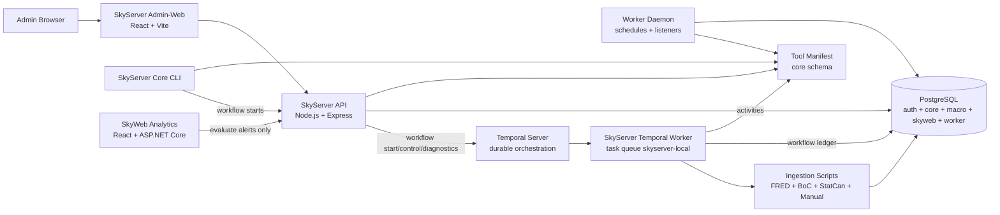

# SkyServer

SkyServer is the private **Node.js / Express / PostgreSQL control plane** for the Sky ecosystem. It owns operational administration, ingestion, repository tooling, worker scheduling, script execution, alert evaluation, and future workflow orchestration.

SkyWeb Analytics is the public/member-facing analytics product. SkyServer stays behind the curtain as the trusted operational engine.

## Stack at a Glance

| Layer | Technology |
| --- | --- |
| API | Node.js, Express |
| Admin client | React, Vite, React Router, Bootstrap, Axios |
| Database | PostgreSQL |
| Data access | `pg`, SQL migrations/seeds, relational manifests |
| Auth | App-scoped login, hashed bearer sessions, RBAC permissions, audit events |
| Worker/control plane | Node worker daemon, scheduler/listener schema, tool execution logs |
| Durable orchestration | Temporal worker, workflow executor, task queue diagnostics, worker heartbeats |
| Data ingestion | FRED, Bank of Canada, Statistics Canada, manual CSV/spreadsheet pipelines |
| Repo automation | Dev commit workflow, repo map generation, lean repo zip generation |
| Product consumer | SkyWeb Analytics via public/member macro and alert APIs |

## What This Project Demonstrates

- **Operational control-plane architecture** for private admin workflows, tools, ingestion, scheduling, audit, automation, and readiness checks.
- **PostgreSQL-first system design** with separate `auth`, `core`, `macro`, `skyweb`, and `worker` schemas.
- **Permission-aware browser-triggered script execution** with risk levels, confirmation phrases, execution logs, output limits, and audit trails.
- **Reusable data-ingestion pipelines** for public macroeconomic sources with staging, normalization, incremental loading, and status inspection.
- **Worker-backed automation foundation** for scheduled tools, worker-visible manifests, schedule runs, node heartbeats, listener staging, and worker health checks.
- **Temporal-backed durable workflow orchestration** with tool/API/workflow/template nodes, condition branches, waits, human approvals, retries, version guardrails, run controls, and diagnostics.
- **Clean system boundary with SkyWeb**, where SkyServer owns ingestion/evaluation/control-plane work while SkyWeb owns analytics presentation and member workflows.
- **Repository automation discipline** through generated repo maps, generated lean handoff zips, and dev-commit tooling.

## Current Status

**Active status:** Phase 11.2 underway — Temporal implementation is complete, production-readiness inspection is in place, and Admin-Web is moving through the Command Glass UI refresh with a redesigned command-center dashboard.

SkyServer has completed the SkyWeb public-facing macro integration track and now serves as the private operational control plane for ingestion, automation, repository tooling, workflow orchestration, diagnostics, approvals, scheduling, run control, readiness inspection, and Command Glass administration.

Phase 10 moved Temporal from a local FRED pilot into a full SkyServer workflow execution lane. SkyServer workflows can now compose tools, API calls, child workflows, Temporal-native templates, condition gates, waits, human approvals, retry policies, versioned drafts, visual graph editing, runtime overlays, diagnostics, worker health, and production-readiness checks while preserving the existing worker/tool infrastructure.

## Core Product Surfaces

| Surface | Purpose |
| --- | --- |
| Admin-Web Dashboard | Private Command Glass dashboard for API/DB health, ingestion, automation, workflows, task queue health, readiness, tools, sessions, scripts, and audits |
| Tools | Permission-filtered operational tool launcher with dynamic parameters and Tools History logging |
| Workflows | Versioned workflow builder, visual graph editor, start/history, approvals, run controls, Temporal diagnostics, and worker health |
| Automation | Scheduler/listener control surfaces, including bridges to Temporal templates and SkyServer workflows |
| Ingestion Status | Source health, indicator freshness, stale-data detection, run history, and per-indicator diagnostics |
| Access Control | User, role, permission, session, password administration, and User History audit review |
| Tools History | Browser-triggered and worker-triggered tool execution history with stdout/stderr traceability |
| SkyWeb APIs | Public/member macro, profile, preference, dashboard, alert, and alert-evaluation support for SkyWeb Analytics |

## Architecture



Current control flow:

```text
Admin-Web / Core CLI
  → SkyServer API / tool launcher / workflow launcher
      → PostgreSQL auth + core + worker manifests
      → ingestion, repo, DB, git, and operational scripts
      → worker schedules and listener definitions
      → Temporal-backed SkyServer workflow definitions and run ledgers
      → audit + script execution history

SkyWeb Analytics
  → SkyWeb.Api for analytics/member reads and writes
  → SkyServer API only for evaluate-now alert execution and future control-plane workflows
```

## Relationship to SkyWeb Analytics

SkyServer and SkyWeb now have a clean boundary:

| SkyServer owns | SkyWeb owns |
| --- | --- |
| Ingestion pipelines | Public/member analytics UI |
| Worker scheduling | Dashboards and saved views |
| Alert evaluation execution | Alert rules and Signal Center presentation |
| Admin-Web and RBAC administration | Account/profile/preferences UX |
| Script/tool execution | ECharts/D3 visualization layer |
| Repo map/zip/dev-commit utilities | Portfolio-ready product presentation |
| Future Temporal orchestration | Public/member API consumption |

SkyServer should not duplicate SkyWeb product surfaces. SkyWeb should not duplicate SkyServer administrative control surfaces.


## Admin-Web UI Direction

Phase 11 introduces the **Command Glass** UI direction for SkyServer Admin-Web. The design keeps the existing dark operational console identity while moving navigation into a permission-aware left sidebar with grouped sections for command, tools, workflows, automation, data, configuration, and access control. The top bar is now reserved for page context, status pills, and the authenticated operator menu.

The first UI slice is intentionally structural: it changes the app shell, sidebar, topbar, spacing, and responsive behavior without changing routes, API behavior, workflow execution, or database schema. The first polish pass tightened sidebar density, widened workflow workbench pages, refined dashboard command-tile spacing, and softened visual graph scrollbars. The second UI slice redesigns the Dashboard into a command-center interior with a control-plane pulse hero, permission-aware command links, priority workflow/task-queue/readiness metrics, and a stronger workflow control-plane panel. Later UI phases can polish workflow workbench pages and extract shared card/badge/page-header components.

## Workflow Pages

The Workflows menu is the high-level SkyServer workflow cockpit:

```text
Workflows -> Create Workflow
Workflows -> Manage Workflows
Workflows -> Start Workflow
Workflows -> Workflow History
Workflows -> Approvals
Workflows -> Worker Health
```

The workflow surfaces can:

- create, manage, clone, draft, validate, publish, and retire versioned workflow definitions backed by `worker.workflow_definitions`;
- compose `TOOL`, `API_CALL`, `WORKFLOW`, `TEMPORAL_WORKFLOW`, `CONDITION`, `WAIT`, and `HUMAN_APPROVAL` nodes;
- configure tool parameters, Temporal-template parameters, retry policy, node timeout, condition branches, wait timers, and approval role gates;
- render workflow graphs visually with node inspection, drag reorder, branch labels, and runtime status overlays;
- start active published workflows manually from Admin-Web, SkyServer Core CLI, Admin tool bridge, or schedules;
- store workflow-level and node-level run records in PostgreSQL while Temporal owns durable execution state;
- approve/reject human approval gates through Admin-Web signals back to Temporal;
- cancel, terminate, and retry workflow runs;
- inspect Temporal workflow IDs, run IDs, event summaries, diagnostic links, task queue status, and worker heartbeat health.

Lower-level Temporal runtime diagnostics remain available at `/workflows/temporal/start` and `/workflows/temporal/history` for direct Temporal-template visibility. Admin-Web calls SkyServer API; it never connects to Temporal directly. Legacy `/automation/temporal` and `/temporal` links redirect to the workflow cockpit.

## Local Development

Install dependencies from the repository root:

```bash
npm install
```

Run common development surfaces:

```bash
# SkyServer API
npm run api
```

```bash
# SkyServer Admin-Web
npm run web
```

```bash
# SkyServer worker daemon
npm run worker:dev
```

```bash
# SkyServer Core CLI
# Top menu: Run Tools / Run Workflows
npm run core
```

Useful validation/build commands:

```bash
npm run lint
npm run format:check
npm run prepush
npm run db:health
npm run db:build
```

## Environment

Create a root `.env` file with PostgreSQL connection settings:

```env
PGHOST=localhost
PGPORT=5432
PGDATABASE=skyserver_dev
PGUSER=postgres
PGPASSWORD=your_password
```

Common optional variables:

```env
API_PORT=7171
AUTH_SESSION_MINUTES=30
AUTH_SESSION_HOURS=12
SKYSERVER_CORE_APP_CODE=SKYSERVER_CORE
SKYSERVER_CONFIG_PROFILE=DEV_LOCAL
TOOL_EXECUTION_TIMEOUT_MS=180000
TOOL_EXECUTION_MAX_OUTPUT_BYTES=250000
TOOL_EXECUTION_STALE_AFTER_MINUTES=15
TOOL_HIGH_RISK_CONFIRMATION_PHRASE=RUN HIGH RISK
SERVE_ADMIN_WEB=false
WORKER_SCHEDULER_ENABLED=true
WORKER_LISTENER_ENABLED=false
WORKER_NODE_NAME=
WORKER_HEARTBEAT_SECONDS=30
WORKER_POLL_INTERVAL_SECONDS=15
WORKER_TOOL_TIMEOUT_MS=180000
WORKER_TOOL_MAX_OUTPUT_BYTES=250000
WORKER_ALLOW_HIGH_RISK_TOOLS=false

# Temporal local development
TEMPORAL_ADDRESS=localhost:7233
TEMPORAL_NAMESPACE=default
TEMPORAL_TASK_QUEUE=skyserver-local
TEMPORAL_UI_BASE_URL=http://localhost:8233
TEMPORAL_FRED_WORKFLOW_ID_PREFIX=skyserver-fred-ingestion
TEMPORAL_FRED_ACTIVITY_TIMEOUT_MS=1800000
SKYSERVER_INTERNAL_API_TOKEN=replace_with_a_local_secret
```

Database, ingestion, API, worker, and tool execution scripts load `.env` from the SkyServer root so tools can be executed from different command prompt locations.

## Primary Local URLs

| Surface | URL |
| --- | --- |
| SkyServer API health | `http://localhost:7171/_health` |
| SkyServer DB health | `http://localhost:7171/_db/health` |
| Temporal Web UI | `http://localhost:8233` |
| SkyServer Admin-Web | `http://localhost:5173` |
| SkyWeb Analytics client | `http://localhost:5175` |
| SkyWeb.Api Swagger | `http://localhost:7280/swagger` |

## NPM Scripts

| Command | Description |
| --- | --- |
| `npm run start` | Starts the API server. |
| `npm run api` | Starts the API server with Nodemon. |
| `npm run web` | Starts the Admin-Web Vite development server. |
| `npm run web:build` | Builds the Admin-Web frontend. |
| `npm run web:preview` | Previews the built Admin-Web frontend. |
| `npm run worker` | Starts the worker daemon. |
| `npm run worker:dev` | Starts the worker daemon with Nodemon. |
| `npm run temporal:worker` | Starts the SkyServer Temporal worker. |
| `npm run temporal:worker:dev` | Starts the SkyServer Temporal worker with Nodemon. |
| `npm run temporal:health` | Checks connectivity to the configured Temporal service. |
| `npm run temporal:fred` | Starts the FRED ingestion workflow pilot and waits for the result. |
| `npm run daemon` | Starts the API daemon entry point with Nodemon. |
| `npm run core` | Starts the SkyServer Core CLI with top-level Run Tools / Run Workflows menus. |
| `npm run db:health` | Tests PostgreSQL connectivity. |
| `npm run db:build` | Rebuilds the configured PostgreSQL database from SQL files. |
| `npm run auth:create-admin` | Runs the first-admin/user creation script. |
| `npm run lint` | Runs ESLint checks. |
| `npm run format:check` | Verifies Prettier formatting. |
| `npm run prepush` | Lightweight reminder; run `npm run validate` intentionally before phase handoff/release snapshots. |

## Repository Layout

```text
SkyServer/
├── apps/
│   ├── admin-web/        # Private React/Vite Admin-Web frontend
│   ├── api/              # Node/Express API layer
│   └── worker/           # Background worker daemon, schedulers, listeners
├── packages/
│   ├── auth/             # Admin user creation and password helpers
│   ├── core/             # SkyServer Core CLI tool
│   ├── db/               # PostgreSQL connection and health utilities
│   ├── db_build/         # Ordered migrations, seeds, and build runner
│   ├── files/            # Repo map and repo zip utilities
│   ├── git/              # Dev commit, status, and merge scripts
│   ├── ingestion/        # FRED, BoC, StatCan, and manual ingestion pipelines
│   ├── skyweb/           # SkyWeb alert evaluation support scripts
│   ├── temporal/         # Temporal worker, workflows, activities, and pilot clients
│   └── shared/           # Shared constants, contracts, and validators
├── scripts/
│   ├── db/               # SQL schemas, tables, views, triggers, and functions
│   ├── node/             # Shared Node utilities
│   ├── powershell/       # PowerShell automation helpers
│   └── python/           # Reserved Python utility space
├── docs/
│   ├── SkyServer_RepoMap.md
│   ├── SkyServer_Temporal_Local_Setup.md
│   └── SkyServer_Temporal_Workflow_Architecture_Plan.md
├── logs/                 # Runtime logs, excluded from generated handoff zips/maps
├── change.log            # Detailed phase history moved out of README
└── package.json
```

Generated handoff zips exclude dependency/build/runtime clutter such as `node_modules/`, `dist/`, `build/`, `bin/`, `obj/`, logs, temp folders, and image binaries by default so project exchange stays lean.

## API Families

| Family | Purpose |
| --- | --- |
| `/_health`, `/_db/health` | API and database health checks |
| `/api/auth/*` | Login, logout, current session, and permissions |
| `/api/tools/*` | Permission-filtered tool catalog and tool execution |
| `/api/admin/*` | Users, roles, permissions, sessions, settings, script executions, and audit events |
| `/api/macro/*` | Private macro summary, view, indicator, and series endpoints |
| `/api/public/macro/*` | Public macro endpoints consumed by SkyWeb during the transition path |
| `/api/ingestion/*` | Ingestion health, source status, recent runs, and indicator diagnostics |
| `/api/worker/*` | Worker health, tools, nodes, schedules, runs, listeners, and listener events |
| `/api/workflows/*` | Workflow definitions, drafts, starts, runs, approvals, run controls, worker health, and version guardrails |
| `/api/temporal/*` | Lower-level Temporal health, template starts, workflow listings, and diagnostics |
| `/api/admin/production-readiness` | Production readiness checks for environment, Temporal, DB, workflow, auth, and operations |
| `/api/skyweb/*` | SkyWeb member/profile/preference/dashboard/alert support and alert evaluation |

## Data and Automation Layers

### PostgreSQL schemas

| Schema | Purpose |
| --- | --- |
| `auth` | Users, roles, permissions, sessions, login events, audit events, script execution logs |
| `core` | Applications, repositories, tool manifest, visibility channels, runtimes, parameters, risk levels |
| `macro` | Indicator registry, physical indicator tables, macro analysis views |
| `skyweb` | SkyWeb profiles, preferences, saved views, dashboards, alert rules, events, notifications |
| `worker` | Worker nodes, schedules, schedule runs, listeners, workflow definitions/versions/runs, approvals, Temporal templates, and worker heartbeats |

### Ingestion sources

| Source | Loader |
| --- | --- |
| FRED | `packages/ingestion/src/loadFREDMacroData.js` |
| Bank of Canada | `packages/ingestion/src/loadBoCMacroData.js` |
| Statistics Canada | `packages/ingestion/src/loadStatCanMacroData.js` |
| Manual CSV/spreadsheet | `packages/ingestion/src/loadManualData.js` |

The ingestion pattern is intentionally idempotent: discover configured indicators, download source data, normalize rows, load staging, merge new data into target tables, log outcomes, and clean temporary files.

### Worker automation

The worker runtime under `apps/worker` is separate from the API process. It handles worker node registration, heartbeats, schedule polling, due-schedule claiming, recurring/one-time execution, queue/unqueue controls, schedule-run records, and worker-visible tool execution through the relational `core` manifest.

Listener support is staged: schema, API endpoints, and Admin-Web surfaces exist; runtime listener processors remain a future focused slice.

### Temporal workflow orchestration

Temporal is now the durable workflow execution lane for SkyServer business workflows. The existing worker daemon and scheduler/listener system remain active; Temporal is used when a process needs durable state, retries, timers, human approval signals, child workflow execution, history, or multi-step orchestration.

Local Temporal commands:

```bash
# Start local Temporal separately
temporal server start-dev

# Run the SkyServer Temporal worker
npm run temporal:worker:dev

# Check Temporal connectivity
npm run temporal:health

# Optional direct FRED workflow pilot runner
npm run temporal:fred
npm run temporal:fred -- --indicators=GDP,UNRATE,DGS10 --concurrency=2
```

Primary protected workflow API families include:

```text
/api/workflows/*              SkyServer workflow definitions, drafts, starts, runs, approvals, run controls, and worker health
/api/temporal/*               Lower-level Temporal diagnostics and template starts
/api/admin/production-readiness  Production-readiness checklist for environment, worker, DB, workflow, and auth safety
```

The browser/Admin-Web should call SkyServer API rather than Temporal directly, preserving the SkyServer auth/RBAC boundary and keeping audit, versioning, workflow-run persistence, and diagnostics in one control-plane layer.

## Browser-Triggered Script Safety

SkyServer allows browser-triggered tool execution through Admin-Web, so guardrails are central:

- Bearer-token authentication and RBAC permission checks
- Tool-specific permissions and risk-level execution permissions
- Medium/high-risk confirmation flows and phrase confirmation
- Parameter validation, repository option validation, and path traversal safety
- Output byte limits, execution timeout handling, and active execution locks
- `STARTED` / `SUCCESS` / `FAILED` execution lifecycle logging
- Stale `STARTED` cleanup and audit events for attempts/results

Execution records are stored in `auth.script_execution_log`; captured stdout/stderr logs are written under `logs/script-executions/`.

## Documentation

`README.md` is now a current-state overview. Detailed implementation history lives in `change.log`; generated structure lives in the repo map. Older phase-specific Temporal notes were removed after Phase 10 completion to avoid repeating the same implementation story in several places.

| Asset | Purpose |
| --- | --- |
| [`change.log`](change.log) | Canonical phase history, implementation notes, and documentation cleanup record |
| [`docs/SkyServer_RepoMap.md`](docs/SkyServer_RepoMap.md) | Generated repository structure map |
| [`docs/SkyServer_Temporal_Local_Setup.md`](docs/SkyServer_Temporal_Local_Setup.md) | Current local Temporal setup, commands, and troubleshooting |
| [`docs/SkyServer_Temporal_Workflow_Architecture_Plan.md`](docs/SkyServer_Temporal_Workflow_Architecture_Plan.md) | Historical architecture decision record for the Temporal migration |

Removed after Temporal implementation because their contents are now represented by `README.md`, `change.log`, the current UI, and the surviving architecture/setup references:

```text
docs/SkyServer_Temporal_Admin_Web_Console.md
docs/SkyServer_Temporal_Core_API.md
docs/SkyServer_Temporal_FRED_Pilot.md
docs/SkyServer_Temporal_Phase_10_Roadmap.md
docs/SkyServer_Temporal_Workflow_Templates.md
docs/SkyServer_Workflow_Builder_Foundation.md
```

## Roadmap

| Phase | Status | Objective |
| --- | --- | --- |
| Phase 1 | ✅ Complete | Install Node.js, initialize the application, and establish npm tooling |
| Phase 2 | ✅ Complete | ESLint, Prettier, Husky, and lint-staged automation |
| Phase 3 | ✅ Complete | PostgreSQL schema, indicator registry, migrations, seeds, and views |
| Phase 4 | ✅ Complete | FRED, BoC, StatCan, and manual ingestion pipelines |
| Phase 5 | ✅ Complete | SkyServer Core CLI tool with configurable script launcher model and direct active-workflow start menu |
| Phase 6 | ✅ Complete | Private Admin-Web with auth, RBAC, relational tool manifest, execution logging, audit trail, dynamic parameters, and safety UX |
| Phase 7 | ✅ Complete | Macro, ingestion status, admin-action APIs, Access Control, Ingestion Status, and Dashboard v2 |
| Phase 8 | ✅ Complete | Worker automation foundation with scheduler-driven tool execution, worker daemon, worker APIs, Automation Admin-Web pages, and listener foundation |
| Phase 9 | ✅ Complete | SkyWeb integration for public-facing macro dashboards, member preferences, saved views, dashboards, alert rules, Signal Center, and alert evaluation support |
| Phase 10 | ✅ Complete | Temporal-backed SkyServer workflow orchestration with visual editing, version guardrails, approvals, branching, waits, retries, run controls, diagnostics, worker health, and production-readiness inspection |
| Continuous | 🔄 Ongoing | Expand reusable operational tools, workflow templates, diagnostics, tests, and documentation |
| Phase 11 | 🔄 In progress | Command Glass Admin-Web refresh: left navigation shell, visual polish, command-center dashboard redesign, workflow workbench polish, and shared UI component cleanup |
| Phase 12 | 🔜 Planned | Ingestion resilience and workflow hardening: retry/backoff review, resumable runs, richer source diagnostics, and production deployment planning |
| Phase 13 | 🔜 Planned | Data mart and analytics-ready PostgreSQL model refinement for public, admin, and BI consumers |
| Phase 14 | 🔜 Planned | Cloud warehouse / BI integration track for Snowflake-style models, snapshots, and scheduled reporting outputs |

## Design Philosophy

> “Automation should feel like intelligence — quiet, precise, and always one step ahead.”

Practical rules:

- Keep tools runnable from anywhere.
- Keep scripts config-driven where possible.
- Keep database builds deterministic.
- Keep ingestion idempotent.
- Keep browser-triggered script execution permission-aware and audited.
- Keep scheduled automation explicit, observable, and reversible.
- Keep the control-plane/product boundary clear between SkyServer and SkyWeb.
- Keep architecture modular before it becomes painful to change.

## Repository

- **GitHub:** https://github.com/PStar1980/SkyServer
- **Primary development branch:** `dev`
- **Main branch:** `main`
- **License:** ISC
