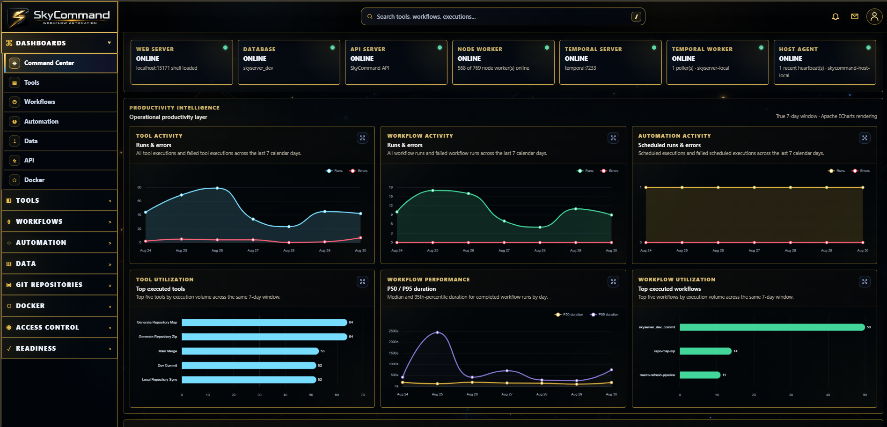
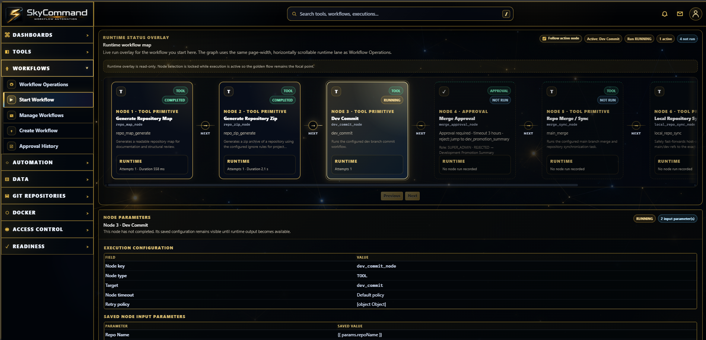
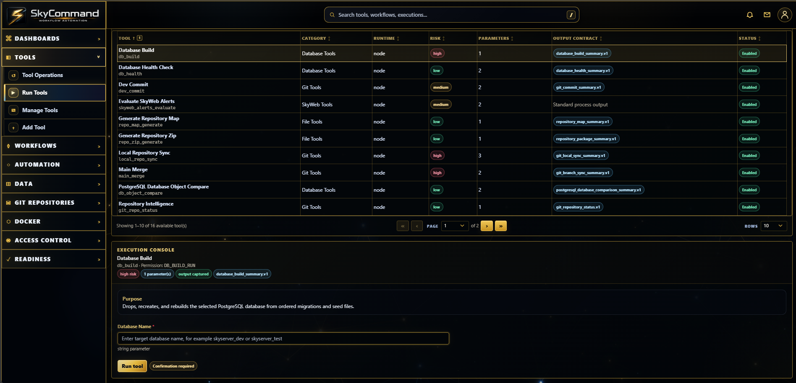
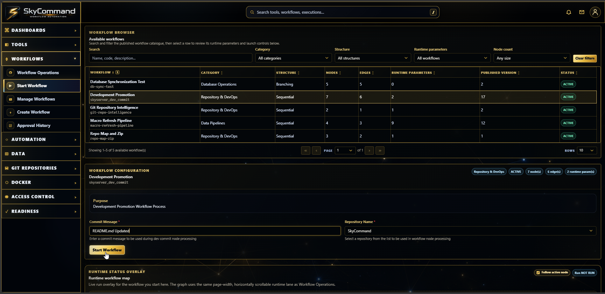
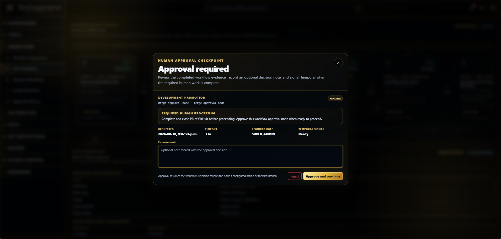
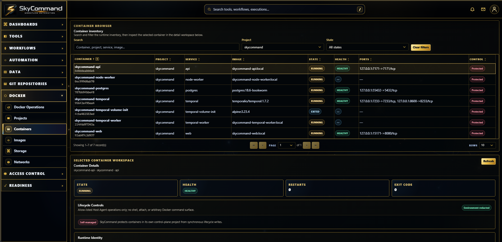
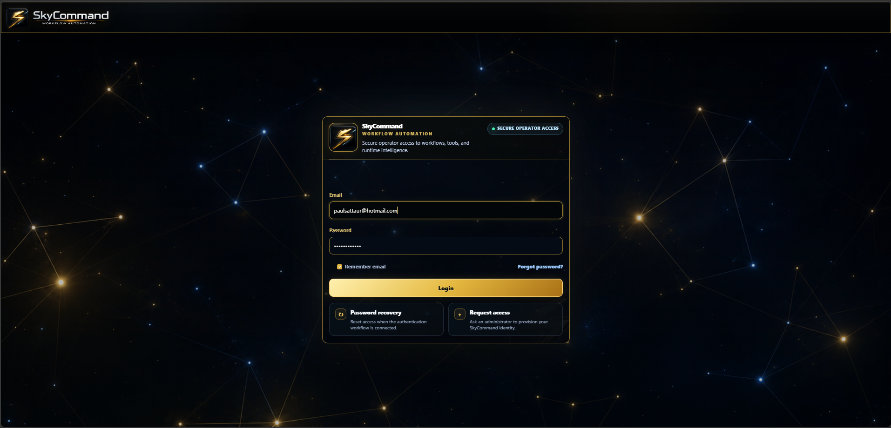
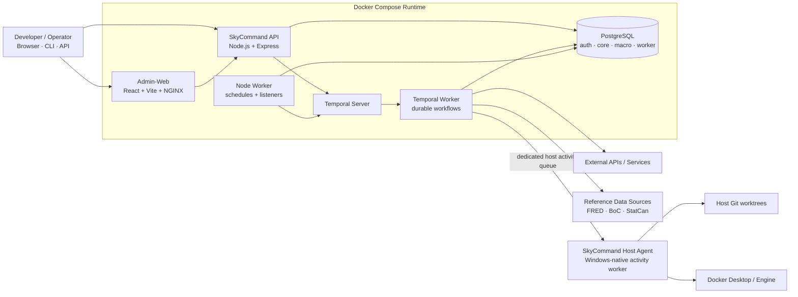

<div align="center">


<br>


<br>

<strong>Deterministic workflow automation with controlled execution, durable orchestration, and inspectable evidence.</strong>

<br>

Build developer workflows that are safe to run, retry, approve, observe, and extend.

<br>


<br>

<a href="https://skillicons.dev">
  
</a>

<br>


<br>

<a href="#-overview">Overview</a> ·
<a href="#-screenshots">Screenshots</a> ·
<a href="#-core-capabilities">Capabilities</a> ·
<a href="#-architecture">Architecture</a> ·
<a href="#-deterministic-execution-model">Execution Model</a> ·
<a href="#-structured-results-and-telemetry">Telemetry</a> ·
<a href="#-reference-workflows">Reference Workflows</a> ·
<a href="#-extending-skycommand">Extending</a> ·
<a href="#-quick-start">Quick Start</a> ·
<a href="#-roadmap">Roadmap</a>

</div>

---

## ⚙️ Overview

**SkyCommand** is a developer-focused workflow automation platform for building, running, and observing **controlled deterministic workflows**. It is designed for automation that must be durable, permission-aware, safe to retry, and easy to inspect after execution.

Temporal provides the durable orchestration layer, Node.js tools perform bounded side effects, PostgreSQL preserves runtime metadata and evidence, and the React Admin-Web provides a visual control surface for authoring, execution, approvals, recovery, and diagnostics.

SkyCommand can be used as a standalone workflow control plane: register tools, compose workflows, add runtime parameters and approval gates, schedule execution, inspect structured results, and trace exactly what happened when a workflow ran.

### Use SkyCommand when you need

- deterministic workflow control rather than opaque scripting chains;
- durable execution with retries, waits, approvals, and recovery;
- controlled tool launching with RBAC, risk levels, validation, and audit evidence;
- structured machine-readable outputs that can drive downstream workflow decisions;
- operational telemetry that shows both **what happened** and **where the time went**;
- guarded automation across local tools, Git repositories, data pipelines, and Docker infrastructure.

### Highlights

- **Durable deterministic workflows** — Temporal-backed retries, waits, approvals, branching, summaries, and recovery.
- **Controlled tool execution** — typed parameters, RBAC, risk controls, concurrency, timeouts, and execution history.
- **Structured execution evidence** — versioned ToolResult contracts, typed workflow bindings, focused output, and summaries.
- **Telemetry-first observability** — phase timing, workflow/tool diagnostics, runtime analytics, and execution history.
- **Guarded Git & Docker automation** — repository promotion, host-native synchronization, infrastructure operations, and durable audit evidence.
- **Extensible architecture** — script-based tools, reusable workflows, schedules, listeners, and optional Host Agent execution.

<div align="center">
  <a href="docs/images/readme/Dashboard.png">
    
  </a>
  <a href="docs/images/readme/Workflow_Running.png">
    
  </a>
  <br>
  <sub><strong>Command Center Dashboard</strong> · <strong>Workflow Runtime</strong></sub>
</div>

---

## 🖥️ Screenshots

A quick visual tour of the current SkyCommand experience. Click any thumbnail to open the full-size image.

<table>
  <tr>
    <td width="50%" align="center">
      <a href="docs/images/readme/Run_Tools.png">
        
      </a>
      <br /><sub><strong>Run Tools</strong></sub>
    </td>&nbsp;
    <td width="50%" align="center">
      <a href="docs/images/readme/Start_Workflow.png">
        
      </a>
      <br /><sub><strong>Start Workflow</strong></sub>
    </td>
  </tr>
  <tr>
    <td width="50%" align="center">
      <a href="docs/images/readme/Approval_Prompt.png">
        
      </a>
      <br /><sub><strong>Human Approval Prompt</strong></sub>
    </td>&nbsp;
    <td width="50%" align="center">
      <a href="docs/images/readme/Docker_Containers.png">
        
      </a>
      <br /><sub><strong>Docker Containers</strong></sub>
    </td>
  </tr>
  <tr>
    <td width="50%" align="center">
      <a href="docs/images/readme/Login_Page.png">
        
      </a>
      <br /><sub><strong>Login</strong></sub>
    </td>&nbsp;
    <td width="50%" align="center">
      <strong>Gold-and-black operational UI</strong><br />
      <sub>Deterministic workflow control, structured evidence, guarded automation, and infrastructure operations in one cohesive command surface.</sub>
    </td>
  </tr>
</table>

---

## 🧩 Core Capabilities

| Area                 | What SkyCommand provides                                                                                                                                                                              |
| -------------------- | ----------------------------------------------------------------------------------------------------------------------------------------------------------------------------------------------------- |
| **Workflows**        | Versioned definitions, visual graph editing, runtime parameters, deterministic control flow, conditions, waits, approvals, retries, nested execution, summaries, node output history, and run control |
| **Tools**            | Managed catalogue, dynamic parameters, permission-aware execution, structured contracts, telemetry, execution history, retry policy, concurrency, and timeout controls                                |
| **Automation**       | Scheduled and listener-driven execution, worker-backed dispatch, future-dated and recurring schedules, and workflow/tool automation                                                                   |
| **Observability**    | Command dashboards, workflow/tool statistics, focused node output, API evidence, worker state, readiness, notifications, and structured performance telemetry                                         |
| **Git repositories** | Repository catalogue, intelligence, map/ZIP artifacts, development promotion, watcher-safe synchronization, and guarded Host Agent Git operations                                                     |
| **Docker**           | Projects, containers, images, storage, networks, lifecycle operations, cleanup controls, live metrics, events, bounded logs, diagnostics, and application-stack observability                         |
| **Data**             | FRED, Bank of Canada, Statistics Canada, and manual ingestion with staging, freshness, quality policies, recovery, inserted/updated rows, revisions, and diagnostics                                  |
| **Access control**   | Authentication, users, roles, privileges, sessions, audit trails, and permission-separated operational controls                                                                                       |
| **Extensibility**    | Script-based tools, versioned ToolResult contracts, typed workflow bindings, reusable workflow templates, and optional host-native execution paths                                                    |

---

## 🏗️ Architecture



### Runtime boundary

SkyCommand uses a six-service Docker Compose runtime for **PostgreSQL, Admin-Web, API, Node worker, Temporal worker, and Temporal server**. The intentional exception is the **Host Agent**, which remains native to Windows so guarded operations can interact safely and efficiently with host-owned Git worktrees and Docker Desktop resources.

Docker provides the runtime boundary. Temporal makes workflow execution durable. PostgreSQL preserves operational evidence. The Host Agent owns narrowly scoped host-native actions.

---

## 🔁 Deterministic Execution Model

SkyCommand treats workflow control and external side effects as separate concerns.

```text
Workflow definition + runtime parameters
        ↓
Deterministic workflow control
        ↓
Tool / activity execution
        ↓
Structured ToolResult
        ↓
Conditions · approvals · retries · summaries
        ↓
Durable workflow evidence
```

Workflow definitions control ordering, branching, waits, retry behavior, approvals, and state transitions. External I/O is isolated inside tool/activity nodes, while Temporal preserves the durable event history required for replay, recovery, and long-running execution.

This does **not** mean external systems always return identical data. It means workflow control is explicit, versioned, inspectable, and reproducible from its recorded execution history rather than depending on hidden process state.

---

## 📊 Structured Results and Telemetry

SkyCommand separates **human-readable process logs** from **machine-readable workflow results**.

```text
Tool script
  ├─ stdout / stderr ───────────────→ Tool Operations
  └─ versioned ToolResult contract → Workflow node output
                                      → workflow context
                                      → conditions / summaries
                                      → Focused Node Output
```

Structured results can expose domain-specific evidence such as:

- phase-level duration and share of total runtime;
- source/workload timing and concurrency;
- cumulative worker-stage time;
- slowest indicators or operations;
- Host Agent dispatch timing;
- child-process envelope timing;
- inserted rows, updated rows, revisions, retries, and other domain outcomes.

The result contract keeps workflow integration generic while allowing each tool to describe the evidence that matters to its domain.

> **SkyCommand performance rule:** optimize only after telemetry shows where the time actually went.

---

## 🧪 Reference Workflows

SkyCommand ships with working examples that demonstrate controlled automation patterns rather than toy tasks.

### Development Promotion

```text
Repository Map
  → Repository ZIP
  → Dev Commit
  → Human Merge Approval
  → Remote Main/Development Sync
  → Local Repository Sync
  → Structured Summary
```

The promotion path keeps remote synchronization separate from host-local mutation and can prove:

```text
local main = local dev = origin/main = origin/dev = approved SHA
```

Key protections include clean-worktree checks, branch-lineage validation, compare-and-swap preflight, authoritative remote re-verification, repository locking, fast-forward-only local updates, and post-sync four-way verification.

### Macro Refresh

The macro refresh workflow runs FRED, Bank of Canada, and Statistics Canada ingestion as controlled tool nodes and produces a structured summary across all sources.

Ingestion results can report source/indicator outcomes, staging rows, new observations, inserted rows, **updated rows**, freshness, revisions, retries, and performance telemetry.

---

## 🐳 Docker Infrastructure Operations

SkyCommand can operate Docker as a guarded infrastructure provider rather than exposing raw daemon or shell access to the browser.

The Docker domain includes:

- Engine, Compose project, container, image, volume, and network inventory;
- permission-separated lifecycle and cleanup operations;
- bounded logs and native Docker event history;
- live CPU, memory, and I/O telemetry;
- application-stack status and failure-domain diagnostics;
- durable Docker Operations audit evidence;
- control-plane self-protection and explicit stale/error semantics;
- a provider/target seam intended to support additional infrastructure providers in the future.

---

## 🧰 Extending SkyCommand

The normal tool-authoring path is intentionally small:

```text
Tool script
  → tool registration / parameters
  → versioned ToolResult contract
  → workflow node
```

Most tools do **not** require Host Agent or Dockerfile changes. A standard tool can run inside the normal SkyCommand execution runtime as long as its dependencies are already available there.

Use a Host Agent execution path only when a tool genuinely needs native access to host-owned resources, such as guarded Windows Git worktrees or Docker Desktop operations. Host-native tools remain explicitly allow-listed rather than inheriting host authority automatically.

For detailed conventions, see the [Tool Authoring Guide](docs/SkyCommand_Tool_Authoring_Guide.md).

---

## 🛠️ Tech Stack

| Layer                  | Technology                                                             |
| ---------------------- | ---------------------------------------------------------------------- |
| Admin-Web              | React, Vite, React Router, Bootstrap, Axios, Apache ECharts, D3, NGINX |
| API                    | Node.js, Express                                                       |
| Database               | PostgreSQL, `pg`, SQL migrations/seeds                                 |
| Durable workflows      | Temporal                                                               |
| Scheduled automation   | Node worker daemon                                                     |
| Host-native operations | SkyCommand Host Agent / Temporal activity worker                       |
| Infrastructure         | Docker Desktop, Docker Compose                                         |
| Auth and security      | Bearer sessions, hashed session tokens, RBAC, audit events             |
| Engineering quality    | ESLint, Prettier, Husky, repository self-tests and validation scripts  |

---

## ⚡ Quick Start

> SkyCommand is currently optimized for local development with Docker Desktop. Host-native Git and Docker operations use the optional Windows Host Agent.

### 1. Clone the repository

```bash
git clone https://github.com/PStar1980/SkyCommand.git
cd SkyCommand
```

### 2. Install dependencies

```bash
npm install
```

### 3. Configure the environment

Create `.env` from `.env.example` and provide the required local database, Temporal, authentication, GitHub, and runtime settings.

### 4. Start the Docker runtime

```bash
npm run skycommand:docker:up
```

### 5. Optional: enable the Host Agent

For host-native Git/Docker operations, enable the bridge in `.env`:

```text
SKYCOMMAND_HOST_AGENT_ENABLED=true
```

Then install/start and verify the Windows Host Agent:

```powershell
npm run host-agent:auto-start:install
npm run host-agent:check
```

For first-time database setup, Docker cutover, Host Agent configuration, and detailed local setup, use the documentation links below rather than treating this README as an operations manual.

### Local URLs

| Surface         | URL                                |
| --------------- | ---------------------------------- |
| Admin-Web       | `http://localhost:15171`           |
| API health      | `http://localhost:7171/_health`    |
| Database health | `http://localhost:7171/_db/health` |
| Temporal Web UI | `http://localhost:8600`            |

### Common Commands

| Command                             | Purpose                                                                    |
| ----------------------------------- | -------------------------------------------------------------------------- |
| `npm run skycommand:docker:up`      | Build/start the complete six-container runtime                             |
| `npm run skycommand:docker:restart` | Rebuild and force-recreate the runtime while preserving persistent volumes |
| `npm run skycommand:docker:status`  | Show runtime container status                                              |
| `npm run skycommand:docker:logs`    | Follow logs across the SkyCommand runtime                                  |
| `npm run host-agent:check`          | Verify Docker/Temporal → Host Agent routing                                |
| `npm run validate`                  | Run repository validation                                                  |
| `npm run validate:syntax`           | Run JavaScript syntax validation                                           |
| `npm run validate:self-tests`       | Run repository self-tests                                                  |
| `npm run validate:release`          | Run validation plus the Admin-Web production build                         |

The complete command catalogue lives in [`package.json`](package.json).

---

## 🗂️ Repository Layout

```text
SkyCommand/
├─ apps/
│  ├─ admin-web/          # React operational console
│  └─ api/                # Express API
├─ packages/
│  ├─ host-agent/         # guarded Windows-native operations
│  ├─ temporal-worker/    # durable workflow execution
│  ├─ git/                # repository automation
│  └─ ...                 # shared domain/runtime packages
├─ scripts/               # validation, Docker, migration, and operational scripts
├─ sql/                   # PostgreSQL migrations, seeds, and database assets
├─ docs/                  # architecture, setup, authoring, and closure documentation
├─ compose.yaml           # six-service Docker runtime
└─ README.md
```

For the generated file-level structure, see [`docs/SkyCommand_RepoMap.md`](docs/SkyCommand_RepoMap.md).

---

## 📚 Documentation

The README is intentionally the **front door**, not the complete operations manual. Deeper implementation and setup material lives under `docs/`.

### Architecture and operations

- [`docs/SkyCommand_Docker_Infrastructure_Control_Plane.md`](docs/SkyCommand_Docker_Infrastructure_Control_Plane.md) — Docker control-plane architecture and guardrails
- [`docs/SkyCommand_Temporal_Workflow_Architecture_Plan.md`](docs/SkyCommand_Temporal_Workflow_Architecture_Plan.md) — Temporal workflow architecture
- [`docs/SkyCommand_Host_Agent_Local_Setup.md`](docs/SkyCommand_Host_Agent_Local_Setup.md) — Host Agent setup and runtime boundary
- [`docs/SkyCommand_API_Observability.md`](docs/SkyCommand_API_Observability.md) — API observability model

### Tool and data authoring

- [`docs/SkyCommand_Tool_Authoring_Guide.md`](docs/SkyCommand_Tool_Authoring_Guide.md) — standard tool-authoring contract
- [`docs/SkyCommand_AI_Tool_Build_Prompt.md`](docs/SkyCommand_AI_Tool_Build_Prompt.md) — AI-assisted tool construction guide
- [`docs/SkyCommand_Phase_14_Structured_Tool_Results.md`](docs/SkyCommand_Phase_14_Structured_Tool_Results.md) — structured result architecture
- [`docs/SkyCommand_Phase_15_Tool_Catalogue_Administration.md`](docs/SkyCommand_Phase_15_Tool_Catalogue_Administration.md) — managed tool onboarding
- [`docs/SkyCommand_Data_Domain_Onboarding_and_Operations_Guide.md`](docs/SkyCommand_Data_Domain_Onboarding_and_Operations_Guide.md) — portable data-domain onboarding and operations

### Local Docker setup

- [`docs/SkyCommand_Admin_Web_Docker_Local_Setup.md`](docs/SkyCommand_Admin_Web_Docker_Local_Setup.md)
- [`docs/SkyCommand_API_Docker_Local_Setup.md`](docs/SkyCommand_API_Docker_Local_Setup.md)
- [`docs/SkyCommand_PostgreSQL_Docker_Migration.md`](docs/SkyCommand_PostgreSQL_Docker_Migration.md)

### History and repository evidence

- [`change.log`](change.log) — detailed implementation history
- [`docs/SkyCommand_RepoMap.md`](docs/SkyCommand_RepoMap.md) — generated repository structure
- [`docs/SkyCommand_Phase_16_Closure_Report.md`](docs/SkyCommand_Phase_16_Closure_Report.md) — ingestion/data-contract closure evidence

---

## 🗺️ Roadmap

| Phase      | Status | Objective                                                                                                         |
| ---------- | ------ | ----------------------------------------------------------------------------------------------------------------- |
| Phase 1    | ✅     | Bootstrap the Node.js application and npm tooling.                                                                |
| Phase 2    | ✅     | Add ESLint, Prettier, Husky, and automated code-quality checks.                                                   |
| Phase 3    | ✅     | Establish PostgreSQL schemas, migrations, seeds, registry metadata, and core views.                               |
| Phase 4    | ✅     | Build FRED, Bank of Canada, Statistics Canada, and manual ingestion pipelines.                                    |
| Phase 5    | ✅     | Introduce SkyCommand Core for controlled tool and workflow launching.                                             |
| Phase 6    | ✅     | Add Admin-Web, authentication, RBAC, tool management, execution logging, and safety controls.                     |
| Phase 7    | ✅     | Add macro operations, ingestion monitoring, admin APIs, access control, and dashboards.                           |
| Phase 8    | ✅     | Establish scheduled tools, listeners, worker APIs, and health monitoring.                                         |
| Phase 9    | ✅     | Integrate analytics-facing macro, preference, dashboard, alert, and Signal Center support.                        |
| Phase 10   | ✅     | Add Temporal workflows with visual editing, approvals, branching, retries, and diagnostics.                       |
| Phase 11   | ✅     | Modernize Admin-Web into the branded SkyCommand shell and reusable UI system.                                     |
| Phase 12   | ✅     | Add ECharts/D3 operational analytics and full-screen chart inspection.                                            |
| Phase 13   | ✅     | Add live workflow telemetry, durable context/output, conditions, and summary nodes.                               |
| Phase 14   | ✅     | Establish structured tool results, output contracts, typed bindings, and repository evidence.                     |
| Phase 15   | ✅     | Add managed tool onboarding, contract validation, controlled execution, and recovery proof.                       |
| Phase 16   | ✅     | Build portable ingestion/data contracts with quality, freshness, recovery, and consumer contracts.                |
| Phase 17   | ✅     | Operate Docker infrastructure with guarded controls, deep observability, diagnostics, and durable audit evidence. |
| Continuous | 🔄     | Expand reusable tools, workflows, diagnostics, tests, documentation, and UI polish.                               |

The Phase 17 provider/target boundary intentionally leaves room for a future **Kubernetes** sibling provider; no Kubernetes runtime is currently implemented in SkyCommand.

---

## 🧭 Design Principles

> **Automation should feel like intelligence — quiet, precise, and always one step ahead.**

- Make workflow control deterministic, explicit, and inspectable.
- Prefer reusable contracts over one-off integrations.
- Keep operational mutations permission-aware, observable, and recoverable.
- Separate human-readable logs from machine-readable workflow results.
- Keep ingestion idempotent and database builds deterministic.
- Put host-owned work on the host and orchestration in the control plane.
- Preserve durable evidence for important execution decisions.
- Optimize only after telemetry shows where the time actually went.

---

## 📦 Repository

- **GitHub:** https://github.com/PStar1980/SkyCommand
- **Primary development branch:** `dev`
- **Main branch:** `main`
- **License:** ISC
