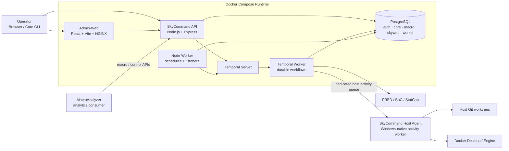

<p align="center">
  
</p>

<p align="center">
  
</p>

<p align="center">
  <strong>Workflow automation, operational control, and proof-driven observability.</strong>
</p>

<p align="center">
  Node.js · React · PostgreSQL · Temporal · Docker
</p>

---

## Overview

**SkyCommand** is the private operational control plane for the Sky ecosystem. It combines workflow orchestration, controlled tool execution, data ingestion, repository automation, infrastructure operations, access control, and deep observability inside one cohesive admin experience.

The project is built around a simple idea: automation should not merely run — it should produce **evidence**. Tool results, workflow outcomes, retries, approvals, performance telemetry, audit records, and infrastructure state are all designed to be inspectable after execution.

SkyCommand is the control plane. **MacroAnalyzer** owns analytical presentation, while **SkyData Studio** focuses on data-engineering workflows and post-ingestion transformation.

## Highlights

- **Durable workflow orchestration** with Temporal-backed execution, approvals, conditions, waits, retries, summaries, and node-level recovery.
- **Structured tool results** with versioned output contracts, typed workflow bindings, focused result views, and performance telemetry.
- **Controlled tool execution** with RBAC, risk levels, parameter validation, confirmation controls, timeouts, execution history, and audit evidence.
- **Macroeconomic ingestion** for FRED, Bank of Canada, and Statistics Canada with quality-aware loading, revision tracking, freshness, retries, and source-level diagnostics.
- **Repository automation** for repo intelligence, map/ZIP generation, development commits, remote synchronization, and guarded four-way local/remote Git synchronization.
- **Docker infrastructure control** with inventory, lifecycle operations, live telemetry, logs/events, diagnostics, self-protection, and durable Docker Operations history.
- **Host-native execution** through a narrowly scoped Windows Host Agent for operations that should not run against host-owned resources through Docker bind mounts.
- **Operational analytics** using Apache ECharts and D3 across workflows, tools, ingestion, API activity, workers, readiness, and Docker surfaces.

## Screenshots

A quick visual tour of the current SkyCommand experience. Click any thumbnail to open the full-size image.

<table>
  <tr>
    <td width="50%" align="center">
      <a href="docs/images/readme/Dashboard.png">
        
      </a>
      <br /><sub><strong>Command Center Dashboard</strong></sub>
    </td>
    <td width="50%" align="center">
      <a href="docs/images/readme/Start_Workflow.png">
        
      </a>
      <br /><sub><strong>Start Workflow</strong></sub>
    </td>
  </tr>
  <tr>
    <td width="50%" align="center">
      <a href="docs/images/readme/Workflow_Running.png">
        
      </a>
      <br /><sub><strong>Workflow Runtime</strong></sub>
    </td>
    <td width="50%" align="center">
      <a href="docs/images/readme/Run_Tools.png">
        
      </a>
      <br /><sub><strong>Run Tools</strong></sub>
    </td>
  </tr>
  <tr>
    <td width="50%" align="center">
      <a href="docs/images/readme/Docker_Containers.png">
        
      </a>
      <br /><sub><strong>Docker Containers</strong></sub>
    </td>
    <td width="50%" align="center">
      <a href="docs/images/readme/Approval_Prompt.png">
        
      </a>
      <br /><sub><strong>Human Approval Prompt</strong></sub>
    </td>
  </tr>
  <tr>
    <td width="50%" align="center">
      <a href="docs/images/readme/Login_Page.png">
        
      </a>
      <br /><sub><strong>Login</strong></sub>
    </td>
    <td width="50%" align="center">
      <strong>Gold-and-black operational UI</strong><br />
      <sub>Workflow orchestration, structured evidence, guarded automation, and infrastructure control in one cohesive command surface.</sub>
    </td>
  </tr>
</table>

## Core Capabilities

| Area | What SkyCommand provides |
| --- | --- |
| **Workflows** | Versioned workflow definitions, visual graph editing, runtime parameters, conditions, waits, approvals, retries, nested execution, summaries, node output history, and run control |
| **Tools** | Managed catalogue, dynamic parameters, permission-aware execution, structured contracts, execution history, telemetry, retry policy, concurrency, and timeout controls |
| **Automation** | Scheduler and listener control surfaces, worker-backed execution, future-dated and recurring schedules, and workflow/tool automation |
| **Data** | FRED, Bank of Canada, Statistics Canada, and manual ingestion with staging, freshness, quality policies, recovery, row revisions, and diagnostics |
| **Git repositories** | Repository catalogue, intelligence, repo map/ZIP artifacts, development promotion, watcher-safe synchronization, and guarded Host Agent Git operations |
| **Docker** | Projects, containers, images, storage, networks, lifecycle operations, cleanup controls, live metrics, events, bounded logs, diagnostics, and application-stack observability |
| **Access control** | Authentication, users, roles, privileges, sessions, audit trails, and permission-separated operational controls |
| **Observability** | Command dashboards, API request evidence, workflow/tool statistics, ingestion health, worker state, readiness, notifications, and structured performance telemetry |

## Architecture



### Runtime boundary

SkyCommand uses a six-service Docker Compose runtime for **PostgreSQL, Admin-Web, API, Node worker, Temporal worker, and Temporal server**. The intentional exception is the **Host Agent**, which remains native to Windows so guarded operations can interact safely and efficiently with host-owned Git worktrees and Docker Desktop resources.

Docker orchestrates. Temporal makes work durable. PostgreSQL preserves operational evidence. The Host Agent owns narrowly scoped host-native actions.

## Workflow Model

A typical repository promotion workflow demonstrates the orchestration model end to end:

```text
Repository Intelligence
  → Repository Map
  → Repository ZIP
  → Dev Commit
  → Human Merge Approval
  → Remote Main/Development Sync
  → Local Repository Sync
  → Structured Summary
```

The workflow keeps remote synchronization separate from host-local branch mutation. Under Docker, Git operations that touch the Windows repository are delegated to the Host Agent while the Temporal workflow remains the durable orchestration authority.

## Structured Results and Telemetry

SkyCommand separates **human-readable process logs** from **machine-readable workflow results**.

```text
Tool script
  ├─ stdout / stderr ───────────────→ Tool Operations
  └─ versioned ToolResult contract → Workflow node output
                                      → workflow context
                                      → conditions / summaries
                                      → Focused Node Output
```

Structured results can include domain-specific telemetry such as:

- phase-level duration and share of total runtime;
- source/workload timing;
- cumulative concurrent worker time;
- slowest indicators or operations;
- Host Agent dispatch timing;
- child-process envelope timing;
- rows inserted, rows updated, revisions, retries, and other domain evidence.

This pattern keeps workflow integration generic while allowing each tool to expose the evidence that matters to its domain.

## Development Promotion and Git Safety

Repository automation is designed around guarded, watcher-safe synchronization rather than blind branch mutation.

The promotion path can prove that:

```text
local main = local dev = origin/main = origin/dev = approved SHA
```

Key protections include clean-worktree checks, branch-lineage validation, compare-and-swap preflight, authoritative remote re-verification, fast-forward-only local updates, repository locking, and post-sync four-way verification.

## Docker Infrastructure Control Plane

Phase 17 expanded SkyCommand from a Dockerized application into a guarded Docker operations surface. The Docker domain provides:

- Engine, Compose project, container, image, volume, and network inventory;
- permission-separated lifecycle and cleanup operations;
- bounded logs and native Docker event history;
- live CPU, memory, and I/O telemetry;
- application-stack status and failure-domain diagnostics;
- durable Docker Operations audit evidence;
- control-plane self-protection and explicit stale/error semantics;
- a provider/target seam intended to support a future Kubernetes sibling provider.

Raw Docker daemon and shell access are never exposed directly to the browser.

## Macro Ingestion

SkyCommand currently supports:

| Source | Coverage |
| --- | --- |
| **FRED** | Configured U.S. macroeconomic indicators with concurrent ingestion and incremental loading |
| **Bank of Canada** | Configured Canadian series with source-specific normalization |
| **Statistics Canada** | Vector-based Canadian statistical series with retries and quality-aware loading |
| **Manual** | CSV/spreadsheet-oriented ingestion paths for controlled operational imports |

Ingestion output records source/indicator outcomes, staging rows, new observations, inserted rows, **updated rows**, freshness, revisions, retry evidence, and performance telemetry.

## Tech Stack

| Layer | Technology |
| --- | --- |
| Admin-Web | React, Vite, React Router, Bootstrap, Axios, Apache ECharts, D3, NGINX |
| API | Node.js, Express |
| Database | PostgreSQL, `pg`, SQL migrations/seeds |
| Durable workflows | Temporal |
| Scheduled automation | Node worker daemon |
| Host-native operations | SkyCommand Host Agent / Temporal activity worker |
| Infrastructure | Docker Desktop, Docker Compose |
| Auth and security | Bearer sessions, hashed session tokens, RBAC, audit events |
| Engineering quality | ESLint, Prettier, Husky, repository self-tests and validation scripts |

## Quick Start

> SkyCommand is currently optimized for local development with Docker Desktop. Host-native repository and Docker operations use the optional Windows Host Agent.

### 1. Install dependencies

```bash
npm install
```

### 2. Configure the environment

Create `.env` from `.env.example` and provide the required local database, Temporal, authentication, GitHub, and runtime settings.

### 3. Start the Docker runtime

```bash
npm run skycommand:docker:up
```

### 4. Optional: enable the Host Agent

For host-native Git/Docker operations, enable the bridge in `.env`:

```text
SKYCOMMAND_HOST_AGENT_ENABLED=true
```

Then install/start and verify the Windows Host Agent:

```powershell
npm run host-agent:auto-start:install
npm run host-agent:check
```

For first-time database setup, Docker cutover, Host Agent configuration, and detailed local setup, use the documentation links below rather than treating this README as an operations manual.

## Local URLs

| Surface | URL |
| --- | --- |
| Admin-Web | `http://localhost:15171` |
| API health | `http://localhost:7171/_health` |
| Database health | `http://localhost:7171/_db/health` |
| Temporal Web UI | `http://localhost:8600` |

## Common Commands

| Command | Purpose |
| --- | --- |
| `npm run skycommand:docker:up` | Build/start the complete six-container runtime |
| `npm run skycommand:docker:restart` | Rebuild and force-recreate the runtime while preserving persistent volumes |
| `npm run skycommand:docker:status` | Show runtime container status |
| `npm run skycommand:docker:logs` | Follow logs across the SkyCommand runtime |
| `npm run host-agent:check` | Verify Docker/Temporal → Host Agent routing |
| `npm run validate` | Run repository validation |
| `npm run validate:syntax` | Run JavaScript syntax validation |
| `npm run validate:self-tests` | Run repository self-tests |
| `npm run validate:release` | Run validation plus the Admin-Web production build |

The complete command catalogue lives in [`package.json`](package.json).

## Repository Layout

```text
SkyCommand/
├─ apps/
│  ├─ admin-web/          # React operational console
│  └─ api/                # Express API
├─ packages/
│  ├─ host-agent/         # guarded Windows-native operations
│  ├─ temporal-worker/    # durable workflow execution
│  ├─ git/                # repository automation
│  └─ ...                 # shared domain/runtime packages
├─ scripts/               # validation, Docker, migration, and operational scripts
├─ sql/                   # PostgreSQL migrations, seeds, and database assets
├─ docs/                  # architecture, setup, authoring, and closure documentation
├─ compose.yaml           # six-service Docker runtime
└─ README.md
```

For the generated file-level structure, see [`docs/SkyCommand_RepoMap.md`](docs/SkyCommand_RepoMap.md).

## Documentation

The README is intentionally the **front door**, not the complete operations manual. Deeper implementation and setup material lives under `docs/`.

### Architecture and operations

- [`docs/SkyCommand_Docker_Infrastructure_Control_Plane.md`](docs/SkyCommand_Docker_Infrastructure_Control_Plane.md) — Docker control-plane architecture and guardrails
- [`docs/SkyCommand_Temporal_Workflow_Architecture_Plan.md`](docs/SkyCommand_Temporal_Workflow_Architecture_Plan.md) — Temporal workflow architecture
- [`docs/SkyCommand_Host_Agent_Local_Setup.md`](docs/SkyCommand_Host_Agent_Local_Setup.md) — Host Agent setup and runtime boundary
- [`docs/SkyCommand_API_Observability.md`](docs/SkyCommand_API_Observability.md) — API observability model

### Tool and data authoring

- [`docs/SkyCommand_Tool_Authoring_Guide.md`](docs/SkyCommand_Tool_Authoring_Guide.md) — standard tool-authoring contract
- [`docs/SkyCommand_AI_Tool_Build_Prompt.md`](docs/SkyCommand_AI_Tool_Build_Prompt.md) — AI-assisted tool construction guide
- [`docs/SkyCommand_Phase_14_Structured_Tool_Results.md`](docs/SkyCommand_Phase_14_Structured_Tool_Results.md) — structured result architecture
- [`docs/SkyCommand_Phase_15_Tool_Catalogue_Administration.md`](docs/SkyCommand_Phase_15_Tool_Catalogue_Administration.md) — managed tool onboarding
- [`docs/SkyCommand_Data_Domain_Onboarding_and_Operations_Guide.md`](docs/SkyCommand_Data_Domain_Onboarding_and_Operations_Guide.md) — portable data-domain onboarding and operations

### Local Docker setup

- [`docs/SkyCommand_Admin_Web_Docker_Local_Setup.md`](docs/SkyCommand_Admin_Web_Docker_Local_Setup.md)
- [`docs/SkyCommand_API_Docker_Local_Setup.md`](docs/SkyCommand_API_Docker_Local_Setup.md)
- [`docs/SkyCommand_PostgreSQL_Docker_Migration.md`](docs/SkyCommand_PostgreSQL_Docker_Migration.md)

### History and repository evidence

- [`change.log`](change.log) — detailed implementation history
- [`docs/SkyCommand_RepoMap.md`](docs/SkyCommand_RepoMap.md) — generated repository structure
- [`docs/SkyCommand_Phase_16_Closure_Report.md`](docs/SkyCommand_Phase_16_Closure_Report.md) — ingestion/data-contract closure evidence

## Roadmap

| Phase | Status | Objective |
| --- | --- | --- |
| Phase 1 | ✅ Complete | Bootstrap the Node.js application and npm tooling. |
| Phase 2 | ✅ Complete | Add ESLint, Prettier, Husky, and automated code-quality checks. |
| Phase 3 | ✅ Complete | Establish PostgreSQL schemas, migrations, seeds, registry metadata, and core views. |
| Phase 4 | ✅ Complete | Build FRED, Bank of Canada, Statistics Canada, and manual ingestion pipelines. |
| Phase 5 | ✅ Complete | Introduce SkyCommand Core for controlled tool and workflow launching. |
| Phase 6 | ✅ Complete | Add Admin-Web, authentication, RBAC, tool management, execution logging, and safety controls. |
| Phase 7 | ✅ Complete | Add macro operations, ingestion monitoring, admin APIs, access control, and dashboards. |
| Phase 8 | ✅ Complete | Establish scheduled tools, listeners, worker APIs, and health monitoring. |
| Phase 9 | ✅ Complete | Integrate analytics-facing macro, preference, dashboard, alert, and Signal Center support. |
| Phase 10 | ✅ Complete | Add Temporal workflows with visual editing, approvals, branching, retries, and diagnostics. |
| Phase 11 | ✅ Complete | Modernize Admin-Web into the branded SkyCommand shell and reusable UI system. |
| Phase 12 | ✅ Complete | Add ECharts/D3 operational analytics and full-screen chart inspection. |
| Phase 13 | ✅ Complete | Add live workflow telemetry, durable context/output, conditions, and summary nodes. |
| Phase 14 | ✅ Complete | Establish structured tool results, output contracts, typed bindings, and repository evidence. |
| Phase 15 | ✅ Complete | Add managed tool onboarding, contract validation, controlled execution, and recovery proof. |
| Phase 16 | ✅ Complete | Build portable ingestion/data contracts with quality, freshness, recovery, and consumer contracts. |
| Phase 17 | ✅ Complete | Operate Docker infrastructure with guarded controls, deep observability, diagnostics, and durable audit evidence. |
| Continuous | 🔄 Ongoing | Expand reusable tools, workflows, diagnostics, tests, documentation, and UI polish. |

The Phase 17 provider/target boundary intentionally leaves room for a future **Kubernetes** sibling provider; no Kubernetes runtime is currently implemented in SkyCommand.

## Design Principles

> **Automation should feel like intelligence — quiet, precise, and always one step ahead.**

- Prefer reusable contracts over one-off integrations.
- Keep operational mutations permission-aware, observable, and reversible.
- Separate human logs from machine-readable workflow results.
- Keep ingestion idempotent and database builds deterministic.
- Put host-owned work on the host and orchestration in the control plane.
- Preserve durable evidence for important execution decisions.
- Optimize only after telemetry shows where the time actually went.

## Companion Projects

| Project | Role |
| --- | --- |
| **SkyCommand** | Workflow automation, operational control plane, orchestration, infrastructure, and evidence |
| **MacroAnalyzer** | Macroeconomic analytics, visualization, and financial/macro interpretation surfaces |
| **SkyData Studio** | Data engineering, ETL, modeling, lineage, and post-ingestion data workflows |

## Repository

- **GitHub:** https://github.com/PStar1980/SkyCommand
- **Primary development branch:** `dev`
- **Main branch:** `main`
- **License:** ISC
