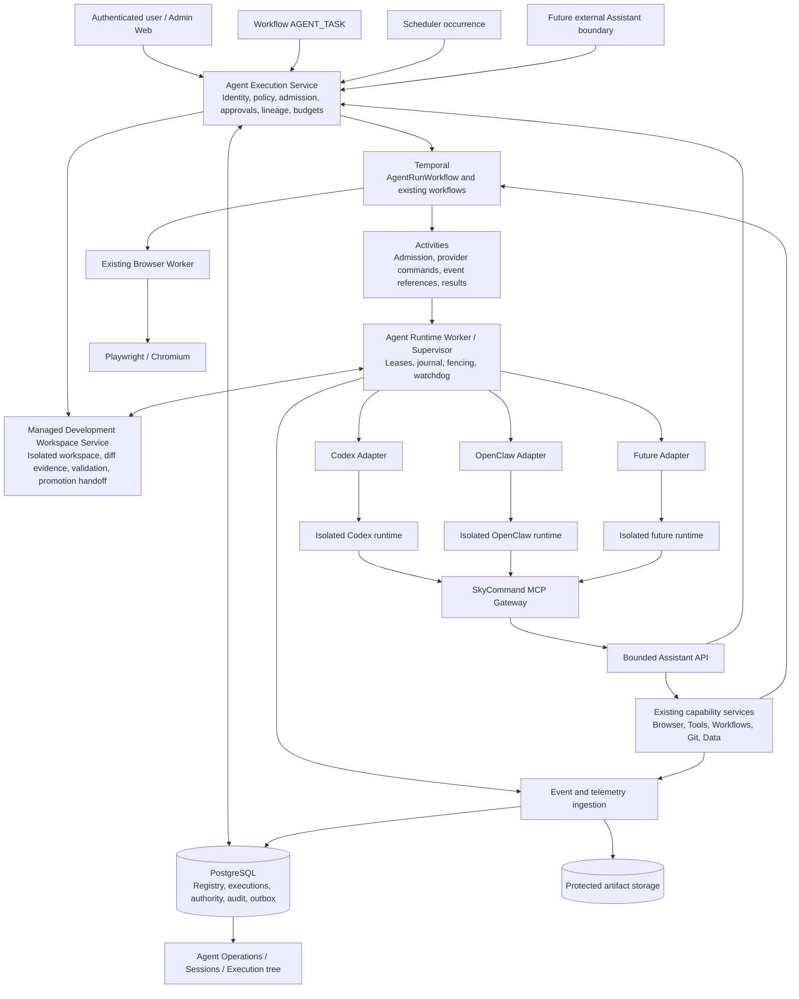

# SkyCommand Agentic AI Architecture & Phased Implementation Plan — v1.0 APPROVED

**Status:** Approved engineering blueprint and implementation baseline v1.0.  
**Baseline:** Supplied lightweight SkyCommand repository and complete architecture brief, reviewed September 13, 2026.  
**Review disposition:** Astra Ultra's architecture is accepted with one deliberate product amendment: **Phase 3.5 — Managed Development Workspace & Controlled Code Modification**. This keeps Astra's isolation/authority model while making the first release useful for real software-development work.  
**Release boundary:** Phases 0–8, including Phase 3.5, deliver controlled local v1. Phase 9 is a separately gated future external integration release. No application implementation was performed by the planning exercise itself.

## 1. Executive architecture

Build an **Agent Execution Service inside SkyCommand**, a provider-neutral domain package, a durable Temporal Agent Run workflow, and isolated runtime workers. Every entry surface submits the same execution request to the same authorization and admission logic. Runtime adapters translate protocol and telemetry; they do not decide business authority, allocate child agents, schedule autonomous jobs, or own execution history.

Codex is runtime #1. Prove the common contract with a deliberately different fake runtime before Codex, and with a constrained OpenClaw adapter before the v1 release. This catches provider coupling while architecture changes are still inexpensive. After the read-only Codex pilot is certified, Phase 3.5 adds a **Managed Development Workspace**: an isolated, SkyCommand-owned writable workspace in which an authorized development Agent may edit code and run approved validation commands without writing directly to the registered live checkout or controlling promotion.

Move authorization, isolation, telemetry, cancellation, idempotency, and human escalation ahead of usable agent execution. Delegation ships only with its limits. Preserve the proven **Agent → MCP → SkyCommand Assistant API → Temporal → Browser Worker → Playwright** path. Extend the policy/context passed through it; do not replace the browser platform.

### Proposed architecture diagram



The diagram has two related paths. Starting an agent goes through the Agent Execution Service. Executing a registered capability continues through its existing service, using the **same verified ExecutionContext and policy evaluator**. Do not force every existing capability implementation into an agent-specific service or rewrite all historical workflows.

### Non-negotiable invariants

1. Only SkyCommand admits and creates Agent Runs, including descendants requested through intermediate workflows.
2. A provider session is conversation state. A SkyCommand Run is an independently authorized, durable, auditable execution. Neither ID substitutes for the other.
3. Initiating user, initiating actor, immediate requesting actor, and executing Agent identity are distinct and immutable facts.
4. Effective authority never exceeds any applicable ceiling. Approval satisfies a condition inside a ceiling; it cannot silently enlarge that ceiling.
5. Provider sends are not presumed idempotent. An uncertain send is reconciled, not blindly repeated.
6. Cancellation immediately revokes future governed authority; physical provider stoppage is separately verified and reported.
7. Unknown usage, context, quota, cost, model, or reasoning values remain unknown. A progress message is not telemetry evidence.
8. An agent-accessible workflow cannot reset lineage, budgets, or authority by starting another agent indirectly.
9. Terminal execution results are immutable. Corrections and late telemetry are appended as evidence revisions.
10. Every phase retains working Tool, Workflow, Scheduler, Access Control, and Playwright behavior.
11. Writable development occurs only inside an isolated SkyCommand-managed workspace under an explicit development profile. An Agent never writes directly to the registered live checkout, and code modification never implies permission to merge, push, deploy, publish, or alter SkyCommand's control plane.

## 2. Repository baseline and verified gaps

Paths below are relative to the supplied archive's `SkyCommand/` root. They are implementation seams, not a claim that a production deployment matches the archive. The zip contains no usable Git commit identity; record its SHA-256 as the reviewed baseline: `7B8CE3C58E703C197A5A602690451513999B09CA913C49E3AA19B44E620AB803`. Brief SHA-256: `BAA9F58CB535976D3548B86745D4C61E8D0F80A6B9BD5B6F1BFC60CBA7DBA236`.

| Observed repository fact | Engineering consequence |
|---|---|
| Express API, React Admin-Web, PostgreSQL, CommonJS packages, Temporal dependencies `^1.18.1` in `package.json`. | Follow existing package/service conventions; pin and test the actual resolved SDK/runtime versions before integration. No framework rewrite. |
| `scripts/mcp/skycommandMcpGateway.js` and `docs/PLAYWRIGHT_PHASE11_5_MCP_GATEWAY.md` implement the local MCP-to-Assistant bridge. | Preserve its bounded tool namespace and execution path. Add a managed credential mode, retaining explicit legacy mode. |
| `apps/api/src/middleware/assistantIntegrationMiddleware.js:16–89` uses shared bearer configuration and a supplied agent label, with no authenticated human user. | A label is not a registered Agent principal. New managed runs require server-bound credentials and immutable attribution. |
| `apps/api/src/services/assistantIntegrationService.js:196–209` scopes legacy operation reads to Assistant origin. | Add resource-level Project/user/run authorization for status and artifact reads; origin alone does not isolate users. |
| `apps/api/src/services/browserAutomationExecutionService.js:502` is a shared execution seam, with permission, confirmation, and environment checks immediately following. | Pass verified execution context into this service and linked execution records; preserve existing browser dispatch. |
| `core.repositories` and `core.repository_paths` already identify repositories and profile-specific roots. | Add Project-to-repository relationships and host/workspace bindings, not a second repository registry. |
| `packages/temporal/src/workflows/skyCommandWorkflowExecutorWorkflow.js` already supports child workflows and node dispatch; activities live in `packages/temporal/src/activities/skyCommandWorkflowActivities.js`. | Add a versioned `AGENT_TASK` branch using real child workflows and shared admission. Preserve existing activity aliases/history. |
| `00039__workflow_builder_foundation_seed.sql` includes an `AGENT` palette placeholder. | Introduce explicit `AGENT_TASK`; inspect any existing `AGENT` records before migration. Never silently reinterpret old node payloads. |
| `apps/worker/src/jobs/scheduledPlaywrightRunner.js:49–76` and `scheduledSkyCommandWorkflowRunner.js:46–67` construct broad service permissions. The workflow bridge passes `user: null` at `112–120`. | Do not copy this identity/authority pattern into Agent scheduling. Existing privileged bridges must not become agent-accessible bypasses. |
| `apps/worker/src/schedulers/schedulePoller.js:115–193` claims due work without a durable unique occurrence identity and handles ONCE/INTERVAL. | Add atomic Agent occurrence claims, uniqueness and advancement. Preserve existing schedule kinds; do not imply cron support already exists. |
| `00051__workflow_human_approval_requests.sql` requires workflow/run-node foreign keys. Agent waits can exist without such a node. | Reuse decision rules and UI components through a new generalized interaction service/table; retain old approval records. |
| Existing approval handling signals before persisting resolution in `workflowExecutorService.js:7370–7377`. | New agent interactions need transactional decision persistence, compare-and-set, and outbox delivery. Do not duplicate this race. |
| `packages/tools/src/toolResultContract.js` already defines the structured ToolResult envelope. | Embed `agent_run_summary.v1` as an output type inside this envelope for workflow compatibility. |
| `packages/db_build/src/db_build.js:19` shares global ordering between migrations/seeds; its documented build command drops and recreates the target database. | Never use `db:build` as an in-place production upgrade. Establish a reviewed incremental upgrade path and applied-change ledger. |
| Existing `packages/host-agent` performs privileged host Git/Docker work and loads broad environment configuration. | The new Agent Runtime Worker is a different service and security principal. Do not confuse “Host Agent” with an AI Agent or run AI inside that privileged worker. |

The brief's successful Codex/browser run is accepted as supplied evidence. This review did not rerun it. The lightweight archive's referenced self-test suite and deployed database/worker configuration require verification against the full checkout in Phase 0; absence from this package is not proof the full repository lacks them.

## 3. Explicit domain model

### Domain entities and ownership

| Concept | Definition and required relationships |
|---|---|
| **Project** | SkyCommand security and context boundary: stable ID/code, memberships, repositories, instruction revisions, permitted Agents/environments, data classification, limits, workspace policy. Independent of an Agent, provider project, or Docker Compose project. |
| **Project Workspace Binding** | Project + registered host + environment/profile + repository set + workspace mode. Resolves existing repository-path records into a canonical, validated execution root. Runtime paths are never accepted from an ordinary start request. |
| **Agent Definition** | Registered Agent identity: stable ID/code/name and lifecycle. Has immutable revisions containing instructions, required adapter capabilities, runtime binding, default model/reasoning, authority profile, output contract, delegation targets and limits. A runtime switch creates a new revision. |
| **Agent Runtime Type** | Adapter family, e.g. `CODEX`, `OPENCLAW`, `CLAUDE_CODE`, `LOCAL`. Code strings in a registry, not provider-specific columns or a database enum requiring a migration for every provider. |
| **Runtime Installation** | Pinned executable/image, adapter version, host, verified protocol schema, capability manifest, isolation class and health. Disabling it prevents new execution and optionally revokes active leases. |
| **Runtime Execution Cell** | Isolated live process/container/VM and its private state. In v1, owned by one Agent Session with one leased Run at a time; identity includes principal, Project, Agent revision, account and security fingerprint. An Installation can host multiple independently isolated cells. |
| **Runtime Account Binding** | Credential reference, provider account/workspace identity, owner/trust domain and usage visibility policy. Multiple Agents can use one account, so account quota is not a per-Agent budget. |
| **Agent Session** | SkyCommand-owned conversation container bound to Project, principal, Agent revision, runtime/account, security fingerprint and provider conversation reference. Contains sequential Runs. Session creation, last activity, history access and archive status are independent of execution status. |
| **Provider Conversation Reference** | Opaque, namespaced provider thread/session ID plus installation/account and generation. May disappear, be archived or be unavailable. It is never an authorization credential or SkyCommand execution ID. |
| **Agent Run** | One admitted task and one business Temporal Workflow identity. Pins all effective inputs, definition/output revisions, initiating identity, root/parent lineage, deadline, budget and authority. Produces one final result. |
| **Agent Turn** | One instruction submission to the provider inside a Run. Initial turn plus bounded internal turns for approved input or child-result continuation. Stores actual provider turn ID when available. Does not mean a Temporal workflow task or arbitrary token chunk. |
| **Provider Operation / Attempt** | Journaled adapter command, transport attempts and outcome certainty. Retrying a read differs from resending a model instruction. A new substantive task retry is a new Run linked by `retry_of_run_id`. |
| **Root Execution Scope** | Cross-primitive envelope for an outer manual execution, workflow execution, or scheduled occurrence. Owns cumulative limits, deadline, revocation epoch and emergency stop. Includes linked capability executions and every agent descendant. |
| **Root Agent Run** | First Agent Run in an agent subtree. `root_agent_run_id` may differ between independent `AGENT_TASK` nodes in one outer workflow; both share `root_execution_id`. Root limits apply across all subtrees. |
| **Parent Agent Run** | Closest causal ancestor Agent Run, even when a workflow or capability lies between them. Root agents have `parent_agent_run_id = null`. `caused_by_execution_id` identifies the immediate workflow node/capability. |
| **Orchestration Owner** | Immediate durable execution responsible for starting/joining a Run: root dispatcher, outer Workflow node or parent Agent workflow. Persist owner kind/ID, Temporal namespace/Workflow ID and `dispatch_mode = ROOT_START | PARENT_CHILD`. It can differ from the closest Agent ancestor. |
| **Initiating User** | Human whose authority sponsors the root execution. Immutable ID and historical display snapshot. For a schedule this is the designated run-as user, not a claim that the user clicked at firing time. Future pure service executions may have no human, explicitly marked as such. |
| **Initiating Actor** | Actual root trigger actor: authenticated user, scheduler service or authorized external client. Retain client/service identity separately from human sponsorship. |
| **Requesting Actor** | Immediate caller of a command: user, workflow service, scheduler, external client, or authenticated parent Agent Run. A delegated Run keeps the root initiating user and records the parent as requester. |
| **Trigger Source** | Immediate source: `MANUAL`, `WORKFLOW`, `SCHEDULER`, `AGENT_DELEGATION`, `EXTERNAL_ASSISTANT`; structured source reference and immutable root trigger also retained. Existing browser `ASSISTANT` origin remains compatible. |
| **Authority Snapshot** | Immutable normalized capabilities, resource predicates, data boundaries, constraints, approval conditions, resolved policy revisions and delegation ceiling. Includes requested, configured and granted differences. |
| **Interaction Request** | Durable approval or user-input request with exact action/input digest, run/turn/operation, eligible responders, expiry, decision and delivery state. |
| **Capability Execution Link** | Run/tool-call to existing Browser/Tool/Workflow/Git execution record. Carries root scope, immediate caller and authority receipt without replacing that execution's native ID. |
| **Artifact / Result / Audit Event** | Artifacts are protected evidence with checksums and provenance. Results are validated immutable summaries. Audit records capture attributed decisions/actions, independently of optional provider telemetry. |

### Cardinality and identity rules

- Project has many Agents through explicit allow rules, and many repositories through join records. One repository can belong to several Projects with distinct authority.
- Session has many sequential Runs; Run has one or more Turns; Turn has zero or more reported provider items and tool calls. A Run denied before dispatch has no provider Turn.
- A Run belongs to exactly one Project, Session, Agent revision, Runtime Installation and Account Binding in v1. No mid-run provider failover. A replacement runtime requires a new Run and usually a new Session.
- Each Run has exactly one stable Temporal Workflow ID, `agent-run/<run-id>`. Store Temporal namespace and **all** Temporal execution Run IDs as separate execution segments. Temporal's Run ID is never called `agentRunId`.
- Every executable entity has a stable UUID and code/name snapshots where useful. Renaming/deactivating a user, Project or Agent never rewrites history. Soft deletion is the default for referenced entities.
- `root_execution_id`, `root_agent_run_id`, `parent_agent_run_id`, `requested_by_agent_run_id`, `caused_by_execution_id`, `retry_of_run_id`, and `session_id` answer different questions and must not be overloaded.

## 4. Architecture decisions

| ID | Decision | Rationale / rejected alternative |
|---|---|---|
| ADR-01 | SkyCommand is the sole authority and admission plane; adapters receive signed/opaque execution grants. | Runtime settings or prompts alone cannot establish user/resource authorization. |
| ADR-02 | One bounded Run per business Temporal Workflow; persistent Sessions span Runs. | A forever-running conversation workflow creates unbounded history and muddles follow-up authorization. |
| ADR-03 | Add `packages/agents`, an API service layer, and a dedicated Agent Runtime Worker/supervisor. | Separate protocol translation, deterministic orchestration, and untrusted model execution; reuse CommonJS conventions initially. |
| ADR-04 | Project references current repository registry and profile paths. **Phase 3.5 writable development uses isolated SkyCommand-managed workspaces with immutable baselines, bounded write scope, diff/validation evidence and explicit promotion handoff.** | Avoid metadata drift and simultaneous agents changing a user's live checkout while still enabling useful coding work. Direct live-checkout writes remain prohibited. |
| ADR-05 | Explicit capability/resource intersections, immutable snapshots, and live revocation checks at every effect boundary. | Startup-only authorization is stale during long-running work; profile labels do not enforce scope. |
| ADR-06 | PostgreSQL admission/command outbox plus deterministic Temporal IDs; no distributed transaction assumption. | DB commit, Temporal start and provider acceptance cannot be atomic. Each gap needs reconciliation. |
| ADR-07 | Provider-neutral required/optional adapter features with certification. | Lowest-common-denominator telemetry and provider conditionals in UI both create lock-in. |
| ADR-08 | Codex uses a pinned managed local app-server protocol adapter; OpenClaw uses an isolated pinned Gateway adapter. | Supports lifecycle/event integration without desktop UI automation. Unsupported protocol/containment fails certification rather than silently falling back. |
| ADR-09 | Provider-native spawning, messaging, cron, goals/autonomous continuation and runtime self-reconfiguration are disabled. | SkyCommand must see and govern every independent execution. |
| ADR-10 | Delegated Runs are real Temporal children started by the owning SkyCommand workflow after common admission. | Starting them as unrelated workflows from an HTTP handler breaks durable parent semantics. |
| ADR-11 | Root execution scope spans agents, workflows and capabilities; limits are transactional and cumulative. | Direct parent depth checks alone miss recursion through workflow tools and repeated fresh sessions. |
| ADR-12 | Unknown provider send outcome blocks resubmission until reconciled. | Exactly-once inference/tool effects cannot be promised over an unreliable external protocol. |
| ADR-13 | Generalized durable interaction records reuse existing approval semantics/UI. | Existing workflow-node foreign keys cannot represent standalone Agent waits cleanly. |
| ADR-14 | Metrics carry source, scope, freshness and availability; cost types remain separate. | Account quota, context occupancy and task token spend are different measurements. |
| ADR-15 | Keep current scheduler as trigger owner; Temporal owns each admitted execution. | Adding a second scheduler for the same schedule would create duplicate firing and migration complexity. |
| ADR-16 | v1 is controlled local, non-production operation; external execution ships separately. | The core must first prove isolation, multi-user history and durable cancellation under local conditions. |
| ADR-17 | Additive upgrades with deployment gates and preserved workflow versions. | A rollback must not destroy audit data, reinterpret old node definitions or strand live histories. |

## 5. Highest-risk issues and resolutions

| Risk | Resolution and release evidence |
|---|---|
| Shared Assistant bearer token plus spoofable identity becomes a multi-user confused deputy. | Managed run credentials derive identity from DB; strip caller identity headers; enforce Project/object access on discovery, execution, status, events and downloads. Cross-user negative tests are a first-launch gate. |
| Runtime can bypass MCP through filesystem, shell, network, inherited credentials or plugins. | Isolate runtime from API/worker secrets and control sockets; read-only code snapshot by default; deny native tools/egress outside a certified profile. Test hostile prompts and direct OS/network access. Unisolatable runtime remains disabled. |
| Writable coding corrupts the live repository or turns the Agent into an uncontrolled host shell. | Phase 3.5 creates a disposable/isolated workspace from a pinned repository baseline. A certified `DEVELOPMENT_WORKSPACE` runtime profile may edit only that workspace and execute approved validation commands inside the isolated cell. SkyCommand captures the diff, changed-file manifest, command/test receipts and artifact hashes. Merge, push, deployment, publication and live-checkout mutation remain separately governed and disabled by default. |
| Provider accepted a turn but SkyCommand lost the response. | Durable operation journal and reconciling state; reuse provider ID only when evidence identifies the same operation. Otherwise `RECOVERY_REQUIRED`, revoke capability grant and request human resolution. Never issue a speculative duplicate. |
| Revoked user/session still contains privileged information. | Resume requires both execution authority and entitlement to the entire retained context. Changed principal/security envelope starts a fresh conversation with approved context; permission narrowing cannot erase model history. |
| Automatic OpenClaw/provider restart replays canceled work. | Supervisor fencing, local kill/quarantine, live run grant checks and restart-after-stop certification. Only reattach to proven existing work. No new send while provider recovery is unresolved. |
| Delegation through a workflow resets depth or gains scheduler service privilege. | Mandatory inherited ExecutionContext for every agent-accessible capability; indirect agent admission counts as delegation. Legacy broad service execution paths are unavailable to agent credentials. |
| Concurrent children overspend, double-delegate or deadlock waiting on capacity. | Root-locked reservations, durable unique delegation intents, explicit duplicate semantics, quiescent provider-turn yielding and separate running/waiting capacity. Capacity-one parent/child test is mandatory. |
| Temporal cancellation or termination is reported as physical provider termination. | Revoke authority first; retain stop state until provider/process evidence arrives. Independent supervisor watchdog and orphan reconciler handle terminated workflows. UI shows unconfirmed stopping explicitly. |
| Scheduler redelivery or workflow node retry repeats side effects. | Stable occurrence/node-attempt identities through common admission; separate dispatch retry from deliberate task retry; shared root effect ledger across replacement Runs. |
| Unreported cost creates fictional budgets. | Enforce time/count/concurrency limits universally. Require reliable bounded metering for hard token/currency limits; reject unsupported hard-budget requests instead of inventing cost or allowance. |
| Migration/release rollback reactivates weaker code or loses live history. | New execution gate, compatible workers retained, additive schema and legacy isolation. Do not roll active agent traffic onto old binaries. Test rollback with running/waiting children. |

## 6. Schema and migration strategy

Use existing `core`, `auth`, and `worker` schemas rather than a separate database. Core fields that drive security, joins, states and uniqueness are relational. Use bounded JSONB for versioned policy/input snapshots, event payloads and provider extensions. Large transcripts/artifacts belong in protected storage with DB references.

### Target tables and critical fields

| Table / group | Required fields and constraints |
|---|---|
| `core.projects`, `core.project_members`, `core.project_repositories`, `core.project_workspaces` | UUID IDs; unique Project code; member user/role with explicit Project rights; repository FKs; host/environment/profile/path-record references; workspace mode; active/version fields. No arbitrary path supplied at run time. |
| `core.agent_runtimes`, `core.agent_runtime_installations`, `core.agent_runtime_accounts` | Adapter kind/version/schema digest; installation host/health/certification; account owner/trust domain; secret reference only; capability manifest revision. |
| `core.agent_definitions`, `core.agent_definition_versions`, `core.agent_capability_profiles` | Unique code; immutable revision; approved instruction Git reference + content digest; runtime/account binding; policy and result schema versions; constraints. Prefer explicit normalized target/resource rules over mutable labels. |
| `auth.execution_principals`, `auth.execution_grants` | Typed user/service/external-client principal references; user FK where applicable; grants bound to Run/Project/Agent/root, audience, expiry, epoch, policy digest and credential hash. A model cannot mint or refresh grants. |
| `worker.execution_scopes`, `worker.execution_links` | Root ID; original actor/user/source; outer workflow/schedule occurrence; deadline; cumulative counters/reservations; revocation epoch/stop state; links to native execution IDs. |
| `worker.agent_sessions` | Project, owner principal, Agent revision, installation/account, provider reference/generation; security/context fingerprint; status; optimistic version; lease owner/epoch; last known provider cursor and resumability reason. |
| `worker.agent_runtime_cells` | Session/security fingerprint, installation, cell instance/generation, supervisor identity/fence, lifecycle/health, resident-resource reservation, stop evidence and quarantine disposition. Cell state is never shared across differently scoped Run credentials. |
| `worker.agent_workspace_instances` | Project/workspace binding, owning Run/Session, immutable repository/base revision, workspace generation, lifecycle, write profile, allowed command profile, changed-file/diff digest, validation evidence refs, cleanup/quarantine state and optional Development Promotion handoff reference. Store a managed workspace reference, never a user-supplied arbitrary path. |
| `worker.agent_runs` | Run/session/Project/version FKs; all lineage and actor fields; source reference; authority/input/result digest; status/wait reason/outcome; workflow ID; owner execution kind/ID and Temporal namespace/Workflow ID; dispatch mode; deadline; timestamps; stop confirmation; error code; retry link. |
| `worker.agent_turns`, `worker.agent_provider_operations`, `worker.agent_temporal_segments` | Turn ordinal unique per Run; provider IDs scoped to installation/account/session; operation ID/type/input digest/idempotency key/outcome certainty; attempt metadata; Temporal namespace/workflow/run IDs and segment order. |
| `worker.agent_admission_requests`, `worker.execution_outbox`, `worker.execution_inbox` | Request source/scope/key; original submitted-intent hash and resolved pinned-spec hash; accepted/rejected result; command/event ID; delivery status; next attempt/expiry. Unique command consumption; replay returns original response. |
| `worker.agent_authority_snapshots`, `worker.agent_delegation_requests`, `worker.agent_budget_reservations`, `worker.agent_resource_leases` | Parent ceiling and resolved policies; approved child intent; normalized duplicate fingerprint; root counters; active-provider/session/workspace leases with fencing epochs. |
| `worker.agent_interaction_requests`, `worker.agent_interaction_decisions` | Typed approval/input request; exact operation digest; requester/responder; required policy; expiry; CAS version; decision; delivery acknowledgement. Link existing workflow approval records optionally; do not invent a workflow node. |
| `worker.agent_events`, `worker.agent_tool_calls`, `worker.agent_usage_observations`, `worker.agent_quota_observations` | Run/turn/root/actor context; stable source event identity/cursor; normalized event type; timestamps; provenance; availability; meter scope/basis; nullable measurements. Distinct account quota observations. |
| `worker.agent_artifacts`, `worker.agent_results` | Artifact ID/checksum/size/media type/classification/origin/storage ref; native capability artifact link; immutable output/schema/result hash; validation errors and redacted raw-output reference. |
| Scheduler additions | Versioned Agent target configuration, run-as principal/grant, occurrence scheduled time/revision and unique claim key, root/Agent Run link, terminal reconciliation state. Extend existing schedule records without changing old target semantics. |
| Existing execution/audit extensions | Add nullable execution-context/root/Agent Run references where needed; otherwise bridge via `execution_links`. Keep legacy trigger/status columns and projections stable. |

Enforce these boundaries in constraints and transactional services:

- One active Run lease per Session; one instruction-submission owner per provider Turn; one writer per mutable workspace. A waiting Run keeps its Session lease. Observe/reconcile/cancel commands can run concurrently with an unresolved submission; emergency stop never waits for a send lock or inference permit.
- Parent/root FKs and same Project/root checks; cycle validation inside root-locked admission; immutable lineage after admission.
- Unique `(admission_scope, idempotency_key)` with canonical request hash; unique `(parent_run_id, delegation_request_id)`; unique schedule occurrence identity; unique `(source_instance, source_event_id)` when the source supplies stable IDs.
- Source without a stable event ID uses supervisor-assigned durable sequence. Do not deduplicate text chunks by content, since repeated text may be legitimate.
- Index `(project_id, created_at, run_id)`, `(initiating_user_id, created_at)`, `(root_execution_id, parent_agent_run_id)`, active states, outbox readiness and account/window telemetry. Use keyset pagination.
- Definitions/versions referenced by execution are never hard-deleted. User erasure uses a controlled tombstone/anonymization policy retaining non-personal execution IDs; it must not falsely reassign the execution to another user.

**Upgrade mechanics:** reserve the next globally unique migration/seed ordinals from the full repository (the supplied package reaches `00127`), maintain canonical SQL/view definitions where the repository requires both, and create an incremental applied-change ledger with checksums. Existing installations baseline already-applied changes by verified schema inspection; do not rerun destructive historical setup. New upgrades are additive, resumable and lock-bounded. Test upgrade on a restored database copy, repeat application, clean build, and mixed old/new readers. Feature flags remain off until constraints, permissions, backups and worker compatibility checks pass.

## 7. Effective authority and multi-user security

### Formal policy contract

Represent authority as a set of permitted **action/resource/environment/input/data-access tuples**, with obligations and quantitative constraints. A permission code such as `BROWSER_AUTOMATION_RUN` is only one dimension; permission to run a named automation does not authorize every environment, repository, destination or parameter value.

For a root Agent Run:

```text
Ceiling(root) = SponsoringUserOrRunAsPrincipalAuthority
             ∩ AuthenticatedCallerGrantAuthority
             ∩ AgentDefinitionAuthority
             ∩ ProjectAuthority
             ∩ InvocationAuthority
             ∩ EnvironmentPolicy
             ∩ RuntimeAccountUseAndDataReleaseAuthority
             ∩ RuntimeContainmentCapabilities
             ∩ RequestedNarrowing

Effective(run, time, action) = Ceiling(run at admission)
                           ∩ CurrentRevocationsAndRestrictions(time)
                           ∩ SatisfiedActionObligations(action)

Delegatable(run) ⊆ Ceiling(run) ∩ ExplicitDelegationRules(run)

Ceiling(child) = Delegatable(parent)
              ∩ SponsoringUserOrRunAsPrincipalAuthority
              ∩ AuthenticatedCallerGrantAuthority
              ∩ ChildAgentDefinitionAuthority
              ∩ ProjectAuthority
              ∩ EntireInheritedWorkflowAndScheduleConstraints
              ∩ EnvironmentPolicy
              ∩ RuntimeAccountUseAndDataReleaseAuthority
              ∩ RuntimeContainmentCapabilities
              ∩ RequestedChildNarrowing
```

Missing required policy means deny. An absent Workflow/Schedule constraint for a manual request is the neutral element, not an implicit deny; a present but empty allowlist denies. Explicit denies dominate. Capabilities/resources intersect; approval conditions accumulate; numeric ceilings take the minimum, then subtract shared reservations/consumption. Unknown or incomparable constraints fail closed. Budget and time constraints are evaluated separately from set membership.

For Manual, the sponsoring principal is the authenticated human and the caller grant is their current session authorization. For Scheduler it is the saved run-as user, intersected with the narrow scheduler dispatch grant; the scheduler service's administrative permissions never substitute for that user. External calls intersect local sponsoring-user authority with client grant. A delegated caller is a synthetic `AGENT_RUN` principal resolved from its run grant, while retaining the original sponsor. Future explicitly approved service-only roots use a scoped non-human sponsor and `initiatingUserId = null`, never an invented user.

`InvocationAuthority` includes every inherited layer: a Schedule invoking Workflow W invoking Agent A is constrained by both the schedule grant and W's pinned invocation profile. Agent A invoking W2 cannot use W2's administrator service account to broaden its authority. All agent-accessible nested paths carry the same context and further narrow it.

### Identity and policy enforcement

The API authenticates the user or service/client and resolves an `ExecutionContext.v1`: request ID, initiating user/principal, original actor, immediate actor, Project, source, root/parent references, definition versions, authority digest and trace ID. Client-supplied `userId`, `agentId`, parent/root IDs, permissions or provider credentials are never trusted as proof. For a delegated call they come from the parent grant; for a Workflow they come from the durable parent context.

Define permissions such as `AGENT_READ`, `AGENT_MANAGE`, `AGENT_RUN`, `AGENT_ACCOUNT_USE`, `AGENT_SESSION_RESUME`, `AGENT_RUN_CANCEL_OWN`, `AGENT_RUN_CANCEL_PROJECT`, `AGENT_ROOT_STOP`, `AGENT_DELEGATE`, `AGENT_APPROVAL_RESPOND`, and `AGENT_ARTIFACT_READ`, then combine with Project membership, resource predicates and existing capability permissions. Separate registry management, account credential management and execution rights. Owning an Agent does not grant access to all Projects or provider accounts.

Authorization occurs at discovery/read, admission, dispatch, each MCP capability call, approval resolution, internal continuation, child admission, artifact retrieval and credential renewal. The dispatch evaluator may narrow the admitted snapshot after a policy change; it may never enlarge it. Record every denial and the responsible policy component without revealing resources the caller cannot see.

Managed runtime credentials are short-lived, audience-bound and scoped to one Run/epoch. A gateway-side broker holds the credential outside model-visible prompts, parameters and environment dumps. It injects authenticated context; the model only receives permitted tool schemas and opaque execution handles. Every effect checks live root/run revocation, not just token expiry. Authentication/policy storage unavailable means no new capability execution. Legacy shared credentials cannot start/delegate/resume managed Agent Runs or read their records.

This restriction also applies to **managed-linked capability records reached through old URLs**. Every native Browser/Tool/Workflow list, status, artifact, export and stream route consults the execution-context link: if managed Agent context exists, its Project/run/data ACL is mandatory in addition to existing permissions. Legacy Assistant credentials may retain their historical unlinked browser access, but cannot read a managed-linked browser execution merely because its original trigger remains `ASSISTANT`. Ordinary broad browser-read permission alone is likewise insufficient. Apply this filter before pagination/counting to prevent metadata leakage.

### Approval is not authority union

Approval covers an exact action, parameters/resources digest, environment, Run/Turn, expiry and policy revision. The responder must be currently eligible; agent credentials cannot approve their own requests. Persist the decision before sending it anywhere. Reject repeated decisions with different content and reject stale approval after cancellation, expiry or policy change.

A request for capability outside the admitted ceiling is denied for that Run. A human may edit configuration and explicitly start a **new** execution under their own authorized scope, linked to the denied request. The old parent does not gain the new child's powers or data. Budget extensions inside a pre-authorized root maximum can be approved by an entitled human, atomically increasing a reservation; extending a hard root maximum requires a new authorized root. Ambiguity/user input can continue the existing Run if it does not change its task or authority.

### Information authority across runtime boundaries

Before sending instructions, attachments, repository content, MCP responses, child inputs, resumed history or final results to another runtime/client, check the data's classification/ACL and approved provider/account destination. A parent authorized to read a secret is not automatically authorized to send it to a narrower child or another provider. Build explicit context packages from approved references; redact or deny when required. Child results undergo the same release check before returning to the parent, workflow or external client. A model-written summary is not certified declassification. Unknown data classification fails closed for a restricted destination.

## 8. Runtime Adapter contract and deployment

### Contract: `AgentRuntimeAdapter.v1`

This is a design contract, not implementation code. All calls originate in activities/supervisor handlers. Inputs and outputs are schema-validated. Every mutating call includes `operationId`, immutable input digest, Run/Turn/session IDs, runtime/account binding, lease/fence epoch and deadline. Adapters return typed outcomes; `null` never means implicit success.

`RuntimeLocator.v1` contains installation/account, cell instance/generation, provider conversation ID/generation, exact provider Turn/Run ID when available, expected SkyCommand Run/Turn and lease epoch. Observation, reconciliation, interaction response, cancellation and result collection target this locator, never just an unscoped conversation string. A stale R1 command cannot affect a resumed R2. If a provider lacks exact Turn targeting, stop the exclusively owned Session cell and report that broader cancellation scope; do not guess an active Turn or target an unrelated session.

| Operation | Contract and required behavior |
|---|---|
| `probe(installation)` | Return runtime/adapter/protocol versions, health and a capability manifest with support/limitations. No execution, credential disclosure or automatic installation. |
| `validateLaunch(spec)` | Check model/reasoning options, result format, containment, disabled autonomous tools, MCP requirement and workspace. Return effective runtime configuration digest or explicit incompatibility. |
| `openConversation(spec, operation)` | Create or resolve a new provider conversation; return opaque reference and security/config evidence. A creation timeout is an uncertain operation, not permission to create another blindly. |
| `attachConversation(reference, expectedContext, operation)` | Reattach an owned conversation only after SkyCommand authorizes resume. Return current provider state, supported history cursor and compatibility. Never imports arbitrary provider IDs. |
| `submitTurn(reference, instructionRef, spec, operation)` | Send exactly one requested provider instruction attempt. Return provider receipt/turn identity and certainty `ACKNOWLEDGED`, `REJECTED_BEFORE_ACCEPTANCE`, or `UNKNOWN`. Input secrets are resolved outside prompts only where explicitly required. |
| `observe(locator, cursor)` | Normalized event stream/batches with source cursor, ordering guarantees, gaps and terminal evidence. Supervisor journals events before acknowledging them upstream where supported. |
| `reconcile(operation, locator)` | Return `RUNNING`, `WAITING`, `TERMINAL`, `NOT_STARTED_PROVEN`, or `UNKNOWN` with evidence. Only `NOT_STARTED_PROVEN` permits safe initial resubmission. |
| `respondInteraction(locator, requestRef, decision, operation)` | Deliver the exact approved answer/decline if the provider still recognizes that pending request. Unknown request state requires reconciliation, not broad approval. Optional when provider cannot pause natively. |
| `cancelTurn(locator, operation)` | Idempotent cancellation request; return acknowledgement and separate terminal confirmation. Supervisor also supplies a certified process/cell stop mechanism. |
| `readUsage(locator)` / `readQuota(account)` | Optional reported measurements with scope, semantics and provenance; return `NOT_REPORTED`/`UNSUPPORTED` explicitly. Account quota has separate access control and storage. |
| `collectResultAndArtifacts(locator)` | Return provider result candidate and artifact candidates, each with origin and integrity metadata. SkyCommand validates/sanitizes and controls publication. |
| `releaseConversation(reference)` | Release transport/process resources after confirmed quiescence; does not erase SkyCommand evidence. Archive/delete provider data is a separate retained-data policy operation. |

Capability manifest fields include persistence/resume, stable turn IDs, start idempotency, lookup/reconciliation, resumable events, cancel confirmation, host kill, native approval/input support, structured output, reported token/context/quota/cost fields, instruction-source inspection, built-in tool controls, isolated credentials and safe turn-yield support. Each feature is `SUPPORTED`, `UNSUPPORTED`, or `UNVERIFIED`, with certification version and test evidence. `UNVERIFIED` cannot satisfy a required security capability.

Core code consumes these feature flags and normalized contracts. Provider-specific extensions live under `extensions.<runtimeKind>` with a version. Only adapter implementations know RPC names, provider status values, transcript formats or environment-variable conventions. No `if (runtime === CODEX)` branches in policy, workflow graph, scheduler, database views or generic Operations screens.

### Runtime worker and containment

Use a dedicated trusted supervisor outside each untrusted runtime sandbox. The supervisor owns restricted DB/API access, Temporal activity registration, credential broker, operation journal and process lifecycle. The model process has neither database nor Temporal credentials, no Docker socket, no Host Agent credential, and no access to the API's `.env` or provider secrets belonging to other principals.

Default observer/research deployment is a dedicated local container/VM execution cell with read-only Project snapshot, writable scratch/artifact directory, controlled provider/MCP egress and disabled native host-level shell/write/spawn paths. **Phase 3.5 adds a separately certified `DEVELOPMENT_WORKSPACE` profile** whose runtime may edit only a SkyCommand-managed isolated workspace and execute approved build/test/validation commands inside the containment boundary. This is not a generic SkyCommand host-shell capability: no host control sockets, API/worker secrets, arbitrary host paths, live-checkout writes, or unapproved network/package-install paths are inherited. The isolation boundary must survive the model finding alternative execution facilities; tool hiding is defense in depth, not the boundary. Windows-native operation is an additional certified profile requiring equivalent process-tree termination and filesystem/network containment. Do not silently run unrestricted on the host because the default isolation is inconvenient.

Credential/account data and provider history are partitioned by principal/Project security domain and authority fingerprint. In v1 use one Agent Session per runtime cell, with one leased Run at a time and a per-run/epoch MCP proxy channel. A narrower child gets its own cell; it cannot share a parent's global configuration or credential routing merely because both belong to the same Project/user. Runtime Installation identifies the reusable version/image, not a shared live process. Do not reuse the user's interactive desktop Codex home or personal OpenClaw Gateway. Code/instructions are pinned snapshots; provider config, plugins, startup hooks, auto-update, memory, native cron and remote-control endpoints are managed and immutable during a Run. Where controlled code edits are later enabled, write only to a dedicated workspace; merging/publishing/deploying remains a governed SkyCommand capability.

### Codex mapping and certification

The documented app-server surface provides `thread/start`, `thread/resume`, `turn/start`, turn/item notifications, `turn/interrupt`, approval requests, thread token usage and account rate-limit reads. Generate protocol schemas from the pinned binary. Map the provider thread to Session and provider turn to Turn; keep provider `thread.sessionId` separate from SkyCommand IDs. Use local stdio. Documentation labels the app-server command/WebSocket path experimental/unsupported for production workloads; this is a release-support risk requiring explicit certification and local pilot acceptance, not an assumed stable SLA. [Official Codex app-server documentation](https://learn.chatgpt.com/docs/app-server).

SkyCommand-specific decisions: own the process; isolate its configuration/home; require the governed MCP server; journal every send and stream event; use interrupt plus supervisor process termination; refuse unsupported resumption. A transport request ID is not treated as a durable idempotency guarantee. Account windows are displayed as shared account observations. Actual model/reasoning is recorded when reported and otherwise remains distinct from requested settings.

Codex exposes configuration controls for native multi-agent tools, goals, shell and other features. Pin a managed configuration disabling independent spawning/continuation and alternate tool routes; verify effective tool visibility and adversarial behavior, including alternate execution modes and plugins. A single disabled shell flag is insufficient evidence of containment. [Official Codex configuration reference](https://learn.chatgpt.com/docs/config-file/config-reference).

If the pinned version cannot meet a required security/recovery property, keep that capability off. A restricted batch SDK/CLI implementation can later implement the same adapter contract, but cannot be substituted silently with weaker approval, cancellation or resume semantics.

### OpenClaw mapping and certification

Use a managed dedicated Gateway cell and pinned protocol client. Map SkyCommand conversation references to namespaced provider session keys/IDs and map accepted execution receipts to Turns. Use Gateway RPC/event interfaces for submit, observation/status and abort only after testing their exact pinned schemas. Do not use chat channels or webhook delivery as SkyCommand's execution authority.

OpenClaw documents a Gateway as a single trust boundary; a session routing key is not per-user authorization. Use one Agent Session per managed Gateway cell in v1, including separate cells for differently scoped parent/child Sessions. Cell identity includes principal, Project, Agent revision, account and security fingerprint; proxy routing is bound to the exact Run/epoch. [OpenClaw trust model](https://docs.openclaw.ai/gateway/security/trust-model).

Disable provider-native subagent creation, cross-session sending, cron/heartbeat work, channel delivery, gateway/config mutation and unapproved tools/plugins. SkyCommand's MCP facade remains the capability path; if the chosen OpenClaw build lacks a certified direct MCP bridge, supply an adapter-owned fixed-schema proxy to the same gateway, never a shell-command bridge. Either transport must pass identical authorization/lineage tests.

OpenClaw's automatic restart recovery can resume interrupted work independently, and hook idempotency is not durable across restart. Consequently use SkyCommand's durable operation journal, fence canceled cells, and reconcile recovered provider work before any new submission. A recovered provider turn cannot renew a revoked SkyCommand grant. [Restart recovery](https://docs.openclaw.ai/gateway/restart-recovery), [Hook configuration](https://docs.openclaw.ai/gateway/config-hooks).

Certification must establish receipt/terminal distinction, session key isolation, duplicate acceptance behavior across restart, turn correlation, event gaps, abort granularity, quota/usage scope, native tool restrictions and no outbound messages. Unsupported fields remain absent. OpenClaw is not allowed to claim Codex-equivalent observability merely to fill UI columns.

For the pinned Gateway version, implement against its documented session-control operations: `sessions.create`, certified `chat.send`/`sessions.send`, run-specific `sessions.abort`, event observation and history catch-up. The supervisor must clear or fence queued follow-ups as part of cancellation; an abort acknowledgement alone does not prove the session is idle. [OpenClaw session-control RPC](https://docs.openclaw.ai/gateway/protocol/rpc-session-control).

Use OpenClaw's native reasoning runtime for this second-provider test, not its Codex harness. Advertise streaming capabilities and verify exact client/Gateway version pairing. [Gateway client integration](https://docs.openclaw.ai/gateway/clients). The documented MCP configuration supports Streamable HTTP and tool filtering; a managed per-run proxy can bridge to SkyCommand's existing bounded service while keeping credentials outside model-readable configuration. [OpenClaw MCP configuration](https://docs.openclaw.ai/gateway/config-extensions).

## 9. Run, Session and Temporal lifecycle

### States and permitted transitions

```text
ADMITTED -> QUEUED -> STARTING -> RUNNING
RUNNING <-> WAITING_FOR_APPROVAL | WAITING_FOR_USER_INPUT | WAITING_FOR_CHILDREN
RUNNING / WAITING -> CLOSING -> FINALIZING -> COMPLETED | FAILED | TIMED_OUT
any nonterminal -> CANCEL_REQUESTED -> CANCELLING -> CANCELED
uncertain provider/worker state -> RECONCILING -> previous proven state
                                           -> RECOVERY_REQUIRED
```

`RECOVERY_REQUIRED` is a blocked, non-success state with revoked effect authority and bounded operator escalation. It is not permission to submit a new Turn. `stopState` independently records `NOT_REQUESTED`, `REQUESTED`, `ACKNOWLEDGED`, `CONFIRMED`, or `UNCONFIRMED`; a disconnected process cannot be displayed as stopped. Force containment is recorded as a cancellation method, not a claim that previous effects were undone. The UI can render `STOP_UNCONFIRMED` as a prominent derived condition.

Finalization validates result schema, commits immutable result/evidence references, closes child intents, settles known budget observations and releases only leases supported by confirmed quiescence. Unconfirmed physical stoppage retains Session quarantine, resident-process allocation, workspace protection and unresolved usage reservations, even if an operator records a logical terminal outcome. Release requires stop evidence or an audited reconciliation of the residual process/effects; cancellation cannot free capacity for an unbounded number of still-running cells. A task can be technically completed with business outcome `PARTIAL` only when the pinned contract explicitly allows it. Otherwise malformed output, required-child failure or missing evidence becomes `FAILED` with a typed error. Every admitted child must be terminal before normal parent closure. Optional affects business outcome only; unfinished optional children are canceled and joined when the parent is otherwise ready to finish. No terminal success while live children or pending admitted child intents remain.

All transitions use optimistic version/CAS and an allowed-transition matrix. Temporal owns orchestration decisions. PostgreSQL stores durable admission, receipts, audit and read projections. Conflicting evidence produces a reconciliation alert; last-write-wins never turns a canceled Run into success. Late provider completion after cancellation is evidence attached to the canceled Run, with any residual effects disclosed.

Normal successful root completion also requires no descendant with unconfirmed execution/stop disposition. An authorized operator may close a logically failed/canceled execution with an explicit unresolved-effect record, but that does not mark the cell safe, release quarantined resources, or permit Session resume.

### Submission and recovery sequence

1. Authenticate caller, validate the submitted intent and locate its scoped idempotency key. For an existing key, compare the original submitted-intent hash and reauthorize receipt visibility; return the original pinned receipt without re-resolving defaults or reserving resources. Changed submitted content conflicts. For a new key, resolve Project/definition/default revisions and calculate authority/runtime compatibility.
2. In one transaction: recheck/claim the idempotency key under uniqueness protection; lock/check root and relevant quotas; acquire Session/workspace intent; reserve limits; store original-intent and resolved-spec hashes; create Run and authority snapshot; append mandatory audit; write dispatch outbox. A concurrent loser reads the committed original receipt. Return `202` with Run ID and current state. A preview is advisory; first admission always rechecks.
3. For `dispatch_mode = ROOT_START`, the root outbox consumer starts `AgentRunWorkflow` using its stable Workflow ID and rejects duplicate workflow creation. On ambiguous Temporal start, describe the same ID; do not label provider execution failed or allocate a new Run.
4. For `dispatch_mode = PARENT_CHILD`, the outbox wakes the recorded immediate orchestration owner instead. That workflow invokes common admission/verification activities and then `startChild`; it records start acknowledgement before treating the child as running. Dispatch mode comes from trusted context, not whether `parent_agent_run_id` is null: an outer Workflow's first Agent has no Agent parent but is still a Temporal child.
5. Activities resolve immutable input references, recheck live restrictions and leases, and call the trusted supervisor. Supervisor durably records command intent **before** sending to provider, then records the receipt/uncertainty and normalized evidence.
6. Provider observation is journaled outside Temporal; bounded control events notify the workflow by durable IDs. Workflow activities retrieve authoritative receipts/results. UI reads projections with a freshness marker.
7. Reconciler repairs committed-but-undispatched admission, missing Temporal start receipts, orphaned child reservations, lost provider observation and incomplete result publication. It never creates an unrelated replacement execution as an automatic repair.

### Appropriate Temporal use

- `AgentRunWorkflow.v1` orchestrates states, deadlines, approved responses, child starts/waits, cancellation and finalization. All DB access, credential resolution, provider calls, filesystem access, telemetry ingestion and runtime health checks are activities/supervisor operations.
- Disable automatic Workflow-level retries for Agent Runs; business retry is an explicit new linked Run under the existing root. Do not inherit a retry policy from a generic workflow template. Recovery of the same Run replays/reconciles its recorded commands.
- Use bounded regular activities to submit commands and reconcile; a provider-observation activity may long-poll with heartbeats and a bounded timeout, returning a cursor. The supervisor owns the persistent process and journal, so activity retry does not respawn it. Separate task queues/capacity for control/cleanup and provider work so saturation cannot prevent cancellation.
- Use durable timers for deadlines and human wait expiration. Default provider control polling maximum is 30 seconds; outbox wakeups carry lifecycle/decision IDs sooner. Heartbeat interval target is 5 seconds with a 20-second timeout, adjustable after load testing. Heartbeat data contains IDs/cursors, not transcripts/secrets.
- Signals enqueue known command IDs and are deduplicated. Signal delivery acknowledgement is not proof the decision was applied. Prefer an HTTP command receipt plus eventual applied status. Updates may provide synchronous validation/acknowledgement in a future API, but their deterministic validators never fetch live authorization. [Temporal message passing](https://docs.temporal.io/develop/typescript/workflows/message-passing).
- `AGENT_TASK` and delegated Runs use real child workflows. Set explicit parent-close cancellation policy and child cancellation waiting semantics; ordinarily wait for all admitted children/handlers before parent completion. `REQUEST_CANCEL` plus `WAIT_CANCELLATION_COMPLETED` is the starting policy, with an external watchdog handling noncooperative termination. [Temporal child workflows](https://docs.temporal.io/develop/typescript/workflows/child-workflows).
- Use a non-cancellable cleanup scope for bounded cancellation activities and durable stop receipts. Provider-observation activities heartbeat to receive cancellation. Temporal termination bypasses normal workflow cleanup, so a separate lease watchdog/reconciler is mandatory. Do not expose Temporal reset as ordinary agent retry: it cannot undo external effects. [Temporal cancellation](https://docs.temporal.io/develop/typescript/workflows/cancellation).
- v1 Runs are bounded by deadline, provider Turn count and control-event limits. Store streamed text/token deltas outside Temporal and batch wakeups. Do not introduce Continue-As-New until load tests show a need. If later added, preserve business Run ID, message-deduplication state, child accounting and all Temporal segment IDs; wait for handlers and resolve child ownership before continuing. [Temporal Continue-As-New](https://docs.temporal.io/develop/typescript/workflows/continue-as-new).
- Version the new workflow type and patch/version existing executor branches. Replay representative old histories before rollout; retain compatible workers for active histories. Do not rename persisted activities or change command ordering in place. [Temporal workflow versioning](https://docs.temporal.io/develop/typescript/workflows/versioning).

### Session resume and follow-up semantics

`POST /agent-sessions/{id}/runs` creates a new Run and Temporal Workflow after the previous Run is terminal, the provider is confirmed idle, and the Session lease is free. It resolves the exact stored provider reference; it does not create an endless Temporal conversation. New user instruction means new audit boundary, even when the provider thread is reused.

An input/approval response to a pending request stays inside the active Run. If the provider turn has ended at a certified yield point, the response may start a new internal Turn within the original task and authority. Unsolicited steering, arbitrary task replacement and concurrent follow-ups are not exposed in v1.

### Retry and side-effect contract

| Operation | Retry behavior |
|---|---|
| Admission / Temporal start | Replay the same submitted intent/key or stable Workflow ID. Reconcile uncertain acceptance before any replacement. |
| Read/status/event retrieval | Bounded exponential retry, initially 5 attempts with 1-second initial and 30-second maximum interval, within the Run deadline; record gaps/freshness. |
| Provider instruction submission | One underlying send attempt per journaled operation unless the provider proves it never accepted it or a certified durable provider idempotency contract applies. An activity retry may query/ensure the existing supervisor operation, never blindly send again. |
| Capability side effect | Stable effect key, canonical arguments digest, live authority check and durable dispatch receipt. Read-only/safe-repeat classification does not itself implement deduplication. Unknown outcome is reconciled at the same execution ID. |
| Approval/input/cancel command | Durable decision/command ID with exact digest; repeat same command, reconcile saved-versus-applied state. Cancellation/control has reserved capacity independent of provider submission. |
| Result/artifact publication | Retry immutable content-addressed publication and DB CAS; verify checksum before declaring success. No model rerun merely because storage failed. |
| Substantive task retry | New linked Run only after authorized classification of predecessor outcome; same root budget and inherited authority. Default disabled for side-effecting work. |

For managed capability dispatch, add an effect ledger keyed by `(root_execution_id, effect_key)` with request hash, execution kind/ID, state and outcome certainty. The wrapper passes a stable preallocated native execution/Temporal ID into the existing capability service so a wrapper retry cannot create a second browser/tool/workflow record. Persist the effect intent/outbox before start, and recover via that native ID on ambiguous acceptance. A provider tool-call ID may seed the key only when stable; otherwise the managed gateway allocates/persists the call receipt before dispatch and requires a caller-stable request key. A fresh deliberate repeated effect needs a distinct allowed intent, and never resets root call/usage accounting.

Agent-controlled capability workers receive a protected context reference and dispatch claim; validate live root epoch before their irreversible boundary. Retain old context-free behavior only for genuinely legacy unlinked execution, never as fallback when a managed context is missing or invalid. This is a targeted extension of existing capability services/workers, not a replacement browser executor.

Resume requires the same owner principal, Project, Agent revision, account, runtime binding and compatible security/instruction fingerprint in v1. Recheck current entitlement to all retained data. If authority shrinks, configuration changes, the provider loses its thread, or another process has modified the conversation, reject with an explicit reason and offer a clean Session with a human-reviewable sanitized context package. Never silently recreate a missing conversation and call that “resume.” Human session sharing and cross-provider transcript migration are deferred.

## 10. Safe delegation, budgets and cancellation

### Delegation request contract

An authenticated parent requests a target Agent revision, task input/result contract, requested authority narrowing, budget share, child-failure policy and a caller-stable `delegationRequestId`. It may include an application task key or repeat-instance key. It cannot supply authoritative user/root/parent identity, unrestricted runtime settings or a new Project in v1.

The common admission service atomically checks the parent is open and not stopping, validates target visibility, intersects all authority, checks ancestry, reserves limits, records the child intent and increments `pending_child_intent_count`. It returns `DENIED`, `PENDING_APPROVAL`, or an accepted child Run/ticket. Approval-pending requests have bounded pending quotas and expiry; they do not hold scarce provider-execution permits. Revalidate and reserve executable budgets when approval actually enables admission.

The owning Temporal workflow drains committed intents and starts admitted children. Finalization uses a DB barrier: transition the owning execution to `CLOSING` only when every admitted intent is resolved and all admitted children are terminal. The same barrier applies to Workflow owners, not only Agent Run rows; persist ownership/in-flight intent state in the execution-scope/link records. New admission rejects a closing owner or causal Agent parent. This prevents the race where an API commits a child while its owner completes before receiving the signal.

### Mandatory controls

| Control | Exact policy |
|---|---|
| Cycle detection | Reject target stable Agent Definition ID + Project if already in inherited ancestor path, independent of revision/code aliases. Preserve path through workflows/capabilities. Existing workflow-cycle checks remain and are combined with this check. |
| Depth | Root Agent depth 0; each causal Agent descendant increments once, including indirect descendants. Default max depth 2 once delegation is enabled. |
| Fan-out and total | Default max 3 children per parent and 8 admitted Agent Runs per root, including failed/retried Runs. Counts do not reset when a child finishes. Separate pending-request limit 8/root prevents approval spam. |
| Parallelism | Default 2 active provider Turns/root, 2/Project, 4/installation; effective value is the minimum of applicable limits. Separate resident-cell caps default to 4/root, 4/Project and 8/installation, subject to host memory limits. Open-Run limits are separate. Installation/operator caps cannot be raised by a Run. |
| Time and turns | Default 15 minutes/run, 60 minutes/root, 10 provider Turns/run and 100 governed capability calls/root. Child deadline cannot exceed parent/root deadline. Waits count toward wall-clock deadline. These are proposed configurable local-v1 defaults, not provider limits. |
| Duplicate requests | Same delegation ID + same hash returns existing response; changed hash conflicts. Different IDs with same normalized target/task/inputs/authority/result fingerprint within the parent return an existing in-flight/completed child ticket unless an explicit permitted repeat-instance key distinguishes the work. |
| Semantic repetition | Do not promise semantic equivalence detection. Paraphrases/aliases may evade task hashing; target allowlists, cumulative total/depth/call limits still bound them. Registry aliases cannot bypass stable identity ancestry. |
| Budget sharing | Child reservations debit the shared root and parent's delegated allocation atomically. Children cannot each claim the full remaining root budget. Release unused allocation at proven completion; count all consumed usage once. |
| Child failure | Pinned policy `FAIL_PARENT`, `ALLOW_PARTIAL`, or `REQUIRE_HUMAN`; default `FAIL_PARENT` for required children. Optional children must be explicitly marked. Parent receives typed outcome/evidence, never fabricated success. |
| Retries | Transport/control retry reuses the operation. Explicit task retry creates a linked Run under the same root, depth and cumulative budget. No automatic side-effecting task retry in v1. |
| Orphan prevention | Parent-close policy plus independent scope reconciler. Child survives transport disconnect, never parent-root emergency stop. No detached/fire-and-forget children in v1. |

Acquire root, Project and runtime/account allocation locks in a documented global order; use short transactions, retry serialization conflicts and enforce uniqueness. Lease expiry alone never proves a provider stopped. A replacement supervisor uses a new fence epoch and must fence/confirm the old process before taking execution ownership.

### Avoiding parent/child capacity deadlock

Delegation returns a ticket promptly; MCP HTTP timeouts do not become durable wait semantics. A parent can request a typed `WAIT_FOR_CHILDREN` yield and finish the current provider Turn. Only after terminal/idle evidence does SkyCommand release its active-provider permit, while retaining its Run and Session lease. Temporal starts/waits for children, then reacquires capacity and submits a bounded internal continuation Turn containing authorized child results.

The yield is a proposed SkyCommand orchestration contract, not an assumed provider pause API. A runtime that supports a pending-tool pause must certify no further model execution/effects while that permit is released. A runtime lacking a safe yield must reserve parent-plus-child capacity or reject delegation under that limit. A malformed yield or a parent continuing to work cannot release capacity optimistically. Processes retained during waits still consume resident-memory/process quotas.

Apply the same deadlock analysis to resident cells: before admitting a child-dependent wait, either reserve sufficient descendant resident headroom or stop/release the parent's proven-idle cell using certified persistent attach. If neither is safe, reject delegation with a capacity reason. Child admission reserves its cumulative budget and queue position, not an unavailable active-provider permit synchronously; provider dispatch acquires that permit when capacity becomes available. A waiting cell is never counted as physically released merely because its inference permit was returned.

Managed MCP exposes bounded orchestration tools `skycommand_agent_delegate`, `skycommand_agent_child_get`, `skycommand_agent_request_input`, `skycommand_agent_request_approval`, and `skycommand_agent_yield`. These are separate from future external start tools. Each request returns an opaque durable ticket. `agent_control.v1` defines a Turn-end disposition of `COMPLETE`, `WAIT_FOR_CHILDREN`, `WAIT_FOR_APPROVAL`, or `WAIT_FOR_USER_INPUT`, referencing only owned persisted ticket IDs. SkyCommand validates the disposition and provider-idle evidence before waiting or starting an internal Turn; a model-supplied status alone changes no canonical state. Internal Turn purpose is recorded as `INITIAL`, `CHILD_RESULT`, `USER_RESPONSE`, `APPROVAL_RESPONSE`, or the explicitly enabled `RESULT_REPAIR`. Missing/invalid disposition cannot trigger an implicit unlimited continuation loop.

### Budget and cost enforcement

Universally enforce wall time, Turn count, call count, root total/depth/fan-out and active/resident concurrency. Token/currency policy has explicit enforcement mode: `HARD`, `OBSERVED_STOP`, or `INFORMATIONAL`.

- `HARD` is available only if a certified runtime/provider can impose a conservative upper bound before each operation and report compatible cumulative usage. Reserve that upper bound before dispatch. If those guarantees are unavailable, reject the requested hard limit.
- `OBSERVED_STOP` compares reported measurements to the threshold, stops on observed breach and displays possible in-flight overshoot plus measurement delay. Never label it a guaranteed cap.
- Unknown final consumption remains an unresolved reservation/charge estimate; it cannot be automatically refunded as zero. A privileged accounting adjustment is an appended audited action.
- Account quota windows are advisory shared capacity signals. Respect provider rate-limit errors and reset timestamps where supplied; do not compute a Run's cost by multiplying a subscription fee by quota percentage.

### Root emergency stop and cancellation

Root stop transaction sets stop intent, increments revocation epoch, revokes grants and prevents new authorization of Turns, delegates and capability effects. Outbox sends cancellation to all linked Agent, Browser, Tool and Workflow executions. Cooperatively interrupt the provider; after 10 seconds without confirmation invoke the certified cell/process-tree containment path. Local watchdog lease target is 15 seconds and containment target is 30 seconds after lost authority connectivity; certify measured behavior under partition. These targets are not a claim of instantaneous remote provider stoppage.

The precise ordering boundary is a durable effect-dispatch claim serialized with stop under the root lock/epoch. A claim ordered after stop is denied. A claim ordered before stop is already potentially in flight: its external action may complete after stop, even if a final worker epoch check reduces that window. There is no atomic transaction between PostgreSQL and an external action. Record these pre-stop claims as potential residual effects, cancel where supported, and reconcile their final outcome. Apply the same claim discipline to provider Turn dispatch and child admission.

Root stop dominates new concurrent approval/child/start authorization. Previously authorized/in-flight effects are recorded, not undone automatically. Queued provider messages, native recovery and subprocesses are included in quiescence verification. If confirmation is impossible, quarantine the Session/cell, retain `UNCONFIRMED`, preserve residual-effect evidence and notify an operator. The control-plane deny rule takes effect immediately upon committed stop; every downstream capability must check before its irreversible boundary and use a cancellable adapter where available.

## 11. Observability, results, artifacts and audit

### Telemetry envelope

Every normalized observation carries `observationId`, `schemaVersion`, source kind/name/version, source instance/event/cursor, observed time, ingestion time, Run/Turn/Session/Project/Agent/runtime/account/root/parent correlation where applicable, scope, unit, availability and completeness. Source kinds distinguish `SKYCOMMAND`, `TEMPORAL`, `RUNTIME_PROVIDER`, `RUNTIME_SUPERVISOR`, and `DERIVED`. Quota observations may be account-scoped without a Run; do not forge Run attribution.

Availability is `REPORTED`, `NOT_REPORTED`, `UNSUPPORTED`, or `ERROR`; freshness is separate (`CURRENT`, `STALE`, `UNKNOWN`). Derived values include formula and source observation IDs. Persist `null` for unknown numeric values, never zero. A configured maximum context window is configuration metadata, not observed occupancy.

| Telemetry | Normalization rule |
|---|---|
| Identity/lifecycle | Always available from SkyCommand: initiating user/actor, immediate requester, Project, Agent/version, runtime/account reference, source, lineage, statuses, retries, waits, timestamps and Temporal IDs. Preserve identities after rename/deactivation. |
| Model/reasoning | Requested values, provider-reported effective values and changes are separate. Reject unauthorized model/account fallback; a silent fallback is a certification failure. Never infer actual reasoning effort from response quality. |
| Tokens | Input/output/cached/reasoning/total with meter scope and delta/cumulative basis. Cached input is often a subset of input and reasoning a subset of output; do not add all columns. Preserve source totals and definitions. |
| Context | Report window size, occupancy/remaining only when supplied or mathematically derived from compatible provider-reported operands. Session cumulative token spend is not context occupancy; compaction/reset changes generation/basis. |
| Provider quota | Account/workspace + limit-bucket identity + duration/start/reset where reported + units/used/remaining. Do not sum percentages or attribute other users' account activity to this Run. Shared-account detail requires account-observe rights. |
| Cost | Decimal amount, currency, scope, `BILLED`/`PROVIDER_REPORTED`/`CALCULATED_ESTIMATE`, reliability and price-source revision. “Provider reported” alone does not imply billed or reliable. Only documented reliable measurements enter the reliable-cost total. Missing billed data displays `NOT REPORTED`. |
| Runtime permissions | Configured/effective sandbox, filesystem/egress/tool constraints and certification evidence. Runtime-reported settings and supervisor-enforced controls have distinct sources. |
| SkyCommand authority | Requested/configured/effective capability sets, MCP visibility, environment/resource predicates, policy version/digest, approval requirements, denials and grant epoch. |
| Activity | User-visible messages/progress, reported native tool calls, canonical MCP calls, linked capability executions, artifacts, file changes and revision lineage where safely observed. No private chain-of-thought collection. |
| Duration | Queue, active provider, human wait, child wait, cleanup and wall-clock durations separately. Root elapsed time is not the sum of concurrent child durations. Use trusted receipt timestamps for fallback timing and label the basis. |

SkyCommand gateway receipts are authoritative for governed tool calls; provider “tool succeeded” messages are supplemental evidence. Link them using a canonical invocation ID to avoid double-counting. High-volume text events can be bounded/coalesced with explicit truncation/gap markers; lifecycle, authorization, approval, command receipts and cancellation evidence must never be silently dropped. Event-storage outage blocks new effectful dispatch; limited encrypted supervisor spooling supports recovery, and full spool means pause/stop with an explicit error.

OpenClaw usage APIs may expose account windows and token-derived local cost estimates. Preserve those source semantics instead of treating every returned currency field as billing evidence. [OpenClaw usage RPCs](https://docs.openclaw.ai/gateway/protocol/rpc-system-and-channels), [OpenClaw usage and costs](https://docs.openclaw.ai/reference/api-usage-costs).

### Structured result contract

Reuse the existing ToolResult envelope for workflow consumers:

```json
{
  "schemaVersion": "1.0",
  "success": true,
  "outputType": "agent_run_summary.v1",
  "output": {
    "runId": "<uuid>",
    "sessionId": "<uuid>",
    "projectId": "<uuid>",
    "agentDefinitionId": "<uuid>",
    "agentRevision": 1,
    "runtimeKind": "CODEX",
    "rootExecutionId": "<uuid>",
    "rootAgentRunId": "<uuid>",
    "parentAgentRunId": null,
    "initiatingUserId": "<uuid>",
    "initiatingActor": { "kind": "USER", "id": "<principal-id>" },
    "triggerSource": "MANUAL",
    "status": "COMPLETED",
    "outcome": "SUCCESS",
    "summary": "<validated user-visible summary>",
    "taskOutput": {},
    "taskOutputSchema": "<registered-contract-version>",
    "artifacts": [],
    "changes": [],
    "childRuns": [],
    "usage": { "availability": "NOT_REPORTED", "observationsRef": "<opaque-ref>" },
    "cost": { "availability": "NOT_REPORTED", "amount": null, "currency": null },
    "recommendations": [],
    "extensions": {}
  },
  "warnings": [],
  "error": null,
  "metadata": { "authoritySnapshotId": "<uuid>", "resultRevision": 1 }
}
```

This example describes shape, not fabricated execution data. SkyCommand fills canonical identity/status/usage/artifact fields from its records; the provider supplies only the permitted task output/summary candidates. Validate both the common envelope and registered task-specific JSON Schema. Pin schema digest, prohibit remote `$ref` resolution and executable validators, reject unknown authority-bearing fields, limit depth/size and escape unsafe markup.

Limit inline final envelope to 64 KiB in v1, below the existing general 1 MiB ceiling; large output is a protected artifact reference. Temporal carries only compact control/result references. `success` is true only when required validations and required children satisfy the task contract. Define explicit failures for `OUTPUT_SCHEMA_INVALID`, `AUTHORITY_REVOKED`, `RUNTIME_INCOMPATIBLE`, `PROVIDER_OUTCOME_UNKNOWN`, `DEADLINE_EXCEEDED`, `BUDGET_EXCEEDED`, `CHILD_FAILED`, `CANCELED` and `ARTIFACT_VALIDATION_FAILED`. No unlimited model-driven JSON repair; default zero repair turns, optionally one pre-budgeted, side-effect-free repair Turn if enabled in the pinned task contract.

### Artifact and audit handling

Artifact ingestion accepts candidates only from approved runtime roots or existing capability artifact registries. Resolve real paths and reparse points, reject traversal and mount escapes, open/copy with race-resistant ownership checks, enforce size/type quotas, hash immutable bytes and store outside mutable workspaces. Never fetch arbitrary provider URLs as an artifact shortcut; a later remote importer needs its own egress/SSRF policy. Downloads and previews reauthorize the viewer and use sandboxed rendering/content disposition. Artifacts inherit Project/data ACLs, not public URL semantics.

Track source Run/Turn/tool/capability execution, provider origin, checksum, creation/ingestion times, classification, retention and optional repo/base/head/diff references. Provider-reported changes are labeled reported; supervisor-observed diff hashes are separate evidence. Agent output does not automatically create a commit, merge, send a message or publish an artifact externally.

Use transactional mandatory audit for admission, denials, grants, delegation, decisions, stop, policy changes and exports; reuse `authService.recordAuditEventWithClient` where suitable. Grant the execution service append privileges, keep deletion/admin rights separate, and record event integrity digests. This is not represented as tamper-proof against a database administrator. Provider debug transcripts are optional and redacted; public messages/instructions may still contain secrets. Reject oversized content, sanitize before persistence where possible and keep restricted raw diagnostics separately encrypted.

Proposed defaults needing operator adoption: execution/audit/result metadata 365 days; redacted visible event content 30 days; artifacts 30 days unless pinned; provider session retention no longer than approved Project retention. Support legal/operational holds and explicit tombstones. Backups include DB plus artifact manifests/storage and required session persistence; restoration begins with all execution gates closed and old grant epochs invalidated, then reconciles remote/provider work before dispatch.

Retention/cleanup excludes active or quarantined executions, unresolved operations/reservations and evidence required for supported idempotent replay. A Session archive is a UI lifecycle action, not authority to delete unknown live provider state.

## 12. API, UI and invocation contracts

### Core command and APIs

`AgentExecutionService.admit(command, authenticatedContext)` is the only Agent admission implementation. Thin Manual, Workflow, Scheduler, Delegation and External adapters produce a normalized command and supply trusted source context. Internal service authentication proves the service's identity, never the initiating user's permission.

The normal start command contains Project/registered workspace ID, Agent revision selection, instruction or template inputs, optional owned Session ID, approved model/reasoning choices, requested profile narrowing, deadline/budget, registered task-output contract and idempotency key. Definition/model defaults are resolved and pinned during admission. It excludes trusted actor/lineage/grant fields and arbitrary executable/path/MCP configuration.

| Endpoint, under `/api` | Behavior |
|---|---|
| `GET/POST /agent-projects`, `GET/PATCH /agent-projects/{id}` | Project discovery/management with membership and revision checks; repository/workspace subresources. API namespace can be agent-focused while Project storage remains general. |
| `GET/POST /agents`, `GET/PATCH /agents/{id}`, `POST /agents/{id}/versions` | Agent registry; immutable versions, status and capability compatibility. Management is separately authorized. |
| `GET /agent-runtimes`, `GET /agent-runtimes/{id}/capabilities` | Certified runtime health/features; restricted account/credential management endpoints separate. |
| `POST /agent-executions/preview` | Validate and show effective authority, missing support, Project/workspace and budget mode. Does not reserve or authorize later execution. |
| `POST /agent-runs` | Common admission, `202` with durable Run/receipt or typed denial/conflict. Idempotent duplicates return original receipt. |
| `GET /agent-runs`, `GET /agent-runs/{id}` | ACL-filtered Operations query, status/result, projection freshness and identities. Keyset pagination and bounded filters. |
| `GET /agent-runs/{id}/events`, `/tree`, `/artifacts`, `/authority`, `/usage` | Authorized paginated evidence; SSE can use persisted event cursor/Last-Event-ID, with explicit retention gaps and polling fallback. |
| `POST /agent-runs/{id}/cancel`, `POST /execution-scopes/{id}/stop` | Idempotent attributed command receipts; stop result distinguishes revocation committed from provider confirmed stopped. |
| `GET /agent-sessions`, `GET /agent-sessions/{id}`, `POST /agent-sessions/{id}/runs`, `POST /agent-sessions/{id}/archive` | Conversation history and new Run on continuation. Reject active/incompatible/unauthorized resume. Archive does not cancel or erase history. |
| `POST /agent-interactions/{id}/decision` or `/response` | Exact pending request + expected version + decision idempotency key; saved and applied statuses separate. |
| `POST /agent-runs/{id}/delegations` | Managed parent credential only; trusted parent resolution; accepted/approval/denied ticket. Ordinary external callers cannot impersonate a parent. |
| `GET /agent-artifacts/{id}/download` | Current artifact authorization, integrity and safe download headers. No raw filesystem paths exposed. |

Use `401` for unauthenticated, `403` for denied authorized-resource action, `404` for non-visible object, `409` for key/hash/lease/state conflict, `422` for incompatible capability/contract/budget, `429` for rate limits, `503` for unavailable admission dependencies. Stable error codes and retriability/outcome certainty accompany HTTP status. A `202` means durable acceptance, not success.

Store two canonical hashes: original submitted intent (including explicit revision selections, but preserving omitted defaults as omitted) and the fully resolved pinned execution specification. Scope keys to principal + surface/source + Project for root requests and parent/source occurrence for internal requests. Duplicate lookup precedes default resolution and allocation; identical redelivery returns the original receipt even if current Agent/model defaults changed. Reauthorize visibility, but never redispatch the accepted Run. Persist keys/tombstones at least for the entire execution and supported redelivery/recovery window; occurrence identity is retained for the schedule's lifetime. Deleted visible history must not free a key while replay is still possible. Changed submitted input under an old key returns `409`, not a new task.

### Operations and Sessions UI

Follow existing **Agents → Agent Operations / Run Agent / Manage Agents / Agent Sessions** navigation, plus Project management. Run Agent asks Project then Agent and permitted options, displays resolved authority/required approvals, budget enforcement mode and workspace before submission. Unsupported options are disabled with evidence, not hidden behind provider-specific forms.

Operations columns: Agent, Runtime, Project, requested/effective model, status/wait/stop condition, initiating user, initiating actor/trigger, elapsed time, reported usage with availability, and permission profile. Filters include Project, user, Agent, runtime, state, source, date and root. Details show identity/revisions, authority diff, activity/tool/capability links, telemetry source/freshness, artifacts/results, errors/decisions, and the tree with actual parent relationships and cumulative limits. Development Runs additionally show managed workspace baseline, changed-file count, diff/patch artifact, validation commands/results, workspace disposition and Development Promotion handoff state.

Sessions show owner, Project, Agent/runtime/account alias, provider reference to entitled operators, all Runs with their own initiators/results, last activity and resumability reason. Do not label all session usage as current Run usage. Keep transcript access narrower than operations metadata where required. Account quota details can be withheld while showing an authorized scheduling status such as `ACCOUNT_CAPACITY_UNAVAILABLE`.

Approval UI shows exact action/parameters/environment, requesting Agent and original user, relevant evidence, requested budget change, expiry, eligible responder and saved/applied state. Root stop is always reachable by authorized operators from a nested view. Live streams must survive reconnect and access revocation; close/deny streams when access expires. Sanitize agent-rendered Markdown and previews.

### Workflow `AGENT_TASK`

Node configuration pins Agent version, Project/workspace binding, instruction template revision, typed parameter mappings, requested permission ceiling, approved model options, deadline, result schema, child policy and failure/retry behavior. Validate template variables and size; do not permit templated Agent IDs, environment codes or capabilities to escape their registered allowed set. Untrusted workflow output remains data, never executable configuration.

Preflight checks Agent/runtime compatibility, caller and Project access, capability closure including any possible delegated targets, and inherited constraints. At execution, reauthorize using the live initiating user and pinned ceilings. Workflow code calls an admission activity, starts/awaits `AgentRunWorkflow` as a child, and maps the validated ToolResult into existing node output/context storage. Graph displays waiting states and links to Agent Operations/tree. No provider invocation in the generic node activity or UI.

Default retry is no substantive Agent task retry. Recovering a node delivery reuses its original admission key. An explicit retry policy may create a new linked Run after classified safe failure, shares the original root budgets/effect ledger and never runs concurrently with an uncertain predecessor. Existing `AGENT` placeholders remain disabled unless reviewed and migrated to a compatible `AGENT_TASK` definition.

### Scheduler Agent targets

Add target kind `AGENT` with saved Agent task spec and explicit run-as user/grant. Save creator, current owner and run-as identity separately. Recheck active user, application/Project membership, Agent version eligibility and schedule ceiling on every fire. Revocation blocks that occurrence; the scheduler service's own privilege does not replace user authority.

For ONCE/INTERVAL, create a durable occurrence with unique `(schedule_id, scheduled_for_at)`; store revision as data, **not** part of uniqueness, so an edit cannot create a second copy of the same firing. Claim occurrence, advance next due time and write dispatch outbox transactionally. Dispatch through common admission with occurrence key. Record `DISPATCHED/RUNNING` until actual Agent terminal result arrives; keep overlap count occupied during human/child waits.

Default overlap is `SKIP`; record the skipped occurrence and reason. Optional bounded `QUEUE_ONE` retains at most one pending missed firing; no unbounded catch-up. Default recovery misfire policy is `SKIP_MISSED`; explicit one-time catch-up is separately recorded. UTC instants are canonical, display timezone is stored, and interval cadence remains duration-based. Calendar/cron/DST expansion is deferred until deliberately added to the existing scheduler. Schedule changes affect future unclaimed occurrences; disabling prevents new firing, while “disable and stop active” is a separate explicit operation.

### Future external boundary

Design versioned `skycommand_agents_list`, `skycommand_agent_get`, `skycommand_agent_start`, `skycommand_agent_status`, `skycommand_agent_continue`, `skycommand_agent_cancel`, and `skycommand_agent_artifacts`. `continue` creates a new Run for an idle owned Session; it is not a raw provider steering endpoint. Expose a separate interaction-response operation later if needed.

The future boundary authenticates a registered external client and bound local user/service grant, validates audience/scopes, Project/Agent allowlists, origin/session ownership and idempotency, then invokes the same service. Use a separate credential namespace from legacy Assistant/browser tokens. Never accept a provider session ID or parent identity as authorization. Local agents cannot call this surface to create a fresh root that escapes delegation accounting. No dependency on a particular ChatGPT subscription, connector entitlement or product roadmap.

## 13. Security/threat model and operational test strategy

| Threat actor/input | Boundary and required test |
|---|---|
| Malicious prompt, repository instructions, tool response or artifact | Treat as untrusted data. Attempt to alter authority, expose credentials, spawn native agents, bypass MCP, install a plugin or change config; containment and API policy must deny independently of model compliance. |
| Authorized user guessing another user's Run/Session/artifact ID | Enforce object/Project/context access on all read/write/SSE/download routes; test two users, two Projects, shared provider account and known IDs. |
| Compromised runtime process | No DB/Temporal/API admin credentials, control-plane mounts or mutable supervisor binaries. Test egress to localhost/private networks, credential-helper access and host sockets. |
| Stolen/expired/replayed Run credential | Audience/expiry/root epoch checks, scoped resources, rate limits and idempotency. Test cross-run, cross-Project, post-cancel and old-supervisor replay. |
| Privileged schedule/workflow deputy | Inherited context is mandatory for agent-origin executions; no broad service fallback. Test Agent → Workflow → Agent and Agent → generic tool → scheduler/control API attempts. |
| Provider protocol compromise/version drift | Pin schemas/builds, validate messages/size, quarantine on unknown control semantics, require recertification for security-relevant change. |
| Duplicate/delayed/out-of-order messages | Durable outbox/inbox and receipts; failpoint testing at each DB/Temporal/provider boundary. Late completion cannot override cancellation. |
| Filesystem/path race or hostile preview | Real-path/open checks, immutable artifact copy, sandboxed preview; symlink/reparse swap, traversal, oversized files and active HTML fixtures. |
| Missing/forged telemetry | Source validation and null semantics; provider summary cannot set usage/status. Test cumulative counter reset, compaction, duplicated deltas, missing quota and estimated-cost labels. |
| Operator DB restore or rollback | Gates closed, epochs rotated, live provider work reconciled, old histories replayable, artifacts hash-verified. |

Testing layers: pure policy/contract tests; adapter fixtures and fault-injection fake runtime; PostgreSQL concurrency/integration tests; Temporal deterministic replay and time-skipping wait tests; real-runtime certification; API multi-user tests; focused UI integration/Playwright tests; and isolated end-to-end failure drills. Model wording is not a stable assertion: assert authority, receipts, lineage, validated result shape and observed side effects.

Release metrics include admission latency, outbox age, event lag, active/waiting/resident counts, stale leases, unknown provider operations, stop-confirmation latency, denied escalation, scheduler claim conflicts, result-validation failures, artifact failures and quota freshness. Proposed local v1 targets: acknowledged admission p95 under 2 seconds excluding interactive approval; lifecycle projection p95 under 5 seconds on a healthy local stack; zero duplicate logical admissions/effects in the defined fault matrix; committed root revocation blocks the next effect-authorization claim. Pre-stop dispatch claims remain subject to the residual-effect rule in Section 10. Load-test target hardware before advertising performance.

## 14. Phased engineering roadmap

Each phase is a separately reviewable change set with a feature gate and recorded exit evidence. “Tests” below are work to perform during implementation, not tests already run for this plan. No phase may weaken the preceding phase's authorization, telemetry or recovery guarantees. Keep a release matrix of schema version, API version, workflow type, worker build, adapter build and supported runtime versions.

| Phase | Independently usable outcome | Gate |
|---|---|---|
| 0 | Reproducible baseline, signed-off contracts and certification fixtures | Architecture readiness |
| 1 | Project/Agent/runtime registry, policy and telemetry foundation | Registry only; execution off |
| 2 | Durable execution kernel, governed MCP and human waits using fake runtimes | Internal test runtime only |
| 3 | Isolated Codex manual execution, Sessions and Operations | Local Codex read-only pilot |
| 3.5 | Managed isolated development workspace with controlled code modification, validation and promotion handoff | Codex development pilot |
| 4 | Independently certified OpenClaw execution through the same contract | Second-runtime pilot |
| 5 | Fully bounded multi-agent delegation | Explicit Project/Agent opt-in |
| 6 | Workflow `AGENT_TASK` with real child semantics and structured outputs | Per-workflow-version enablement |
| 7 | Durable, authorized Agent schedule occurrences | Per-schedule enablement |
| 8 | Integrated multi-user v1 release, recovery and operations readiness | Controlled local v1 |
| 9 | Future external Assistant boundary and adapter expansion | Separate post-v1 release |

### Phase 0 — Baseline, design contracts and certification preparation

**Objective.** Make the implementation baseline and non-negotiable boundaries reproducible before adding schema or executing a model.

**Rationale/dependencies.** No dependency on new application behavior. Resolve archive-versus-deployed assumptions, missing tests and destructive database-build conventions first. This phase reduces the largest risk of an otherwise detailed plan: implementing against an incomplete baseline.

**Schema/migrations.** Inventory deployed schema/views/permissions and migration history on a restored copy. Design the incremental upgrade ledger, baseline procedure, next ordinal allocation and restore evidence. Do not run `db:build` against an existing deployment. Deliver reviewed schema/relationship specifications for Sections 3 and 6.

**Backend/services.** Finalize package seams for `packages/agents`, API Agent Execution/Capability Authorization services, supervisor and credential broker. Define JSON Schemas for commands, authority, events, results, errors and capability manifests. Produce an entry-surface-to-service traceability matrix.

**Temporal work.** Capture representative workflow histories for replay, inventory deployed worker/SDK versions, document stable activities and define Agent workflow IDs, child ownership, state transitions and failpoints. Establish an isolated Temporal/PostgreSQL test topology.

**Runtime-adapter work.** Select candidate pinned Codex/OpenClaw binaries and obtain their protocol schemas. Define fake adapters with intentionally divergent behavior: persistent versus ephemeral sessions, delayed versus absent usage, known versus ambiguous acceptance. Plan containment/restart experiments; do not assume protocol documentation is conformance evidence.

**API changes.** Produce request/response/error contracts and endpoint authorization matrix only. Explicitly distinguish public inputs from server-derived ExecutionContext fields.

**UI changes.** Review static wireframes for Run Agent, Operations, Sessions, authority preview, waiting states and root stop. Specify unknown/stale telemetry and saved-versus-applied approval presentation.

**Security/permissions.** Approve the default execution cell, account ownership, Project membership, retention and v1 environment boundaries. Document legacy Assistant identity as asserted rather than authenticated. Identify all existing routes that an agent could use to reach privileged scheduler/Host Agent services.

**Observability.** Finalize telemetry availability/scope rules, source vocabulary, retention, correlation IDs and mandatory audit events. Define measurable cancellation/admission targets and test instrumentation.

**Tests.** Obtain the full self-test suite; inventory the declared Assistant/MCP/browser/workflow/scheduler tests and replay fixtures. Reproduce the existing read-only MCP/browser smoke test only in an authorized isolated environment. Record failures before changing application behavior.

**Acceptance criteria.** All fifteen request requirements map to contracts/phases/tests; repository baseline and missing artifacts are recorded; upgrade path avoids destructive rebuild; every entry path and provider has a concrete certification matrix; no unresolved security-critical default is silently delegated to implementation.

**Rollback/backward compatibility.** Documentation/fixtures only; no runtime behavior changes. Baseline failures remain visible rather than being overwritten as new-agent regressions.

**Items deferred.** Application implementation, real-agent admission, public external transport, production permissions, performance claims and estimated delivery dates before work sizing.

### Phase 1 — Domain, authority and telemetry foundation

**Objective.** Register Projects, Agent versions and certified-runtime metadata, and calculate enforceable authority with immutable actor attribution before enabling execution.

**Rationale/dependencies.** Depends on Phase 0 contracts and upgrade procedure. Policy, identity and observation cannot follow the first runtime launch as a later feature.

**Schema/migrations.** Add Project/membership/repository/workspace tables; runtime/install/account references; Agent definitions/versions/profiles; execution-principal types; execution-scope/run/session/authority skeleton; versioned telemetry schemas. Create immutable IDs, indexes and required constraints. Add upgrade ledger and least-privilege grants. Seed no executable Agent with wildcard authority.

**Backend/services.** Implement registry CRUD, revision pinning, repository/workspace resolution, policy intersection and data classification checks. Add entitlement checks for account use. Introduce mandatory ExecutionContext construction and durable admission/audit transaction helpers. Execution remains gated off.

**Temporal work.** Define versioned workflow/activity contracts and task queues without dispatching real runtimes. Verify workflow bundles import no nondeterministic provider/client modules. Register compatibility metadata for future deployments.

**Runtime-adapter work.** Add interface/schema validation and capability manifest handling. Implement probe/configuration validation against fake fixtures only; unknown capability cannot satisfy a required control.

**API changes.** Add registry, Project and runtime-capability APIs plus execution preview. Reject caller-provided authoritative identity/permission/lineage fields. Use ETags/expected revisions for configuration edits.

**UI changes.** Add Manage Agents, Project membership/workspace forms, runtime health/features and read-only effective-authority preview. Hide start controls until Phase 2/3 gates; clearly distinguish registered Agent from existing Host Agent.

**Security/permissions.** Add explicit Agent and Project rights, account-use/management separation, resource predicates and denied-by-default profiles. Runtime containment participates in admission compatibility. All list/detail/preview routes enforce object access.

**Observability.** Persist policy evaluation source/revisions and requested/configured/effective differences. Establish actor snapshots, source/freshness/availability vocabulary and event/result validation. Unknown telemetry fixtures render `NOT REPORTED`.

**Tests.** Table-driven intersection/deny cases, ancestor monotonicity properties, missing policy inputs, account ownership, two-user Project isolation, path/reparse escape, revision immutability, repeated upgrade and old-view regression tests.

**Acceptance criteria.** Two users can manage only permitted Projects/Agents; identical normalized inputs produce a stable authority digest; no combination broadens a child or runtime beyond a ceiling; upgrade-on-copy and repeat application succeed; old Operations remains readable; execution cannot start accidentally.

**Rollback/backward compatibility.** Disable new registry routes/UI and retain additive data. Old binaries ignore new tables. Do not remove shared permission data or downgrade schemas. Existing repository/Compose Project behavior remains unchanged.

**Items deferred.** Provider credentials provisioning UI, real Runs, live telemetry, workflow/scheduler invocation, delegation, session sharing and external access.

### Phase 2 — Durable execution kernel, governed MCP and human waits

**Objective.** Prove admission, execution, recovery, cancellation and approvals end-to-end using fake runtimes before exposing a real provider.

**Rationale/dependencies.** Depends on Phase 1 policy/domain. This is the reliability and security kernel reused by all later surfaces.

**Schema/migrations.** Complete admission/idempotency records, outbox/inbox, provider-operation journal, Turns, temporal segments, grants/epochs, leases, execution links, interactions/decisions, events/artifacts/results and budget reservations. Add unique keys, parent-closing barrier and dispatch-owner fields. Mandatory audit writes share the admission transaction.

**Backend/services.** Implement common admission, supervisor command/reconciliation service, bounded observer, finalizer, artifact ingestion and root-stop reconciler. Add managed run-token authentication and Capability Authorization Service wrapping the existing browser service. Server binds user/Agent/Project/root to status and artifact access. Add effect-invocation idempotency before dispatch; do not rely on browser safety metadata as deduplication.

**Temporal work.** Implement `AgentRunWorkflow.v1`, deterministic states/timers, activity retries, persisted command-ID signals, durable interaction waits and bounded cleanup. Root start uses outbox; child-ready interfaces exist but delegation is off. Keep provider sends separate from replay-safe reads/control retries.

**Runtime-adapter work.** Implement two fake runtimes and supervisor fence/kill contract. Simulate lost receipts, missing telemetry, provider-side recovery, stale leases, duplicate/out-of-order events and irreversible effect acknowledgements.

**API changes.** Add internal-gated start/status/events/result/cancel/root-stop/session-run and interaction APIs. Gateway managed mode receives a run credential; legacy mode remains browser-only. Replies distinguish accepted/applied, acknowledged/stopped and unknown/rejected.

**UI changes.** Add internal Operations detail and durable interaction UI, including pending/saved/applied decisions, authority and stop state. Display fake runtime unmistakably. Surface result-schema failures and recovery-required state.

**Security/permissions.** Enforce per-object reads/downloads/SSE, live revocation and epoch checks, no elevation by approval, secret redaction and scoped token renewal. Retain legacy Assistant opt-in, HEADLESS and no-confirmation browser restrictions; unsupported risky capabilities remain denied.

**Observability.** Capture all mandatory identity/authority/lifecycle/tool-call evidence from the first fake Run. Link canonical MCP/capability receipts to existing browser records without double counting. Track event gaps, spool capacity and unknown operations.

**Tests.** Crash at every DB/outbox/Temporal/provider boundary; concurrent identical start requests; identical retry after defaults change; reused key with changed input; unknown send without resend; grant revocation during wait; approval replay; artifact traversal; Session lease races; unconfirmed stop/quarantine; authorization-claim → stop → external-send race. Test cross-user managed-linked reads through both `/api/assistant/browser-automation-runs/{workflowId}` and `/api/browser-automations/runs/{workflowId}`, including artifact routes. Run old Assistant/MCP/browser regression and verify audit-storage failure prevents admission.

**Acceptance criteria.** Defined failpoint matrix produces one logical admission and no blind provider resubmission; every permitted effect has durable authority/actor evidence; stale credentials cannot execute; waits survive worker restart; terminal results validate; cancellation never reports physical stoppage without evidence.

**Rollback/backward compatibility.** Close internal execution gate, revoke test grants, stop/drain fake Runs, retain compatible workers until histories close. Retain new tables/audit. Legacy browser requests continue through their existing route and cannot see managed Runs.

**Items deferred.** Real providers, public Run Agent UI, delegation, `AGENT_TASK`, Agent schedules, native runtime privilege grants and external execution.

### Phase 3 — Codex adapter and complete manual pilot

**Objective.** Deliver a usable Manual → Codex → governed MCP → SkyCommand capability execution with Sessions, results and full Operations visibility.

**Rationale/dependencies.** Depends on Phase 2 kernel. A real provider is enabled only after containment and lost-acceptance handling are demonstrated for the exact binary/profile.

**Schema/migrations.** Register the certified Codex installation/account binding, versioned Agent and Project policies. Populate optional provider conversation/turn fields and protocol/configuration fingerprints; no Codex-only business tables. Seed the read-only reference task with least privilege.

**Backend/services.** Deploy dedicated runtime supervisor/cell, credential broker and workspace snapshot preparation. Add session ownership/compatibility checks, final-result validation and redacted diagnostics. Resolve provider account entitlement without exposing secrets or personal account history.

**Temporal work.** Connect existing activities to the Codex adapter. Prove reconnection versus new Turn submission, cancellation/cleanup and pending-input handling. No Codex protocol logic enters workflow code.

**Runtime-adapter work.** Implement the pinned local app-server mapping, event normalization, exact turn correlation, interrupt/kill, optional usage/quota reads, structured output collection and safe idle resume. Disable native spawning/goals/config changes/alternate tool paths and attest the effective environment. Unsupported approval/recovery semantics fail closed.

**API changes.** Enable Manual admission and owned-session continuation for pilot Projects. Add authorized runtime/account aliases and availability reasons; expose requested versus observed model/reasoning. Do not expose raw app-server, login tokens or arbitrary process arguments.

**UI changes.** Enable Run Agent, Agent Operations and Agent Sessions; show Project/Agent/authority preview, unknown telemetry, wait/stop states, artifacts and initiating user/actor. Resume creates a visibly separate Run in the Session timeline.

**Security/permissions.** Default read-only Project snapshot plus exact browser capability allowlist. Permit only non-production environments. Test source checkout cannot mutate running SkyCommand binaries/config/secrets. Any later write-capable profile requires separate certification; no unrestricted local shell.

**Observability.** Ingest Codex-reported model/effort/tokens/context where exposed, account-scoped quota windows and protocol source/version. Costs remain unknown absent reliable evidence. Record MCP calls and browser execution/artifact links as canonical facts.

**Tests.** Live reference browser task; two users/two Projects; concurrent Session resume; provider restart; acceptance lost before/after receipt; cancellation during tool work; stale pending input; missing quota; revoked account/Project; malicious repo instructions/native spawn attempts; existing browser/MCP suites.

**Acceptance criteria.** Pilot user selects Project/Agent, runs the reference task, sees a validated result and artifact with complete lineage/authority; idle Session continuation creates a new Run; cross-user access and all unauthorized native routes fail; crash/cancel tests retain accurate uncertainty; no desktop UI automation is required.

**Rollback/backward compatibility.** Disable new Codex admissions, revoke grants and drain/cancel active Runs using the pinned worker. Keep read-only history and saved Sessions; mark incompatible resume unavailable. Restore prior supervisor binary only after no owned active provider work remains; do not fall back to a personal Codex session.

**Items deferred.** Native multi-agent features, arbitrary shell/write access, production operations, shared Sessions, provider migration, workflow/scheduler triggers and quota-credit purchase/reset actions.

### Phase 3.5 — Managed Development Workspace and controlled code modification

**Objective.** Make SkyCommand immediately useful for real development work by allowing an authorized Codex development Agent to modify source code and execute approved validation commands inside an isolated, SkyCommand-managed workspace, while preserving Astra's isolation, audit, authority and promotion boundaries.

**Rationale/dependencies.** Depends on the complete Phase 3 read-only Codex pilot, Phase 2 effect/idempotency kernel and Phase 1 Project/authority model. Read-only analysis proves orchestration, but SkyCommand's practical development value requires a controlled write path. The safe boundary is not "the Agent may modify the user's live checkout"; it is "SkyCommand may provision a disposable, attributable workspace in which a specifically authorized development Run may write." Promotion remains an independent governed action.

**Schema/migrations.** Add/complete `worker.agent_workspace_instances` and related evidence links. Pin Project/workspace binding, repository/base revision, owning Run/Session/root, workspace generation, write/command profile, lifecycle, changed-file and diff digests, validation receipts, cleanup/quarantine state and optional Development Promotion handoff. Extend Project workspace policy with `READ_ONLY` and `MANAGED_DEVELOPMENT` modes plus size/file/process limits. Do not persist an arbitrary user-provided filesystem path as execution authority.

**Backend/services.** Implement a Managed Development Workspace service that provisions from a pinned registered repository baseline using a certified isolation mechanism such as a controlled worktree/copy-on-write workspace appropriate to the host profile. The service owns creation, mounting, baseline verification, diff extraction, changed-file manifest, cleanup/quarantine and handoff. It never overlays the registered live checkout as the Agent's writable root. Add registered validation-command profiles so a development Run can execute repository-approved build/lint/test/self-test commands without receiving a generic privileged Host Agent shell. A command runner inside the isolated runtime cell may provide normal development shell semantics **within the workspace and its resource/network policy only**; it is not a generic SkyCommand host-shell capability.

**Temporal work.** `AgentRunWorkflow.v1` acquires a workspace lease before provider dispatch for `MANAGED_DEVELOPMENT`, records the immutable baseline, preserves the workspace across approved internal Turns/waits, and finalizes only after diff/validation evidence is durably captured. Cancellation revokes further MCP/effect authority and invokes runtime/process containment; workspace cleanup happens only after process quiescence is confirmed. Failed/canceled workspaces may be quarantined for inspection according to retention policy. A retry of the substantive task creates a new linked Run/workspace unless an explicitly certified recovery is continuing the same Run.

**Runtime-adapter work.** Certify Codex against the `DEVELOPMENT_WORKSPACE` capability profile. The adapter/supervisor must prove the model sees only the managed workspace as writable project state and cannot reach the registered live checkout, Docker socket, Host Agent credentials, SkyCommand secrets, unrelated repositories or arbitrary host paths. Permit runtime-native file editing and bounded shell/build/test execution only inside the isolated cell. Provider-native subagent spawning, uncontrolled plugins, startup hooks, self-reconfiguration and unapproved network/package installation remain disabled. Later runtimes may advertise this profile only after passing the same conformance suite.

**API changes.** Extend Run preview/start with registered workspace mode and validation profile selection derived from Project/Agent policy. Add authorized workspace evidence endpoints for summary, changed files, diff/patch artifact, validation receipts and disposition. Add an explicit `prepare-promotion-handoff` command that creates evidence/input for the existing Development Promotion path but **does not** merge, commit, push, publish or deploy by itself. Never expose raw host paths or arbitrary command execution endpoints.

**UI changes.** Run Agent shows `Managed Development Workspace` only for eligible Project/Agent/runtime combinations and clearly explains that the Agent edits an isolated workspace. Agent Operations adds baseline revision, workspace state, changed-file count, diff/patch viewer/download, validation results and `Prepare Promotion Handoff`. Make `Discard`, `Quarantine/Retain`, and promotion handoff explicit operations with confirmation/authorization as appropriate. The UI must never imply that Agent completion means the changes are promoted.

**Security/permissions.** Introduce explicit capabilities such as `AGENT_WORKSPACE_CREATE`, `AGENT_WORKSPACE_WRITE`, `AGENT_VALIDATION_RUN`, `AGENT_WORKSPACE_DIFF_READ` and `AGENT_PROMOTION_HANDOFF_PREPARE`, intersected with user, Project, Agent, environment, runtime and root ceilings. `AGENT_WORKSPACE_WRITE` grants no direct repository push/merge/deploy rights. Deny production environments. Filesystem enforcement is supervisor/OS/container backed, not prompt based. Validation profiles use registered commands/working directories and bounded environment variables. Default network egress remains provider/MCP plus explicitly certified Project needs; package installation or external downloads require a separately governed policy.

**Observability.** Record workspace creation/baseline/generation, file-write/change observations where reliably available, canonical final changed-file manifest, diff/patch checksum, validation command identity/arguments profile, exit status, duration, artifacts, source revision, Run/root/user/Agent identity, resource-limit events and cleanup disposition. Do not record private chain-of-thought. Agent-reported "tests passed" is supplemental; registered validation receipts are canonical evidence.

**Tests.** Baseline immutability; live-checkout write denial; traversal/symlink/reparse escape; unrelated-repository access; Docker/Host Agent/API-secret access; workspace lease conflict; two concurrent Agents on the same Project using distinct workspaces; process-tree escape; resource exhaustion; allowed validation success/failure; unregistered command denial; cancellation during edit/test; provider crash and workspace recovery; stale workspace generation; diff integrity; artifact ACL; cleanup/quarantine; Development Promotion handoff contains the correct baseline/diff/evidence; old read-only Phase 3 path and existing Git/Playwright/workflow tests remain green.

**Acceptance criteria.** From SkyCommand, an authorized user selects Project + Codex development Agent, starts a managed development Run, Codex modifies code inside the isolated workspace, executes at least one registered validation path, and returns a validated structured result. SkyCommand displays the exact baseline, changed files, diff/patch and canonical validation evidence. The registered live checkout remains unchanged until a separately authorized promotion/apply step occurs. Attempts to write outside the workspace, access control-plane secrets/sockets, execute an unregistered host command, or promote automatically fail with durable audit evidence.

**Rollback/backward compatibility.** Disable `MANAGED_DEVELOPMENT` admission and new workspace creation first. Stop/drain or quarantine active writable Runs using the certified supervisor, preserve their evidence/workspaces according to retention policy, and leave Phase 3 read-only Codex execution available. Additive schema remains. No rollback copies unfinished workspace changes into the live checkout.

**Items deferred.** Automatic merge/commit/push/deploy/publication; direct writes to the user's live checkout; production changes; arbitrary host shell; arbitrary network/package installation; shared writable workspaces; concurrent writers to one workspace; automatic conflict resolution/rebase; database mutation outside separately governed capabilities; autonomous promotion after validation; writable OpenClaw/Claude/local-runtime support until each adapter passes the same development-workspace certification.

### Phase 4 — OpenClaw adapter and provider-neutrality gate

**Objective.** Execute the same registered task/result contract through an independently governed OpenClaw runtime without changing the core schema, policy, scheduler or UI model.

**Rationale/dependencies.** Depends on Phases 2–3 contracts/Operations. Phase 3.5's managed-workspace contract is provider-neutral but writable support is an optional certified runtime capability; OpenClaw does not have to receive write authority merely to prove provider neutrality. Perform protocol research/certification in parallel with Phase 3/3.5 where possible; second-provider acceptance precedes broad v1 claims.

**Schema/migrations.** Add OpenClaw installation/account/Agent revisions and certification evidence as registry data. Store provider session/run references and recovery generation in generic fields/extensions. Any required new core field must represent a provider-neutral concept and trigger contract review.

**Backend/services.** Provision one isolated Gateway cell per owned Agent Session and security fingerprint, with immutable configuration and restricted network/tool inventory. Implement certified per-run/epoch MCP transport/proxy, artifact import and recovery quarantine. Preserve separation from the privileged Host Agent and from narrower child Sessions.

**Temporal work.** Reuse `AgentRunWorkflow.v1` and activities unchanged apart from adapter selection. Test Gateway automatic recovery against Temporal retry/reconnect; exactly one execution owner remains eligible for effects.

**Runtime-adapter work.** Implement version-paired Gateway client, session creation/submission/observation/reconcile/abort and optional telemetry. Disable native delegation, session messaging, cron/heartbeat work, channels, control-plane/config tools and harness fallback. Certify pending queue cancellation and stale recovery state.

**API changes.** Expose OpenClaw capability support through existing endpoints. Unsupported resume or measurement returns a typed reason. No parallel OpenClaw-specific start/status/cancel endpoints.

**UI changes.** Render OpenClaw through existing registry/Run/Operations/Sessions components. Show runtime-specific capability explanations and nested diagnostic extensions without changing common columns or cost semantics.

**Security/permissions.** Do not share a Gateway across untrusted users. Positive tool allowlist plus OS/network containment is mandatory. Keep operator/Gateway secrets outside model-accessible configuration. Use OpenClaw native reasoning, not its Codex harness, to prove runtime independence.

**Observability.** Correlate exact accepted provider execution with events; preserve unknown identity/gaps. Keep token-derived cost estimates labeled and account quota separate from Run usage. Never render a cold quota placeholder as zero.

**Tests.** Full adapter conformance suite; restart after root stop; duplicate ingress across Gateway restart; queued follow-up cancellation; cross-session reads/sends; native spawn/cron/plugin escape attempts; schema failure; missing telemetry; same reference MCP/browser task as Codex.

**Acceptance criteria.** Codex and OpenClaw produce the same common result shape and governed capability audit; core code has no provider-specific policy/UI branches; revoked/restarted OpenClaw cannot obtain new effect authorization; supported/unsupported features are truthful. If optional idle-session resume cannot be certified, disable resume. If crash recovery, fencing, cancellation or duplicate-effect prevention cannot be certified, disable OpenClaw execution entirely; creating fresh Sessions is not a workaround for those mandatory controls.

**Rollback/backward compatibility.** Disable OpenClaw installation/admission, revoke its grants, quarantine/drain cells and retain Sessions/history. Codex continues through unchanged contracts. No automatic cross-runtime rerun of failed OpenClaw work.

**Items deferred.** OpenClaw channels/messaging, native automation/delegation, arbitrary plugins, unapproved harnesses, shared Gateway tenancy and adapters for Claude Code/local models beyond contract fixtures.

### Phase 5 — Governed delegation with complete guardrails

**Objective.** Allow an Agent to request children through SkyCommand with complete lineage, authority monotonicity, bounded resource use and reliable parent result delivery.

**Rationale/dependencies.** Depends on Phase 2 kernel and certified real adapters. Guardrails are part of this phase's first enabled behavior, not a follow-up milestone.

**Schema/migrations.** Enable delegation intents, stable task fingerprints/repeat keys, parent-closing barrier, ancestry records, root/parent budget reservations and separate active/resident/open quotas. Add/verify constraints and indexes for child admission and duplicate detection.

**Backend/services.** Implement parent-authenticated delegation admission, cumulative root locking, cycle checks, child target allowlists, input/output data-flow checks, failure policy and typed parent delivery. Reject closing/stopped/stale parents and all agent attempts to create unrelated roots.

**Temporal work.** Parent drains persisted intents and starts real child workflows; handles signals once, joins all children, propagates cancellation and resolves required/optional outcomes. Implement certified yield/wait/reacquire/internal-continuation sequence. Independent reconciler repairs reservations and detects orphans.

**Runtime-adapter work.** Advertise the fixed SkyCommand delegation/wait tools and certified yield behavior through existing MCP. Parent receives authorized structured child output only. Native provider spawning remains disabled for all adapters.

**API changes.** Enable delegation ticket/status/result APIs for run credentials and authorized Operations views. Exact repeat-instance semantics and `409` conflicts are documented. Approval-pending response does not pretend a child has started.

**UI changes.** Add expandable execution tree, root cumulative budgets, depth/child counts, active versus waiting state, parent/child evidence and root stop. Show denied delegation and optional-child failure without hiding the original user.

**Security/permissions.** Enforce every inherited ceiling, current revocation and target data-access rights. Child cannot change Project/account scope beyond approved binding; approval cannot union privileges. Parent-readable data is not automatically releasable to a child/provider with narrower data policy.

**Observability.** Capture requested/approved/denied delegation, admission/dispatch latency, reservations versus observed usage, source/user lineage, child failure and cancellation propagation. Aggregate root usage without counting rolled-up parent summaries twice.

**Tests.** Direct/revision-alias cycles; depth/fan-out/root-total limits; concurrent budget allocation; identical and paraphrased duplicates; parent-close versus intent race; parallelism-one yield; parent/child worker crashes; root stop during approval/start; late child result; optional child cleanup; unknown child cost.

**Acceptance criteria.** Only SkyCommand creates children; all limits hold under concurrent requests; child capabilities are subsets of every inherited ceiling; a capacity-one parent completes through safe yielding or delegation is rejected clearly; no parent closes with unresolved admitted descendants; root stop fences all descendants.

**Rollback/backward compatibility.** Disable new delegation while retaining child completion/cancel handlers. Drain/cancel live trees before removing related worker code. Existing Manual single-agent execution continues with delegation denied. Retain ancestry/budget records permanently with execution history.

**Items deferred.** Detached agents, arbitrary inter-agent messaging, cross-Project delegation, unrestricted recursive self-entry, dynamic graph optimization, semantic deduplication claims and autonomous budget/privilege expansion.

### Phase 6 — Workflow `AGENT_TASK` and safe capability composition

**Objective.** Make an Agent a first-class durable workflow node with typed inputs/results and governed delegation, while preserving existing workflow execution semantics.

**Rationale/dependencies.** Depends on Phase 5 so a workflow cannot expose an unbounded delegation feature. Agent-callable workflows must carry root authority through every transitive execution path before enablement.

**Schema/migrations.** Register `AGENT_TASK` node type and output contract, node configuration/version fields and Agent execution links. Inventory old `AGENT` placeholder records; leave incompatible nodes disabled with explicit validation messages. Retain existing workflow versions and output schemas.

**Backend/services.** Add a small agent-node service for target resolution, preflight, mapping and result persistence; avoid embedding provider logic in `workflowExecutorService.js`. Extend inherited ExecutionContext through agent-accessible workflow/capability execution. Deny graphs containing unconverted privileged paths.

**Temporal work.** Add a versioned/patched dispatch branch: admission activity followed by `startChild`/`executeChild(AgentRunWorkflow)`. Persist immediate Temporal owner separately from nearest Agent ancestor. Node redelivery reuses admission; classified explicit business retry creates a linked same-root Run.

**Runtime-adapter work.** No new provider-specific operations. Validate output-contract and safe-yield capabilities during preflight. Run the workflow examples against both real adapters and divergent fake adapters.

**API changes.** Extend workflow validation/preview/start/recovery and node metadata APIs for the new type. Add execution-tree links and validated result bindings. Existing workflow start callers keep their contract; agent-origin callers must provide server-bound inherited context.

**UI changes.** Add `AGENT_TASK` editor for Project/Agent revision, instruction mapping, permission ceiling, time/budget/result/failure policy; show runtime compatibility. Graph supports Agent wait states, child tree links, output preview and retry uncertainty.

**Security/permissions.** Workflow/Schedule/user/Project/Agent ceilings all apply. Registry workflow approval does not authorize all embedded capabilities for all users. Block hidden Agent → Workflow → Agent cycles, schedule creation and broad internal-service fallbacks.

**Observability.** Link workflow run/node attempt → Agent Run → Turns/children/capabilities → validated node result. Preserve initiating user and scheduler/external root actor. Show node duration separately from aggregate provider usage.

**Tests.** Existing workflow replay suites; typed input/output mappings; invalid schema; child failure modes; wait/restart/cancel; node redelivery/retry; two `AGENT_TASK` subtrees sharing one root cap; indirect cycle; unconverted capability path denial; deterministic Tool and Playwright regressions.

**Acceptance criteria.** A workflow starts an Agent as a real Temporal child, receives its validated output, and can drive a downstream condition/summary; delegated child authority/lineage survives intermediate workflows; repeated delivery creates no duplicate task; old histories replay and old nodes remain operational.

**Rollback/backward compatibility.** Disable new `AGENT_TASK` publication/starts while keeping pinned worker support for active versions. Existing workflow versions without agent nodes run unchanged. Do not downgrade the executor while live histories require the new branch; retain additive node/result metadata.

**Items deferred.** Agent-authored workflow publication, arbitrary runtime selection expressions, generic code execution nodes, automatic retry of uncertain side effects and enabling all legacy workflows for agent callers.

### Phase 7 — Scheduler Agent targets and durable occurrence accounting

**Objective.** Run registered Agent tasks from schedules with current user authority, unique firing identity and execution-accurate Operations history.

**Rationale/dependencies.** Depends on shared admission and Phase 6 for scheduled workflows containing Agent nodes. Reuse the current scheduler as trigger owner; do not introduce competing Temporal schedules for the same objects.

**Schema/migrations.** Add `AGENT` target, pinned task spec, run-as grant, creator/owner identity, immutable occurrence table/unique key, overlap/misfire policy and Run/root/result link. Support additive dispatch/terminal states without reinterpreting existing target history.

**Backend/services.** Implement transactional occurrence claim/advance/outbox and short dispatch runner through common admission. Resolve current run-as authority on every fire. Reconcile schedule execution state from durable Agent terminal evidence; recover missed outbox deliveries without re-firing.

**Temporal work.** Agent occurrence creates a root Agent workflow or a workflow containing `AGENT_TASK` as appropriate. Propagate occurrence/root context, deadlines and cancel intents. Human waits remain Temporal waits; scheduler polling is never responsible for keeping a provider process alive.

**Runtime-adapter work.** Reuse adapters unchanged. Preflight unattended task compatibility and bounded human-wait behavior; no runtime-native cron/heartbeat scheduling. Provider rate-limit recovery respects deadline and known reset time without making duplicate submissions.

**API changes.** Extend schedule target validation, run-as grant preview, overlap/misfire fields, occurrence list/detail and stop-active command. Schedule edits cannot silently alter a claimed occurrence's pinned task/version.

**UI changes.** Add Agent target selector, Project/Agent task preview, run-as identity, effective authority, overlap/misfire policy and next-run display. Schedule Operations shows occurrence → Agent Run links and differentiates dispatch from completion/skipped/revoked.

**Security/permissions.** No synthetic `SUPER_ADMIN` permission array. Disabled/deleted run-as user or revoked Project access blocks execution. Agents cannot create/update schedules in v1. Schedule owner transfer requires explicit new run-as authorization.

**Observability.** Record scheduled instant, claim/dispatch/start/completion times, actor/user/owner, revision, misfire/skip reason, claim conflicts and actual result. Waiting Runs occupy overlap count. Quota signals do not become invented budget estimates.

**Tests.** Two pollers claim one occurrence; crash after claim before dispatch; edit during claim; ONCE/INTERVAL recurrence; restart/misfire; overlap skip/queue-one; revoked run-as; provider quota block; human-wait expiry; completion reconciliation; existing schedule target regression.

**Acceptance criteria.** Each scheduled instant admits at most one logical Agent task; service privilege cannot bypass run-as restrictions; schedule success requires actual terminal execution success; no unbounded catch-up; workflow and direct-Agent schedules preserve complete root/user lineage.

**Rollback/backward compatibility.** Disable new Agent schedule claims, preserve/reconcile already claimed occurrences, optionally stop active roots through explicit command. Old target runners remain compatible. Never delete occurrence keys or move next-run time backward during rollback.

**Items deferred.** Calendar/cron expansion beyond existing schedule kinds, runtime-native scheduling, agent-created schedules, unlimited missed-run replay and automatic account spending/reset actions.

### Phase 8 — Integrated v1 release and operational hardening

**Objective.** Release controlled local multi-user orchestration — including the certified managed Codex development-workspace path — only after proving all enabled surfaces, runtime combinations and failure modes together.

**Rationale/dependencies.** Depends on Phases 0–7 acceptance evidence. This phase verifies the integrated system; it must not be where basic security or observability is first added.

**Schema/migrations.** Validate final indexes/constraints/retention jobs against representative volume; finalize compatibility views and applied-change checksums. Add no speculative domain features. Prove backup/restore of metadata/artifact manifests and protected provider-session state.

**Backend/services.** Complete deployment health/readiness, supervisor isolation checks, reconciliation dashboards, fair queues, payload/backpressure limits, retention/cleanup and feature kill switches. Provide runbooks for unknown send, orphaned cell, revoked account, full spool and failed finalization.

**Temporal work.** Replay old/new histories, restart workers during every wait/child/cleanup state, verify active-history deployment routing and bounded history growth. Test hard workflow termination followed by independent provider containment. Keep compatible workers until drained.

**Runtime-adapter work.** Freeze certified version/profile matrix, run full conformance for both providers and document optional features. Upgrade admission requires recertification for changed tool inventory, protocol, recovery or security configuration. No silent executable auto-update.

**API changes.** Stabilize v1 schemas/errors, pagination/cursor retention and audit export. Rate-limit admission, observation and interaction endpoints. Verify response filtering and token/identity redaction across every surface.

**UI changes.** Complete integrated Operations/Sessions/tree/approval navigation, accessibility and reconnect behavior. Verify safe artifact previews, clear unknown/stale cost/usage, no hidden active descendants and operator access to root stop.

**Security/permissions.** Execute threat-model tests, least-privilege deployment review and two-user/shared-account isolation. Prove no live control-plane mounts/secrets reach agents. Production capabilities and external Agent execution remain disabled.

**Observability.** Validate specified latency/lag/stop targets on documented hardware, root aggregation, counter resets, partial data and retention. Alerts route only meaningful stuck/failed/security states; logs do not leak prompt secrets or provider credentials.

**Tests.** Full regression scripts from the complete repo plus end-to-end Manual, Managed Development Workspace, Workflow/delegation and Scheduler scenarios; fault/partition/load matrix; concurrent cancellation/approval/child closure; restoration with previously active providers; feature rollback with live histories; workspace escape/live-checkout integrity checks; artifact/diff hash checks.

**Acceptance criteria.** All v1-ready checklist items in Section 20 have evidence and owners; Codex and OpenClaw pass their enabled capability matrix; root revocation is effective under partition; recovery never blindly repeats uncertain work; old SkyCommand behavior passes baseline regressions; rollback drill succeeds without audit loss.

**Rollback/backward compatibility.** Close all new-agent entry gates first, revoke grants if security-related, retain cancel/reconcile/read services and compatible workers, then drain. Roll back UI/API only to a version that refuses unknown agent commands safely. Preserve schemas, occurrence dedupe, results and artifact ACLs. Restore does not automatically restart provider work.

**Items deferred.** All v1 exclusions below, post-v1 external boundary, more runtime adapters, advanced cost optimization and cross-provider Session portability.

### Phase 9 — Future external Assistant boundary and runtime expansion

**Objective.** Let a separately authorized external Assistant select and invoke a registered local Agent through the proven core, then allow additional adapters through the same certification path.

**Rationale/dependencies.** Separate release after Phase 8. External ingress adds client identity, network exposure and consent/data-export risks; it does not justify a second execution engine. Runtime expansion can proceed independently using the existing conformance suite.

**Schema/migrations.** Add external client registrations, user/service grants, audience/scopes, consent/revocation records and source-session correlation. Register future runtime types/installations as data, with only provider-neutral schema extensions when justified.

**Backend/services.** Implement an external boundary adapter with delegated-user authorization, client allowlists/rate limits, replay protection and explicit data-release checks. Use the common Agent service. Service-to-service clients require scoped workload authentication; interactive clients require an approved OAuth/OIDC integration with audience validation and local user binding.

**Temporal work.** Reuse Agent workflows/child semantics unchanged. External disconnection does not cancel a durable Run by default; cancellation/expiry follows explicit grant/deadline policy. A continue request creates a new Run only. An exact pending-input response uses the separately authorized interaction-response operation, never arbitrary workflow mutation.

**Runtime-adapter work.** No changes required to Codex/OpenClaw contracts. Implement Claude Code/local adapters only after protocol/containment evaluation; advertise missing quota/context/cost/resume honestly. Do not wrap one provider in another and call that independent support.

**API changes.** Expose the bounded Agent tool names from Section 12 over a supported authenticated external transport. No raw local path, provider thread selection, arbitrary shell, runtime credentials or generic API proxy. Maintain distinct external, managed-run and legacy Assistant credential audiences.

**UI changes.** Add external client/grant management, consent/data scope preview and external initiator attribution in Operations. Show selected local Agent/Project and result-release policy. Do not expose external integration controls before client authorization is configured.

**Security/permissions.** Reauthorize local sponsoring user plus external grant, Project/Agent/runtime/account and environment on each action. Apply input and result/artifact data-release rules. Reject agent-origin attempts to use external ingress as a fresh-root escape. No assumed ChatGPT product entitlement.

**Observability.** Record client ID, bound user, external request/session correlation, trigger and grant revision with local Agent/root lineage. Audit exports/downloads and grant revocation. Avoid logging external bearer tokens.

**Tests.** External token audience/replay/expiry, user binding, Project deny, consent revocation, duplicate start/continue, disconnected polling, cross-session ID guessing, data-release filtering and local root stop. Reuse complete adapter certification for each new runtime.

**Acceptance criteria.** External client lists only allowed Agents, starts exactly one local Run, retrieves authorized result/artifacts and cancels through the same core; no endpoint bypasses local user authority; a future adapter runs the standard fixtures without provider branches in orchestration.

**Rollback/backward compatibility.** Disable external ingress and revoke its grants while retaining internal cancel/history/reconciliation; existing local Manual/Workflow/Scheduler operation continues. Disabling a new adapter affects only that installation; never replay its unknown work on another provider automatically.

**Items deferred.** Public marketplace/discovery, arbitrary client/plugin installation, shared public execution endpoints, cross-organization tenancy, autonomous provider/account selection and unrestricted conversational remote control.

### Requirements traceability

| Requested requirement | Contract / implementation gate |
|---|---|
| 1. SkyCommand control plane | Sections 1, 7, 12; Phases 1–2 admission and capability policy |
| 2. Provider neutrality | Sections 3, 8; fake adapters in Phase 2, Codex Phase 3, independent OpenClaw Phase 4 |
| 3. Explicit domain concepts | Sections 3, 6, 9; Phase 1 schema and Phase 2 lifecycle |
| 4. Foundational truthful observability | Section 11; required in Phases 1–2 and certified per runtime |
| 5. One execution/authorization service for all sources | Sections 7, 12; Phases 3, 5, 6, 7 and future 9 |
| 6. Safe bounded delegation | Section 10; indivisible Phase 5 acceptance gate |
| 7. Formal effective authority | Section 7; policy/property tests in Phases 1–2 |
| 8. Appropriate Temporal use | Section 9; Phases 2, 5–8 replay/recovery/child tests |
| 9. Practical runtime adapters | Section 8; Phases 3–4 exact protocol/containment certification |
| 10. Schema/API/UI/Operations/results/security/compatibility | Sections 6–13; concrete work in every phase |
| 11. Independently testable phases and rollback | Section 14, all fourteen fields in every phase |
| 12. v1 exclusions | Section 15; Phase 8 API/runtime/UI negative tests |
| 13. Preserve MCP → SkyCommand → Temporal → Playwright | Sections 1, 2, 9, 16; Phase 2 wrapper and Phase 3 live reference path |
| 14. Multi-user and Agent identity history | Sections 3, 7, 11–12; multi-user tests throughout |
| 15. Provider Session versus durable execution | Sections 3, 8–9; Phase 3/4 resume and Phase 8 recovery evidence |
| **Approved v1.0 amendment: useful controlled code modification** | ADR-04, runtime containment in Section 8, **Phase 3.5 Managed Development Workspace**, Operations evidence and Phase 8 integrated release tests |

## 15. What must not be built or exposed in v1

- Provider-native agent spawning, arbitrary agent-to-agent messages, detached children, agent-created schedules or provider cron/heartbeat/goal continuation.
- Generic **host/control-plane** shell, unrestricted database queries, Docker socket/control-plane access, arbitrary browser script execution, arbitrary MCP server registration or provider self-reconfiguration. Phase 3.5 may expose bounded runtime-native development shell/build/test behavior only inside its certified isolated workspace/cell and command/network/resource policy; that exception grants no host or control-plane shell authority.
- All production-environment execution, **direct writes to registered live checkouts/control-plane files**, unmanaged provider workspaces, and mutating SkyCommand capabilities outside explicitly certified contracts remain prohibited. Phase 3.5 is the deliberate v1 exception for source-code/file modification: writes occur only inside a managed isolated development workspace, with canonical diff and validation evidence. Promotion/merge/push/deploy/publication remain separate governed capabilities. Existing confirmation-required Assistant browser tasks remain denied; a generic Agent approval dialog does not automatically make them safe.
- Live privilege elevation, “approve everything for this Session,” administrator permission inheritance, or approval that enlarges a parent's delegatable ceiling.
- Cross-Project child delegation, shared/cross-user provider Sessions, arbitrary provider-thread import, transcript migration across providers or silent recreation of missing Sessions.
- Automatic model/provider/account failover, task retries after uncertain effects, Temporal reset/terminate as ordinary agent controls, or autonomous purchase/consumption of provider credits/resets.
- Private chain-of-thought collection, inferred context occupancy, invented quota/cost, comparable “percentage remaining” across incompatible provider meters, or billed-cost claims from estimates.
- Public external Agent execution, unrestricted ChatGPT/local tunnels, arbitrary external callbacks, or dependency on a subscription-specific connector capability.
- Automatic merge, commit, deployment, outbound messaging or publication based solely on agent output. Such actions require a separately enabled governed capability and actual user authority.
- A new bespoke workflow engine, a Codex-only database/UI, wholesale replacement of current scheduler/Playwright, a fleet scheduler/marketplace, or a speculative Agent Command Center beyond the required Operations surfaces.

## 16. Consolidated target architecture and execution examples

### Target component ownership

| Component | Owns | Does not own |
|---|---|---|
| API / Agent Execution Service | Authentication, Project access, policy, admission, immutable context, idempotency and durable commands | Provider reasoning or arbitrary provider protocol passthrough |
| Capability Authorization Service + existing capability services | Per-action live checks, resource/parameter scope, effect receipt, existing Tool/Workflow/Browser execution | Creation of ungoverned Agent children or use of privileged service identity on an Agent's behalf |
| PostgreSQL | Definitions/revisions, authority, admission/decision/effect receipts, leases/reservations, execution projections and audit | Inferring provider state from missing events |
| Temporal | Durable Run control flow, true child ownership, timers/waits, cancellation orchestration and replay | Provider calls, transcript storage or semantic exactly-once external execution |
| Agent Runtime Worker / supervisor | Pinned adapter, isolated process lifecycle, command/event journal, fencing, containment and credential broker | Authorization expansion or autonomous task creation |
| Runtime adapter | Protocol/status/event translation and measured capability support | SkyCommand domain decisions or invented metrics |
| Runtime | Reasoning and permitted local/MCP work within granted scope | Control-plane authority, independent agents, schedules or privileged infrastructure |
| MCP Gateway / Assistant API | Bounded authenticated capabilities, run attribution and compatibility with proven browser path | Implicit trust from localhost, agent labels or tool annotations |
| Admin Web | Authorized discovery, launch, history, evidence, decisions and stop controls | Client-side security enforcement as the sole boundary |

### Example A — Manual → Codex → MCP → SkyCommand capability

1. User `U1` selects Project `SkyCommand`, registered Agent `codex-observer` revision 3, and the task “Capture the command-center status.” The server resolves the approved workspace and `LOCAL` environment; it does not accept a raw filesystem path.
2. Common admission intersects U1, Agent, Project, runtime/account and requested profile. It creates scope `E1`, Session `S1`, Run `R1`, immutable actor/user context and an outbox command using client key `K1`.
3. Temporal `agent-run/R1` dispatches through a fenced supervisor. Codex gets a read-only Project context and the required managed SkyCommand MCP tool inventory.
4. Codex calls `skycommand_browser_automation_run` for the allowlisted `command-center-status-snapshot`. The gateway's run credential identifies R1; any asserted alternate user/Agent header is ignored.
5. Assistant/Capability Authorization checks current root epoch, U1's authority, opt-in, exact automation, environment, parameter and risk restrictions. A canonical capability invocation is recorded before existing browser dispatch.
6. Existing Browser Automation service → Temporal → dedicated Browser Worker → Playwright/Chromium performs the task. Existing browser history keeps `ASSISTANT` origin and gains a link to R1/E1/U1/Agent identity.
7. Codex observes the capability status/result through authorized MCP tools, produces the task output, and finishes its Turn. SkyCommand validates `agent_run_summary.v1`, links the immutable artifact and records only provider-reported usage.
8. U1 sees the Run, actual user/Agent identities, effective permissions, MCP/browser receipts, duration and artifact. A later continuation of S1 creates R2 with new authorization and Temporal identity, preserving R1 intact.

### Example B — Workflow → Agent → child Agent → capability → parent → workflow result

1. U1 starts pinned Workflow W1. It creates root scope E2 and an immutable initiating context. Node N1 is `AGENT_TASK` for `codex-coordinator`; it invokes the common admission activity.
2. W1 starts Agent Run R3 as a real Temporal child. R3 is the root Agent of its subtree, while its immediate orchestration owner is W1/N1.
3. R3 requests delegation to `openclaw-observer` for a scoped browser status observation. SkyCommand authenticates the parent grant, checks target/data access, ancestry, depth/fan-out/root totals and budget reservation, then commits child intent D1 and Run R4.
4. R3's Temporal workflow drains D1 and starts R4 as a child. R3 ends its current provider Turn at the certified wait boundary; its active-provider permit is released while its Session remains leased.
5. OpenClaw R4 calls the governed MCP browser capability. It receives only R4's narrower grant; execution follows the existing SkyCommand → Temporal → Browser Worker → Playwright path. The capability remains linked to E2/R3/R4/U1.
6. R4 completes with validated result/artifacts. SkyCommand checks the data returned to R3, settles observed usage once, and delivers a typed result reference. If R4 fails, R3 follows the pinned child-failure policy.
7. R3 reacquires provider capacity and receives an internal continuation Turn containing the child result. It emits its final task output. Its workflow joins all admitted children and closes the admission barrier before finalization.
8. W1 receives R3's ToolResult, persists the node output and can map `output.taskOutput` into a condition/summary/downstream deterministic node. W1 failure/retry never resets E2's cumulative Agent/capability budget.

If R3 instead calls an approved Workflow W2 that contains an Agent node, W2 is the immediate Temporal parent of that node's Run, but R3 remains its closest causal Agent ancestor. Re-entry to `codex-coordinator` on the ancestry path is rejected; changing the trigger label to `WORKFLOW` cannot evade delegation policy.

### Example C — Scheduler → Agent

1. Schedule SC1 is saved with creator U1, explicit run-as user U2, Project P2, pinned Agent task and a narrow schedule grant. Its next due instant is T1.
2. One poller transaction claims `(SC1,T1)`, records the exact schedule revision, advances the next due instant and writes outbox. A second poller or restarted worker receives the same occurrence, not a second task.
3. At dispatch, common admission checks U2 is active and still entitled to P2/Agent/account/capabilities. Actual initiating actor is the scheduler service; initiating user is U2. A revoked grant records `BLOCKED_AUTHORIZATION` without provider execution.
4. Scope E3 and Run R5 execute through the same Temporal/adapter/MCP path as Manual. An approval wait follows the configured expiry, while SC1's overlap slot stays occupied.
5. Terminal Run evidence updates the schedule occurrence to actual success/failure/cancellation. Next firing and skip/misfire behavior follow the saved policy; dispatch acknowledgement alone never means success.

### Example D — Future External Assistant → SkyCommand → selected local Agent

1. An external Assistant uses registered client C1 with a grant bound to local user U1 and Project P1. It lists only Agents allowed by both the external grant and U1's current authority.
2. `skycommand_agent_start` selects a registered local Agent and submits typed task inputs and idempotency key. The boundary supplies client/source identity; raw parent/user/provider-thread fields cannot establish authority.
3. Common admission creates E4/S4/R6 with initiating user U1, initiating actor C1 and trigger `EXTERNAL_ASSISTANT`, intersecting external grant, Agent, Project, runtime/account, environment and input-data release policy.
4. Temporal executes the selected local runtime through its adapter. Governed local capabilities use the same MCP → SkyCommand → Temporal path. External client disconnection does not create a second execution or erase the Run.
5. C1 polls R6 and retrieves only the result/artifacts approved for external release. `continue` on an authorized idle S4 creates a new Run; cancel/root stop follows the same policy and command receipts. Revoking C1 prevents further external access and applies the configured active-run policy.

### Example E — Manual Codex managed development task

1. U1 selects Project P1, `codex-developer`, `MANAGED_DEVELOPMENT`, and a registered validation profile. Common admission confirms U1, Project, Agent, runtime/account and environment authority and creates root scope E5, Session S5 and Run R7.
2. The Managed Development Workspace service resolves P1's registered repository/workspace binding and pinned base revision B1, provisions isolated workspace W1 and records its generation. The live registered checkout is not writable by R7.
3. Temporal dispatches R7 through the fenced supervisor. The Codex cell receives W1 as its writable project root plus its governed MCP inventory. Runtime-native file editing and bounded build/test shell behavior are confined to W1 and the certified cell policy.
4. Codex modifies source files and invokes registered validations. SkyCommand/supervisor records canonical command receipts, exit statuses, artifacts and resource events. Governed SkyCommand capabilities still pass through MCP and live effect authorization.
5. Before finalization, SkyCommand captures a changed-file manifest and content-addressed diff/patch against B1, validates required test evidence and validates `agent_run_summary.v1`. "Tests passed" in model text cannot replace validation receipts.
6. U1 reviews Agent Operations: baseline B1, changed files, diff, validation results, usage/authority and artifacts. U1 may discard/retain W1 or explicitly prepare a Development Promotion handoff. Agent completion alone does not modify the live checkout, merge, push or deploy.
7. A later separately authorized promotion/apply process consumes the handoff evidence under its own policy. Its result is linked back to E5/R7 rather than rewriting the Agent Run's immutable outcome.

## 17. Implementation order and critical path

The critical path is **baseline/upgrade readiness → explicit identity and authority → durable admission/effect receipts and supervisor fencing → certified Codex Manual read-only execution → certified Managed Development Workspace/code-modification path → second-runtime conformance → bounded delegation → workflow composition → unique authorized schedule firing → integrated recovery/release**.

Parallel work after contracts stabilize:

- Registry/UI and pure policy tests can proceed alongside the kernel's outbox/Temporal work after Phase 1 schemas are reviewed.
- Codex and OpenClaw protocol fixtures/containment experiments can proceed independently, but neither bypasses Phase 2 acceptance.
- Workflow editor and scheduler forms can be prepared behind disabled flags while delegation matures; their execution paths remain gated until their dependencies pass.
- Artifact storage, telemetry normalization and audit/Operations views can be developed against fake-runtime fixtures, then validated unchanged against real providers.

Keep ownership explicit: a core-domain/API owner, a Temporal/recovery owner, an isolation/adapter owner and an Admin-Web/observability owner. Security and release acceptance require joint review of the same recorded scenarios. A phase is not complete because its UI works or its happy-path prompt succeeds.

Implement source-controlled contracts/instructions/fixtures in Git; keep installed configuration, credential references, registration metadata and execution records in PostgreSQL/secret storage. Choose actual filenames and migration ordinals from the full checkout at implementation time; do not modify historical migration files from this snapshot.

## 18. Unresolved decisions requiring human choice

These are policy/product choices, not invitations to improvise the security model. Recommended defaults keep implementation moving; the responsible owner must record the selected value before the associated enablement gate.

| Choice | Recommended default | Needed by |
|---|---|---|
| v1 deployment isolation and supported OS topology | Dedicated local container/VM cells; Windows-native requires separate equivalent certification. No personal desktop runtime reuse. | Phase 0 / before Phase 3 |
| Acceptance of Codex protocol maturity/support risk | Approve pinned local pilot only after conformance; no production-environment claims. If unacceptable, certify a restricted alternate Codex transport under the same contract before launch. | Phase 0 / Phase 3 |
| Provider account ownership/payment model | Explicit per-user account binding, or an operator-owned service account with authorized-user list and restricted quota visibility. Never implicit shared personal credentials. | Phase 1 |
| Initial approved Projects/Agents/capabilities | One read-only observation Project profile and exact reference browser capability; expand by registered resource review. | Phase 1–3 |
| Run/root limits and hardware concurrency | Adopt Section 10 defaults, then lower for available hardware. Raising operator caps requires capacity/security review. | Phase 2 / Phase 8 |
| Data classification/provider destinations | Project owner approves which data can reach each provider/account; default deny unknown external destinations. | Phase 1 |
| Retention/backups and eligible readers | Adopt Section 11 defaults subject to organizational needs; define session owner, metadata observer and artifact reader roles separately. | Phase 1 / Phase 8 |
| Human responders and unattended-wait behavior | Project-authorized responders, exact-action approval, deadline expiry fails/cancels according to pinned contract; no automatic approval. | Phase 2 / Phase 7 |
| Schedule run-as ownership and transfer | Explicit named active user plus narrow stored grant; transfer requires reauthorization, missed occurrences default skipped. | Phase 7 |
| Writable-development support | **Approved for v1 through Phase 3.5 only:** isolated SkyCommand-managed development workspace, bounded runtime-native edit/build/test behavior, canonical diff/validation evidence and explicit promotion handoff. No direct writes to the live SkyCommand checkout; no automatic merge/push/deploy/publication. | Phase 0 policy choice / Phase 3.5 certification |
| External clients and authentication hosting | Select actual client/transport and user-authorization integration after v1. No assumption that ChatGPT availability constitutes authorization. | Phase 9 |

Additional evidence needed from the full repository/deployment: current migration state, complete self-tests, representative Temporal histories, registered production environments/capabilities, credential storage conventions, host isolation tooling and installed Codex/OpenClaw versions. Missing evidence blocks the relevant enablement gate; it does not justify weakening the contract.

## 19. v1.0 approval amendment record

The Astra Ultra blueprint is approved as the architectural foundation with one intentional product amendment adopted during Sky review: **managed writable development is part of controlled local v1 rather than deferred wholesale beyond v1**. The amendment does **not** relax Astra's core safety model. It narrows write authority to an isolated SkyCommand-managed development workspace, keeps direct live-checkout and control-plane writes prohibited, requires canonical diff/validation evidence, and leaves merge/commit/push/deploy/publication under separate governance.

This amendment exists because SkyCommand's first practical Agentic AI release must be capable of producing real software changes while preserving the principle that the reasoning runtime does not own promotion authority. Phase 3 remains the read-only proving ground; Phase 3.5 is the explicit bridge from safe observation to useful development execution.

## 20. Final ready-to-implement checklist

### Blueprint readiness

- [ ] Baseline zip/full-checkout identity and complete brief are recorded; deployed differences are reviewed.
- [ ] Domain IDs, principal/actor semantics, immediate orchestration owner and Agent ancestry are accepted.
- [ ] One admission service and one policy evaluator serve every entry surface; legacy compatibility is explicit.
- [ ] Command, authority, adapter, event, result, artifact and error schemas are reviewed and versioned.
- [ ] Incremental upgrade/baseline/rollback process is approved; no destructive rebuild is used for upgrade.
- [ ] Runtime/account use, data-release policy, Project/workspace isolation and v1 limits have named owners.
- [ ] Every phase has a feature flag, acceptance evidence owner, dependencies and rollback path.

### Evidence required before v1 enablement

- [ ] Policy intersections and live restrictions preserve no-escalation across user, Agent, Project, Workflow/Schedule, environment, account and parent.
- [ ] Manual, workflow, scheduler and delegation produce complete immutable initiating-user/actor and Agent history.
- [ ] Managed MCP credentials cannot access another Run/Project or revive stopped authority; legacy tokens cannot access managed agent execution.
- [ ] DB/Temporal/provider failpoint tests prove durable idempotency and no blind replay after uncertain acceptance.
- [ ] Codex and OpenClaw pass conformance for every enabled feature; unsupported fields/features remain explicit.
- [ ] Phase 3.5 development Runs can edit and validate only inside managed isolated workspaces; live-checkout integrity, diff/patch evidence, validation receipts, cancellation/quarantine and promotion handoff are proven.
- [ ] Runtime isolation prevents direct access to control-plane secrets, privileged services, arbitrary spawn and unapproved tool/egress paths.
- [ ] Sessions resume only when idle, owned and context-compatible; each new task has a distinct Run/Temporal identity.
- [ ] Delegation enforces cycles, depth, fan-out, total count, parallelism, budget reservations, duplicate protection and data-flow checks atomically.
- [ ] Parent-close races and capacity-one waits are tested; every admitted child is joined or canceled and reconciled.
- [ ] Root stop covers linked capability executions, queued work and provider recovery; unconfirmed stoppage remains visible.
- [ ] Human decisions are exact, authorized, durable, replay-safe and revalidated before application.
- [ ] `AGENT_TASK` uses real child workflows, validated outputs and same-root retry accounting; old histories replay.
- [ ] Schedule occurrence claims are unique, run-as permission is current and dispatch is distinct from completion.
- [ ] Context/token/quota/cost reports retain source, scope, freshness and null semantics; root totals do not double-count children.
- [ ] Results/artifacts are validated, immutable, attributed and ACL-protected; agent text cannot set canonical identity/status/usage.
- [ ] Existing Tool/Workflow/Scheduler/Access Control/Playwright/MCP regression suites and the proven browser path pass.
- [ ] Backup/restore, mixed-version rollout, disabled-feature rollback and orphan recovery are rehearsed.
- [ ] All v1 exclusions remain disabled at API, runtime and UI boundaries; external Agent execution has a separate gate.

The checklist is intentionally unchecked: it defines engineering evidence to produce. Reading this plan or passing a single demonstration does not substitute for those release tests.
